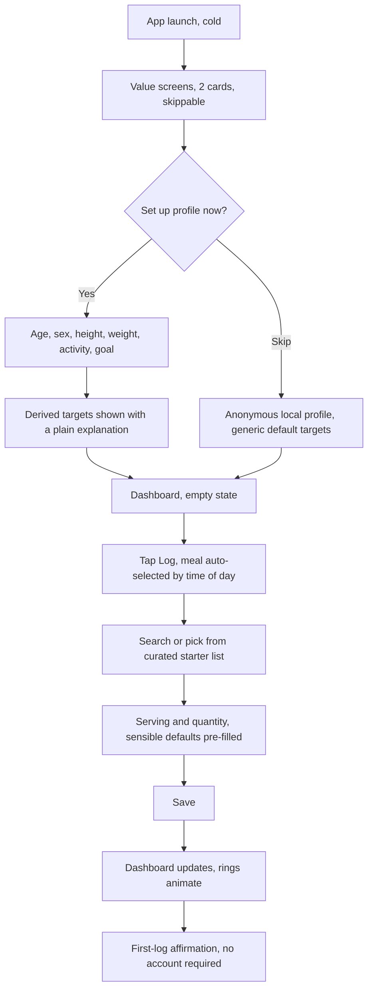
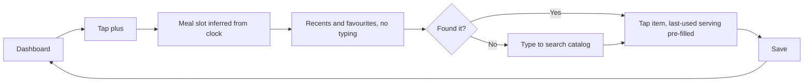

# Part I — Product

*Sections 1–10 · [Back to index](./README.md)*

---

## 1. Executive Summary

Nourishly is a cross-platform (iOS + Android) personal nutrition and hydration tracker. Users log what they eat and drink; the app converts that into macronutrient and micronutrient totals, compares them against personalised targets, and returns a daily performance summary plus weekly and monthly trend reports.

The product problem is not "can we sum calories." Calorie summing is trivial. The three problems that actually decide whether this product succeeds are:

**(a) Logging friction.** Nutrition apps die on retention, not acquisition. A user who needs eight taps and a search that does not know what a *katori* of dal is will stop logging within a week. Every architectural decision that follows is weighted toward making the common case — "log a food I have eaten before" — reachable in three taps and under five seconds, online or offline.

**(b) Data honesty.** Micronutrient coverage in every available food database is sparse and uneven. An app that silently treats "no vitamin D value recorded for this food" as "zero vitamin D consumed" will tell users they are deficient in nutrients they are not, which is both wrong and, given the subject matter, harmful. Nourishly models *unknown* as a distinct state from *zero* throughout the pipeline, and refuses to score a nutrient whose evidence base for that day is too thin.

**(c) Trust in history.** If correcting a food's calorie count silently rewrites last month's reports, or if changing a weight-loss goal retroactively re-scores past days, the longitudinal reports — the actual differentiator over a paper notebook — become worthless. Nourishly snapshots nutrient values onto log entries and effective-dates targets so that history is immutable by construction.

### Recommended technical direction

| Concern | Recommendation | ADR |
|---|---|---|
| Client framework | Flutter (Dart) | ADR-001 |
| Client architecture | Feature-first modular Clean Architecture; pure-Dart `nutrition_core` domain package; Riverpod for DI/state | ADR-002 |
| Local storage | SQLite via Drift, on-device source of truth | ADR-003 |
| Offline model | Offline-first; local write-through; UI never blocks on network | ADR-004 |
| Sync | Outbox + delta pull with server sequence cursor; append-only log semantics make most conflicts structurally impossible | ADR-005 |
| Backend | Managed BaaS (Supabase: Postgres + Auth + RLS + Edge Functions). Sync-ready from day one, sync *switched on* in Phase 2 | ADR-006 |
| Auth | Guest-first, no signup wall. Apple / Google / email OTP when the user opts in. Guest→account migration designed in from the start | ADR-007 |
| Food data | Owned, curated catalog assembled from public-domain and open sources + hand-curated Indian food set; bundled seed + delta updates; provider adapter for future third parties | ADR-008 |
| Reporting | Materialised daily summaries; weekly/monthly aggregated on demand over those summaries | ADR-009 |
| Scoring | Transparent composite of capped, individually-visible sub-scores with explicit data-coverage gating | ADR-010 |

### MVP in one line

Guest-mode, offline-first food and water logging against a curated Indian + international food catalog, with a daily dashboard, a daily performance summary, and a weekly report — shipped before cloud sync, barcode scanning, or AI logging.

Estimated to a working, shippable MVP: **14–18 weeks of solo full-time work** (§36), of which roughly a quarter is food-catalog curation rather than software.

---

## 2. Product Vision

> **Nourishly helps a person understand whether they are eating well — not just how much they are eating — and does it with less effort than the notebook they would otherwise not keep.**

Three commitments follow from that sentence and constrain the design:

**Effort is the product.** The competitive axis is not feature count. It is the time between "I finished eating" and "it is logged." Features that add capability at the cost of the common-path tap count are rejected or moved behind a secondary surface.

**Insight over data.** A screen of 24 nutrient numbers is a spreadsheet, not a product. The app's job is to answer "was today good, and what would make tomorrow better" in one sentence, with the numbers available underneath for those who want them.

**Honesty over engagement.** The app will decline to give a score when it lacks the data to give a truthful one. It will not diagnose, will not label foods as good or bad, and will not use streak pressure or shame as engagement mechanics. Nutrition tracking sits adjacent to disordered-eating risk; the design treats that as a safety requirement, not a nicety (§27.14).

### Positioning

Nourishly is a **wellness and self-knowledge tool**, explicitly not a medical device, not a diagnostic system, and not a source of clinical advice. This positioning is a hard architectural boundary, not marketing copy: it determines what language the insight engine may generate (§21.7), what regulatory regime applies (§30), and what liability the product carries.

### What Nourishly is not

- Not a fitness/exercise tracker (integration, yes; ownership, no).
- Not a meal-delivery or recipe-commerce product.
- Not a coaching or dietician marketplace in the MVP (Future, §10).
- Not a social network. No feeds, no comparison to other users.

---

## 3. Goals and Objectives

### 3.1 Product goals

| # | Goal | Success measure | Target |
|---|---|---|---|
| PG-1 | Make daily logging effortless | Median time to log a repeat food, from app cold start | < 10 s |
| PG-2 | Make daily logging habitual | D7 / D30 logging retention | ≥ 40% / ≥ 20% |
| PG-3 | Turn data into understanding | % of daily-summary views where the user expands at least one insight | ≥ 30% |
| PG-4 | Serve Indian eating patterns properly | % of logged food entries resolved from the catalog (not created as custom) for India-based users | ≥ 85% |
| PG-5 | Work anywhere | % of logging sessions completed with no network round-trip required | 100% |
| PG-6 | Never lose a user's data | Data-loss incidents per 1,000 device migrations | 0 |

*[ASSUMPTION A-1] These targets are set as engineering guardrails for a pre-launch product with no baseline. They should be re-baselined after 500 real users.*

### 3.2 Technical objectives

| # | Objective | Rationale |
|---|---|---|
| TO-1 | Every user-facing read and write is served from local storage | Offline-first is a correctness property, not a feature (§16) |
| TO-2 | Nutrition calculation lives in one pure-Dart package with golden test vectors | Consistency across platforms and across any future server-side recompute (§20.3) |
| TO-3 | Nutrients are rows, not columns, end to end | Adding vitamin B12 or selenium later must be a data change, never a schema migration (§22.4) |
| TO-4 | History is immutable by construction | Snapshotted nutrients + effective-dated targets (§20.4, §20.5) |
| TO-5 | The domain layer has zero dependency on Flutter, on the database, or on the network | Enables fast unit testing and a possible future non-Flutter client (§14) |
| TO-6 | Sync is additive, idempotent, and resumable | Partial sync must never corrupt state (§17) |
| TO-7 | Solo-developer operable | No component requires ops attention more often than weekly (§31) |

### 3.3 Explicit non-goals for v1

- Multi-user / family accounts.
- Server-side heavy analytics or ML.
- Web client.
- Real-time collaboration of any kind.
- Anything requiring regulatory clearance as a medical device.

---

## 4. User Problems Being Solved

| # | Problem | Evidence / reasoning | How Nourishly addresses it |
|---|---|---|---|
| P-1 | "Logging takes too long, so I stop." | The dominant churn reason in food-tracking apps. Every extra screen compounds across 4–6 logging events per day. | Recents-first search, meal templates, one-tap repeat, quick-add water chips (§27.5, §27.8) |
| P-2 | "The app doesn't know my food." | Global databases are built around Western supermarket items. "2 rotis and a katori of dal" has no clean entry in most of them. | Curated Indian food set with household measures as first-class servings (§19.4) |
| P-3 | "I don't know what the numbers mean." | Users see 1,800 kcal / 62 g protein and cannot judge it. | Personalised targets + plain-language daily verdict + capped sub-scores (§21) |
| P-4 | "I only find out I did badly after the day is over." | Retrospective-only feedback cannot change behaviour. | Live dashboard with remaining-budget framing; midday nudges (Post-MVP, §29) |
| P-5 | "I can't see whether I'm actually improving." | Single-day view gives no signal against day-to-day noise. | Weekly/monthly trends with moving averages and period-over-period comparison (§25) |
| P-6 | "I lose everything when I change phones." | Local-only apps punish device migration. | Optional account with sync and export from Phase 2; export available in MVP (§30.6) |
| P-7 | "No signal at the restaurant / on the train." | Logging happens exactly where connectivity is worst. | Offline-first with bundled food catalog (§16) |
| P-8 | "I don't trust that the app isn't selling my health data." | Nutrition data is sensitive; users are increasingly aware. | Guest mode by default, no third-party analytics on health data, in-app export and deletion (§30) |
| P-9 | "It tells me I'm deficient in things I'm probably not." | Sparse micronutrient data misread as zeros. | Coverage-gated micronutrient reporting (§21.5) |

---

## 5. User Personas

*[ASSUMPTION A-2] Personas are constructed from the stated product brief (personal use, India-first, general wellness). They are hypotheses for validation, not research findings. Validate with 8–12 user interviews before locking MVP scope (§37).*

### Persona 1 — Ananya, 29, Bengaluru — "The Consistency Seeker" *(primary)*
Software engineer, mostly vegetarian, eats a mix of home-cooked Indian food and office cafeteria meals. Goal: general health and "eating enough protein." Tracks in bursts, abandons when logging gets tedious.
- **Needs:** fast repeat logging; Indian foods with household measures; protein visibility; no judgement.
- **Frustrations:** searching "dal" returns twelve US lentil-soup entries; portion sizes in grams she cannot estimate.
- **Design implications:** recents/favourites ranked above global search; katori/roti/glass servings; protein prominent on the dashboard.
- **Devices:** mid-range Android (6 GB RAM), patchy office WiFi.

### Persona 2 — Rohit, 34, Pune — "The Goal-Driven Optimiser" *(primary)*
Lifts four days a week. Goal: muscle gain at a modest surplus. Wants macro precision and will tolerate more setup for more accuracy.
- **Needs:** custom foods and recipes for his repeated meals; accurate macro targets; weekly adherence trend.
- **Frustrations:** apps that hide macros behind a paywall; being unable to save "post-workout meal" as one entry.
- **Design implications:** meal templates as an MVP feature, not a nicety; per-gram entry; target overrides.
- **Devices:** iPhone, good connectivity.

### Persona 3 — Meera, 46, Ahmedabad — "The Health-Nudged Adult" *(secondary)*
Told by her doctor to watch sodium and increase fibre. Not a quantified-self person. Low tolerance for complexity.
- **Needs:** simple red/amber/green feedback on two or three things she cares about; water reminders; large type.
- **Frustrations:** dashboards full of numbers; jargon.
- **Design implications:** a "focus nutrients" preference that promotes 2–3 nutrients to the dashboard; strong accessibility defaults; plain-language insights.
- **Risk this persona surfaces:** she is one step from expecting medical guidance. The insight engine's language boundary (§21.7) exists largely for her.

### Persona 4 — Kabir, 22, Delhi — "The Hydration-Only User" *(secondary)*
Wants to drink more water. Has no interest in calories.
- **Needs:** water logging in one tap from a widget or the dashboard; a hydration-only mode.
- **Design implications:** water tracking must be independently useful and not gated behind food logging or profile setup. Onboarding must permit "I only want water" (§27.1).

### Anti-persona — the clinical user
Someone managing a diagnosed condition (CKD, T1 diabetes, pregnancy complications) who expects Nourishly to be a clinical tool. **Explicitly out of scope.** The app must not present itself as adequate for this, and its disclaimers and insight language are calibrated accordingly (§30.8).

---

## 6. Core User Journeys

### J-1 — First run to first log *(the single most important journey)*

**Design constraints on J-1**
- No account, no email, no permission prompt before the first log. Guest mode is the default path (ADR-007).
- Profile setup is skippable; skipping yields generic targets with a visible "personalise for accurate targets" affordance, not a blocked app.
- Target: **under 90 seconds from install to first logged item.**
- Notification permission is requested only at the moment a reminder is first configured, never at launch.

### J-2 — Daily repeat logging *(the highest-frequency journey)*

**Target: 3 taps, under 5 seconds, fully offline.** This is the number the architecture is optimised for. The consequences: the food catalog must be on-device (§19.5), recents must be a local indexed query, and the last-used serving per food must be persisted per user.

### J-3 — Water logging
Dashboard exposes 2–3 quick-add chips sized from the user's preference (e.g. 250 ml glass, 500 ml bottle, 1 L). One tap logs and animates. Long-press opens a custom amount. A mis-tap is undoable via an inline undo for 5 seconds — critical, because one-tap actions produce one-tap mistakes.

### J-4 — End-of-day review
Triggered by an optional evening notification or by opening the app. Presents, in order: a one-sentence verdict, the score with its components, what went well, what fell short, and the meal breakdown. The verdict comes first because most users will read only that.

### J-5 — Weekly reflection
A weekly report becomes available on the user's chosen week-start day. Shows averages, day-by-day adherence, best day, most-frequently-missed nutrient, and consistency. Explicitly compares to the prior week only when the prior week has enough logged days to make the comparison meaningful (§25.6).

### J-6 — Guest to account migration
The user has 40 days of local data and taps "Back up my data." They sign in with Apple/Google/email; local records are uploaded; a success state confirms the count. If the chosen identity already has server data, the merge path in §18.5 applies. **This journey must be lossless and interruptible** — it is the highest-consequence flow in the product.

### J-7 — Correcting a mistake
Tap an entry in the daily breakdown → edit quantity/serving/meal, or delete. Deletions are soft (tombstoned) and undoable for the session. Editing recomputes the daily summary and score immediately.

### J-8 — Creating a custom food
Search fails → "Create custom food" is offered inline at the bottom of results with the typed query pre-filled as the name. Minimum viable entry is name + serving + calories; macros and micros are optional and clearly marked as affecting report completeness. The friction here must be low, because the alternative is the user abandoning the log entirely.

---

## 7. Functional Requirements

Priority key: **M** = MVP · **S** = Should-have (MVP if time allows) · **P** = Post-MVP · **F** = Future.

### 7.1 User & Profile Management

| ID | Requirement | Pri |
|---|---|---|
| FR-U-01 | Use the app fully in guest mode with no account | M |
| FR-U-02 | Create/edit profile: date of birth (or age), biological sex, height, weight, activity level | M |
| FR-U-03 | Select a primary goal: general health, weight maintenance, weight loss, weight gain, muscle gain, improved hydration, nutrition consistency | M |
| FR-U-04 | System derives daily targets (energy, macros, water, micros) from profile + goal, with the derivation explained in plain language | M |
| FR-U-05 | Manually override any derived target; overrides are marked as user-set and survive profile changes until reset | M |
| FR-U-06 | Profile changes take effect from the change date forward and do not alter historical targets or scores | M |
| FR-U-07 | Set unit preferences: metric/imperial, ml/L/fl oz, kg/lb, cm/ft-in | M |
| FR-U-08 | Set week start day (Sun/Mon) and daily rollover time | S |
| FR-U-09 | Choose up to 3 "focus nutrients" promoted onto the dashboard | S |
| FR-U-10 | Create an account (Apple / Google / email OTP) and migrate guest data | P |
| FR-U-11 | Sign out; local data behaviour on sign-out is explicit and confirmed by the user | P |
| FR-U-12 | Delete account and all server data from within the app | P |
| FR-U-13 | Export all personal data (JSON + CSV) | M |
| FR-U-14 | Record body weight over time as a series | S |
| FR-U-15 | Set a "reason for tracking" that tunes which insights are surfaced | F |

### 7.2 Food Catalog & Food Management

| ID | Requirement | Pri |
|---|---|---|
| FR-F-01 | Search the catalog by name with fuzzy/prefix matching, fully offline | M |
| FR-F-02 | Search results rank recents and favourites above general catalog matches | M |
| FR-F-03 | View a food's detail: nutrients per serving and per 100 g, available servings, data provenance and quality tier | M |
| FR-F-04 | Filter/scope search (e.g. Indian foods, my foods) | S |
| FR-F-05 | Create a custom food with name, servings, and nutrients; only name + one serving + energy are mandatory | M |
| FR-F-06 | Edit and delete custom foods; deleting a food already logged does not alter past entries | M |
| FR-F-07 | Mark/unmark any food as a favourite | M |
| FR-F-08 | Recently logged foods list, ordered by recency and frequency | M |
| FR-F-09 | Each food carries one or more named servings with a gram/ml weight (including household measures: katori, roti, glass, cup, tbsp, piece) | M |
| FR-F-10 | Log by direct weight/volume as an alternative to a named serving | M |
| FR-F-11 | Catalog updates delivered incrementally without an app-store release | P |
| FR-F-12 | Report a data error on a catalog food | P |
| FR-F-13 | Barcode scan to resolve a packaged food | P |
| FR-F-14 | Create a recipe from ingredients; nutrients computed per portion, with cooking yield factor | F |
| FR-F-15 | Duplicate detection when creating a custom food that closely matches a catalog food | S |

### 7.3 Meal Logging

| ID | Requirement | Pri |
|---|---|---|
| FR-M-01 | Log a food to a meal slot: breakfast, lunch, dinner, snack | M |
| FR-M-02 | Meal slot pre-selected based on time of day and the user's own historical pattern | S |
| FR-M-03 | Set quantity as a multiplier of a chosen serving (supports fractional values) | M |
| FR-M-04 | Log to any date, not just today (back-fill) | M |
| FR-M-05 | Edit or delete a log entry | M |
| FR-M-06 | Move an entry between meal slots | S |
| FR-M-07 | Copy a meal, a day, or a set of entries to another date | S |
| FR-M-08 | Save a set of entries as a named meal template ("My breakfast") | M |
| FR-M-09 | Log a meal template in one action | M |
| FR-M-10 | Edit and delete meal templates | M |
| FR-M-11 | Define custom meal categories beyond the default four | S |
| FR-M-12 | Attach an optional note or photo to an entry | P |
| FR-M-13 | Log a meal by natural-language description | F |
| FR-M-14 | Log a meal from a photo | F |

### 7.4 Water & Hydration

| ID | Requirement | Pri |
|---|---|---|
| FR-W-01 | Log water with one tap from configurable quick-add amounts | M |
| FR-W-02 | Log a custom amount | M |
| FR-W-03 | Configure quick-add amounts and the display unit (ml / L / fl oz) | M |
| FR-W-04 | Daily water target derived from profile, manually overridable | M |
| FR-W-05 | Live daily hydration progress on the dashboard | M |
| FR-W-06 | Undo a water log immediately after logging | M |
| FR-W-07 | Edit/delete any past water entry | M |
| FR-W-08 | Historical water view (day / week / month) | M |
| FR-W-09 | Beverages other than water (tea, coffee, juice, milk) contribute both their nutrients and a configurable hydration fraction | S |
| FR-W-10 | Water reminders on a schedule or after inactivity | P |
| FR-W-11 | Home-screen widget / watch complication for one-tap water | F |

### 7.5 Nutrition Tracking

| ID | Requirement | Pri |
|---|---|---|
| FR-N-01 | Compute daily totals for every tracked nutrient from all entries | M |
| FR-N-02 | Track macros: energy, protein, carbohydrate, fat, fibre | M |
| FR-N-03 | Track macro sub-components: saturated fat, added/total sugar | S |
| FR-N-04 | Track micros: vitamins A, B1, B2, B3, B6, B9, B12, C, D, E, K; calcium, iron, magnesium, potassium, sodium, zinc | M (data-permitting, §21.5) |
| FR-N-05 | Support adding new nutrients without a schema change or app release | M |
| FR-N-06 | Distinguish *unknown* from *zero* for every nutrient value, everywhere | M |
| FR-N-07 | Show, per nutrient, the % of the day's energy covered by foods that actually report it | M |
| FR-N-08 | Compare every tracked nutrient against that day's effective target | M |
| FR-N-09 | Classify each nutrient as below / within / above target, using target-type-appropriate bands | M |
| FR-N-10 | Per-meal nutrient subtotals | S |
| FR-N-11 | Nutrient contributions attributed to individual foods ("what gave me most of my sodium") | S |

### 7.6 Daily Report & Performance

| ID | Requirement | Pri |
|---|---|---|
| FR-D-01 | Daily summary: energy, macros, micros, water, all against targets | M |
| FR-D-02 | Daily Nourishment Score (0–100) with all sub-scores individually visible | M |
| FR-D-03 | Every score is explainable: tapping it shows exactly what contributed | M |
| FR-D-04 | Score is withheld, with a stated reason, when data coverage or day completeness is insufficient | M |
| FR-D-05 | List nutrients below target ("gaps") | M |
| FR-D-06 | List nutrients above the upper limit ("excesses") | M |
| FR-D-07 | 2–4 plain-language insights per day, drawn from a reviewed rule set | M |
| FR-D-08 | Meal-by-meal breakdown with each meal's energy and macro share | M |
| FR-D-09 | Goal completion percentages per target | M |
| FR-D-10 | Share/export a daily summary | S |
| FR-D-11 | Insights suggest concrete, food-level next actions | S |

### 7.7 Weekly Report

| ID | Requirement | Pri |
|---|---|---|
| FR-WK-01 | Daily averages for energy, macros, water, score over the week | M |
| FR-WK-02 | Count of days each target was met | M |
| FR-WK-03 | Score trend across the seven days | M |
| FR-WK-04 | Best day and weakest day, with the reason | M |
| FR-WK-05 | Most frequently missed and most frequently exceeded nutrients | M |
| FR-WK-06 | Logging consistency (days logged, meals logged per day) shown alongside every average, so averages are never read without their denominator | M |
| FR-WK-07 | Comparison to previous week, shown only when both weeks are sufficiently logged | S |
| FR-WK-08 | Weekday vs weekend pattern analysis | P |
| FR-WK-09 | Weekly report export/share | S |

### 7.8 Monthly Report

| ID | Requirement | Pri |
|---|---|---|
| FR-MO-01 | Monthly averages for all headline metrics | S |
| FR-MO-02 | Month-long trend charts with a moving average | S |
| FR-MO-03 | Goal consistency: % of days targets were met | S |
| FR-MO-04 | Chronically deficient and chronically exceeded nutrients | S |
| FR-MO-05 | Comparison against the previous month | S |
| FR-MO-06 | Calendar heat-map of daily scores | P |
| FR-MO-07 | Correlation between logging consistency and score | F |

### 7.9 Platform, Sync & System

| ID | Requirement | Pri |
|---|---|---|
| FR-S-01 | All logging, viewing, and reporting functions work with no network | M |
| FR-S-02 | Data survives app restart, OS update, and app update | M |
| FR-S-03 | Local data export produces a complete, re-importable archive | M |
| FR-S-04 | Background sync when signed in and connected | P |
| FR-S-05 | Sync status is visible and its failures are actionable, never silent | P |
| FR-S-06 | Multi-device consistency for a signed-in user | P |
| FR-S-07 | Local notifications for reminders and the end-of-day summary | P |
| FR-S-08 | Apple Health / Health Connect read-write | F |
| FR-S-09 | Full dark mode and dynamic type support | M |
| FR-S-10 | Screen-reader accessible across all primary flows | M |

---

## 8. Non-Functional Requirements

### 8.1 Performance

| ID | Requirement | Target |
|---|---|---|
| NFR-P-01 | Cold start to interactive dashboard | p95 < 2.0 s on a 2022 mid-range Android |
| NFR-P-02 | Warm start to dashboard | p95 < 600 ms |
| NFR-P-03 | Food search keystroke-to-results | p95 < 120 ms for a 30k-item local catalog |
| NFR-P-04 | Save a log entry, dashboard reflects it | p95 < 200 ms |
| NFR-P-05 | Daily summary recompute after an edit | p95 < 100 ms |
| NFR-P-06 | Weekly report render (from materialised dailies) | p95 < 400 ms |
| NFR-P-07 | Monthly report render | p95 < 800 ms |
| NFR-P-08 | Scroll performance on all list and chart screens | ≥ 58 fps median, no frame > 32 ms at p99 |
| NFR-P-09 | Installed app size | < 60 MB Android download, < 80 MB iOS |

*Rationale for NFR-P-03: search is typed character by character; anything above ~150 ms feels laggy and users stop trusting the results. This is the requirement that forces a local FTS index rather than remote search (§19.5).*

### 8.2 Reliability & Data Integrity

| ID | Requirement |
|---|---|
| NFR-R-01 | Crash-free session rate ≥ 99.5%; crash-free user rate ≥ 99.0% |
| NFR-R-02 | Zero data loss from app crash, force-quit, or OS kill mid-write — every write is a committed transaction before the UI acknowledges it |
| NFR-R-03 | Every schema migration is forward-tested on a populated database; a failed migration must fall back to a preserved copy, never wipe |
| NFR-R-04 | Sync is idempotent: replaying any request produces no duplicates and no divergence |
| NFR-R-05 | Sync is resumable: interruption at any point leaves both sides in a consistent, retryable state |
| NFR-R-06 | Aggregates are always derivable from source records; a corrupted summary can be rebuilt by recomputation |
| NFR-R-07 | Nutrient arithmetic is deterministic and reproducible from the entry snapshot alone |
| NFR-R-08 | Automatic local backup snapshot retained across app updates |

### 8.3 Offline

| ID | Requirement |
|---|---|
| NFR-O-01 | 100% of MVP functionality available offline, indefinitely, with no degradation notice |
| NFR-O-02 | The app never shows a network error for a logging action |
| NFR-O-03 | Offline-created records are indistinguishable from online ones once synced |
| NFR-O-04 | Outbox survives process death and device restart |
| NFR-O-05 | A device offline for 90+ days syncs successfully on reconnect without manual intervention |

### 8.4 Security & Privacy

| ID | Requirement |
|---|---|
| NFR-S-01 | All network traffic over TLS 1.2+; certificate validation never disabled |
| NFR-S-02 | Tokens stored in iOS Keychain / Android Keystore-backed EncryptedSharedPreferences, never in plain preferences or the app database |
| NFR-S-03 | Local database protected by OS full-disk encryption; database-level encryption (SQLCipher) available as a user-enabled option (§30.3) |
| NFR-S-04 | Server-side row-level isolation enforced at the database, not only in application code |
| NFR-S-05 | No health or nutrition data transmitted to any third-party analytics or advertising SDK |
| NFR-S-06 | Account deletion removes all server-side personal data within 30 days, with logs retained no longer than necessary |
| NFR-S-07 | Data export is user-initiated, complete, and machine-readable |
| NFR-S-08 | No PII in crash reports or logs; log redaction verified by test |
| NFR-S-09 | All third-party SDKs reviewed for data collection before inclusion; each one's justification recorded |

### 8.5 Usability & Accessibility

| ID | Requirement |
|---|---|
| NFR-A-01 | WCAG 2.2 AA contrast for all text and meaningful UI |
| NFR-A-02 | Full VoiceOver/TalkBack support on every primary flow; charts expose a text alternative conveying the same conclusion |
| NFR-A-03 | Dynamic type / font scaling to 200% without layout breakage or truncation of essential content |
| NFR-A-04 | No information conveyed by colour alone — every status carries a label, icon, or shape |
| NFR-A-05 | Primary touch targets ≥ 48 dp |
| NFR-A-06 | Reduced-motion setting respected |
| NFR-A-07 | Common path (repeat food log) ≤ 3 taps |
| NFR-A-08 | All destructive actions confirmable or undoable |

### 8.6 Maintainability

| ID | Requirement |
|---|---|
| NFR-M-01 | Domain and calculation logic ≥ 90% line coverage; the scoring engine has an explicit golden-vector suite |
| NFR-M-02 | Domain layer imports nothing from Flutter, the database, or the network layer — enforced by an import lint rule in CI |
| NFR-M-03 | Feature modules depend on shared modules, never on each other |
| NFR-M-04 | Every architecturally significant decision has an ADR |
| NFR-M-05 | Nutrient set, target rules, scoring weights, and insight rules are data/configuration, not hard-coded branches |
| NFR-M-06 | CI runs analyse, format check, unit tests, and golden tests on every push |

### 8.7 Efficiency & Resource Use

| ID | Requirement |
|---|---|
| NFR-E-01 | Foreground battery use comparable to a text-and-list app; no continuous sensors, no location, no background polling |
| NFR-E-02 | Sync runs opportunistically on OS-scheduled background windows and on foreground resume; never on a timer |
| NFR-E-03 | Catalog delta updates on unmetered connections by default, user-overridable |
| NFR-E-04 | Local storage after two years of daily logging < 150 MB excluding photos |
| NFR-E-05 | No wake locks; no foreground services on Android for MVP functionality |

### 8.8 Scalability *(see §31 for the analysis)*

| ID | Requirement |
|---|---|
| NFR-SC-01 | Client performance must not degrade with history size — all report queries bounded by period length, not total history |
| NFR-SC-02 | Backend design supports 100k users without re-architecture |
| NFR-SC-03 | Food catalog supports 500k items server-side and a 30–50k on-device working set |
| NFR-SC-04 | Backend cost per monthly active user ≤ ₹5 at 10k MAU |

---

## 9. MVP Scope

**MVP goal:** a person in India can install the app, log a day of Indian and international food and water entirely offline, and get a daily summary and weekly report they find accurate and useful — without creating an account.

### 9.1 Must Have

| Area | Included |
|---|---|
| Onboarding | Skippable value intro; profile setup (age, sex, height, weight, activity, goal); derived targets with plain-language explanation; guest mode as the default |
| Food catalog | Bundled on-device catalog: ~1,500–2,500 curated Indian foods and dishes with household measures + ~8–15k international/generic items. Offline full-text search |
| Food logging | Search, recents, favourites, custom foods, meal templates; four meal slots; serving + quantity; back-dating; edit/delete |
| Water | Quick-add chips, custom amount, unit preference, daily target, undo, history |
| Nutrition | 5 macros + saturated fat + sugar + 17 micronutrients where data exists; unknown ≠ zero; per-nutrient coverage |
| Targets | Derived energy/macro/water/micro targets; manual overrides; effective-dated |
| Daily dashboard | Energy ring, macro bars, water progress, focus nutrients, meal list, remaining budget |
| Daily report | Verdict sentence, Daily Nourishment Score with visible sub-scores, gaps, excesses, 2–4 insights, meal breakdown |
| Weekly report | Averages, days-met counts, score trend, best/weak day, most-missed nutrients, consistency denominator |
| Data ownership | Full JSON + CSV export; local backup snapshot |
| Platform | iOS + Android; dark mode; dynamic type; screen-reader support; English |

### 9.2 Should Have *(ship in MVP if it does not delay it)*

- Monthly report (averages, trend chart, consistency).
- Beverage hydration contribution (FR-W-09).
- Copy meal / copy day (FR-M-07).
- Custom meal categories (FR-M-11).
- Focus nutrients on the dashboard (FR-U-09).
- Body-weight series (FR-U-14).
- Duplicate detection on custom food creation (FR-F-15).
- Per-meal nutrient subtotals (FR-N-10).

### 9.3 Nice to Have

- Daily summary share card.
- Weekday/weekend split in the weekly report.
- Nutrient contribution attribution (FR-N-11).
- Hindi localisation.

### 9.4 Explicitly Out of Scope for MVP

| Excluded | Why | Where it lands |
|---|---|---|
| Accounts, sign-in, cloud sync | Highest-effort subsystem; guest mode + export covers the real MVP need (not losing data). Data model is built sync-ready so nothing is thrown away | Phase 2 |
| Barcode scanning | Needs a packaged-goods database, camera permission, and a scan-to-match pipeline. Real value, but not on the critical path to proving the core loop | Phase 2 |
| Any AI feature (photo, natural language) | Accuracy is unproven, cost is per-request, and it cannot work offline. Building the MVP so it *can* be added is the correct MVP-stage investment | Phase 3+ |
| Recipes / multi-ingredient composition | Significant data-model and UX surface. Custom foods + meal templates cover ~80% of the need at ~10% of the cost | Phase 3 |
| Notifications and reminders | Requires permission UX, scheduling, and careful tone work. Ports designed in MVP, implementation later | Phase 2 |
| Apple Health / Health Connect | Integration surface with its own review requirements | Phase 3 |
| Exercise, weight-goal projection, meal planning, grocery lists | Scope adjacent to a different product | Future |
| Social, sharing, family accounts, dietician marketplace | Different product | Future |
| Web client | No evidence of need | Future |
| Multi-language beyond English | Adds cost to every screen; validate demand first | Phase 2 (Hindi first) |

### 9.5 The MVP's deliberate bet

The bet is that **an offline, fast, Indian-food-literate logger with honest daily and weekly feedback is more valuable than a feature-complete logger with a mediocre food database.** Consequently the largest single MVP investment is *catalog curation* (§19.4) — roughly 3–4 weeks of non-engineering work. Reviewers should push back here if they disagree, because it is the load-bearing assumption of the plan.

---

## 10. Future Scope

Classification drives *architecture readiness*, not commitment. Each item lists the seam that must exist in the MVP so the feature does not force a redesign later.

### 10.1 Post-MVP (Phase 2 — the next 3–4 months)

| Feature | Required MVP seam |
|---|---|
| Accounts + cloud sync + multi-device | UUID PKs, `updated_at` + tombstones, outbox table, sync metadata on every syncable entity (§17) |
| Guest → account migration | An `owner_id` on every user-owned row that is a local sentinel until sign-in |
| Barcode scanning | `FoodExternalRef` table keyed by (source, external_id); a `FoodDataProvider` port with a catalog implementation (§19.6) |
| Catalog delta updates | Versioned catalog with `catalog_version` and monotonic `revision` per food |
| Notifications & reminders | `ReminderRule` entity + a `ReminderScheduler` port with a local-notification adapter (§29) |
| Monthly report (if not in MVP) | Materialised daily summaries make this nearly free (§25) |
| Hindi localisation | All strings externalised from day one; no concatenated sentences |
| Food error reporting | Provenance and `food_version` already on every food |

### 10.2 Future / Advanced (Phase 3+)

| Feature | Required MVP seam |
|---|---|
| Natural-language logging ("two rotis, paneer curry, a bowl of rice") | A `MealParser` port returning candidate `(food, serving, quantity)` triples into the *existing* confirmation UI — the AI proposes, the user confirms, and nothing bypasses the normal logging path |
| Photo / image recognition logging | Same port; plus a media store abstraction and an explicit consent gate for uploading images |
| Recipes & ingredients | `FoodItem` already supports a `kind` discriminator; recipe = a food whose nutrients are computed from components with a yield factor |
| Apple Health / Health Connect | A `HealthDataPort` with per-nutrient mapping and explicit user consent per direction |
| Wearables / watch app | Water quick-add is already an independent, idempotent write |
| Weight & exercise tracking | Weight series in MVP-Should; energy expenditure enters as a *target adjustment input*, keeping the target engine the single place that computes targets |
| Meal planning / grocery lists | Read-only projections over catalog + templates |
| Family / shared tracking | The `owner_id` indirection allows a household scope later; do **not** build multi-tenancy now |
| Dietician / professional access | Requires a consented sharing model and a different privacy posture (§30.9); treat as a separate product decision |
| Adaptive personalised targets | Target engine is already versioned and pluggable (§20.4) |

### 10.3 Deliberately rejected

| Idea | Why rejected |
|---|---|
| Social feed / friend comparison | Directly conflicts with the eating-disorder-safety posture (§27.14) |
| Gamified streaks with loss framing | Same. Streaks that punish a missed day drive dishonest logging |
| Automatic "healthy/unhealthy" food labels | Not scientifically defensible per-food; contradicts §2 |
| Ads or data monetisation | Incompatible with §30 and with the product's trust proposition |
| A server-authoritative logging model | Would break offline-first, which is the product's most differentiating property |

---

*Continue to [Part II — Technology Selection](./02-technology.md).*
