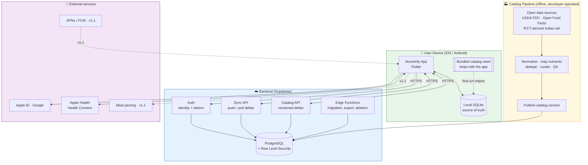
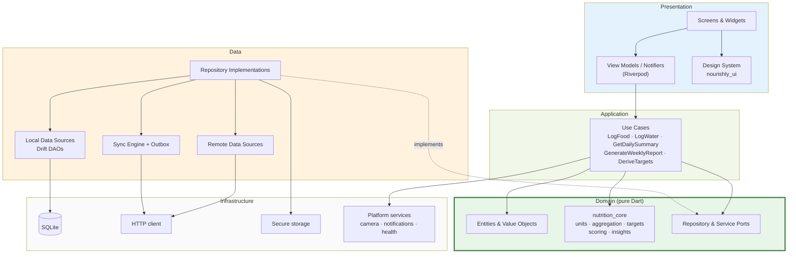
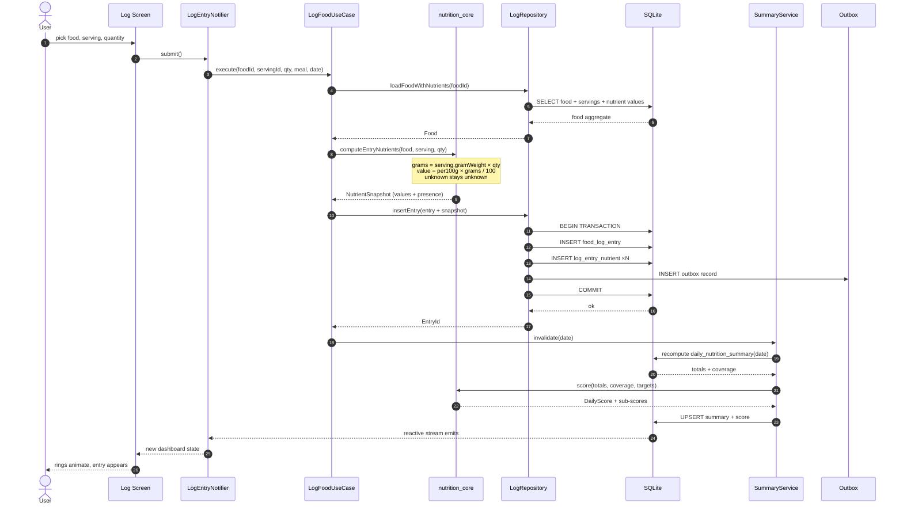
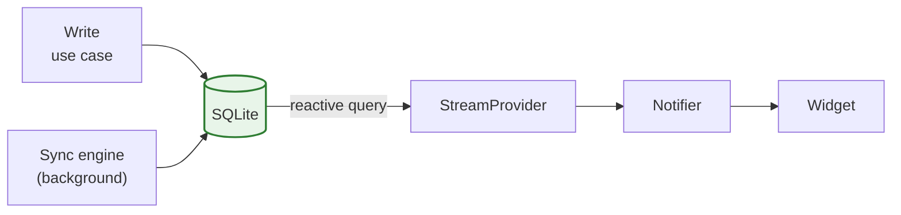
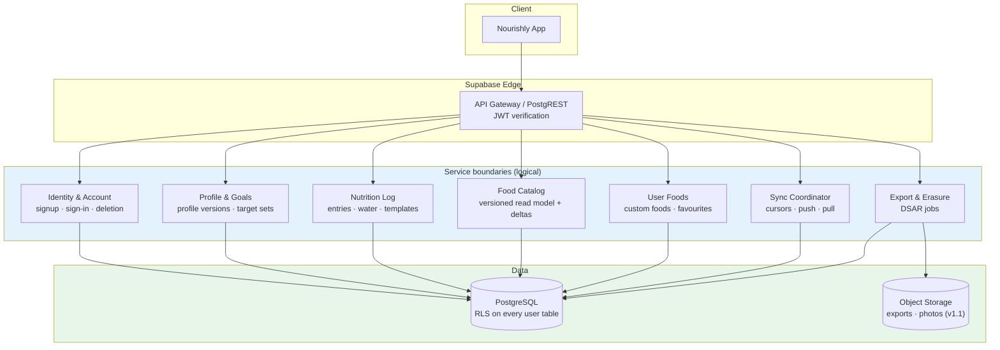

# Part III — System, Mobile, and Backend Architecture

*Sections 13–15 · [Back to index](./README.md)*

---

## 13. High-Level System Architecture

### 13.1 Architectural principles

These are the rules every subsequent decision is checked against.

| # | Principle | Consequence |
|---|---|---|
| AP-1 | **The device is the source of truth for user-generated data.** The server is a durable replica and a synchronisation relay. | No user action ever waits for the network. Sync failures are recoverable, never data-losing. |
| AP-2 | **The server is the source of truth for the food catalog.** Devices hold a versioned, read-only replica. | Catalog updates flow one way; user edits never mutate catalog rows. |
| AP-3 | **Facts are immutable; derived values are disposable.** Log entries and their nutrient snapshots are facts. Summaries, scores, and insights are derived and always rebuildable. | A corrupted or stale aggregate is a recompute, never a data-recovery incident (NFR-R-06). |
| AP-4 | **Unknown is not zero.** | Every nutrient value carries presence, and every aggregate carries coverage (§20.7). |
| AP-5 | **Calculation lives in exactly one place.** | `nutrition_core` is the sole implementation; any second implementation must pass the same golden vectors (§20.3). |
| AP-6 | **Nutrients, targets, scoring weights, and insight rules are data.** | Extending the nutrient set is a content change, not a release (TO-3). |
| AP-7 | **Every external dependency sits behind a port.** | Food providers, auth, notifications, health platforms, and AI parsers are all replaceable adapters (§14.6). |
| AP-8 | **Build the seam even where the feature is deferred.** | Most seams now carry a real v1.0 adapter (§14.6). The ones that do not — `MealParser` above all — still shape the code that ships, because a logging flow built as *propose → confirm → write* can accept AI candidates later and a direct-write flow cannot. |

### 13.2 System context



**Reading the diagram:** everything except the dashed v1.1 edges is live at first release. The critical property to note is that the green box is **self-sufficient**: cut every arrow leaving the device and the app still logs, computes, scores, and reports. The backend adds durability, multi-device access, and catalog freshness — never capability. The yellow pipeline runs on the developer's machine and publishes artefacts to the backend; it is *not* a runtime service.

### 13.3 Logical layering



**Dependency rule:** arrows point inward only. Presentation → Application → Domain. Data *implements* Domain ports and is injected at the composition root; the domain never names a concrete data class. This is the classic Clean Architecture dependency inversion, and it is what allows the entire scoring engine to be tested with no database and no widgets.

### 13.4 Primary runtime flow — logging a food



Everything above happens on-device with no network, even though the backend is live. The outbox insert is inside the same transaction as the entry — this is what makes sync exactly-once-effective rather than best-effort (§17.3). Note what the diagram does *not* contain: any network call on the path between the user's tap and the confirmed write.

### 13.5 Deployment view

| Component | Where it runs | In v1.0? | Ops burden |
|---|---|---|---|
| Flutter app | User device | Yes | App-store releases |
| Bundled catalog seed | Shipped in the app bundle | Yes | Rebuilt per release |
| Postgres + Auth + RLS | Supabase managed | Yes | Managed. Backups configured and **restore rehearsed before launch** |
| Sync API | Supabase PostgREST + Edge Functions | Yes | Low; monitored for error rate and push latency |
| Catalog API + deltas | Supabase tables + CDN-cached static delta files | Yes | Publish per catalog release |
| Catalog ETL pipeline | Developer machine / CI job | Yes | Run per catalog release; not a runtime service |
| Crash reporting | Vendor | Yes | Minimal |
| Push infrastructure | — | No (v1.1) | Notifications are local-only in v1.0 (§29.3) |

**The operational commitment this creates.** Running production infrastructure from day one is the main cost of the full-application decision, and it is worth stating plainly rather than burying in a table: a live backend holding other people's health data brings backup verification, uptime monitoring, security patching, incident response, and — under DPDP — statutory breach-notification duties (§30.1). Three properties keep this inside a solo developer's capacity:

1. **Managed services only.** No servers, containers, or orchestration to operate.
2. **The backend owns no business logic** (§15.5), so it is boring, rarely changes, and rarely breaks.
3. **A backend outage is a P2, not a P1** — the client keeps working offline (AP-1). This is the single most valuable operational property of the offline-first architecture, and it matters more now than it did under the staged plan.

## 14. Mobile Application Architecture

### 14.1 Chosen pattern

**Feature-first modular architecture with Clean Architecture layering inside each feature, plus shared cross-cutting packages.** *(ADR-002)*

Two organising axes exist: by layer (all screens together, all repositories together) or by feature (everything about water logging together). Layer-first directory structures fail at scale because a single change touches four distant directories, and because nothing prevents features from reaching into each other. Feature-first keeps change local; the layering inside each feature preserves testability.

### 14.2 Why not simpler, why not more complex

| Alternative | Verdict |
|---|---|
| MVVM with repositories, no explicit domain layer | Tempting for a solo dev. Rejected: the calculation and scoring logic is the product's core intellectual asset and must be independently testable and portable. Without a domain layer, it would end up entangled with Drift row types. |
| Full DDD with aggregates, domain events, and a bus | Rejected as over-engineering for a single-user, single-writer app. Selected DDD *concepts* are used where they pay: value objects for quantities and nutrient amounts, an explicit aggregate boundary around `FoodLogEntry` + its nutrient snapshot, and a ubiquitous language documented in §22.1. |
| Redux-style single global store | Rejected: forces all state through one reducer graph; poor fit for reactive DB streams. |
| BLoC everywhere | Viable; rejected for boilerplate weight relative to Riverpod at solo-dev scale. Riverpod gives the same testability with less ceremony. |

### 14.3 Layer responsibilities and rules

| Layer | Contains | May depend on | Must never |
|---|---|---|---|
| **Presentation** | Widgets, screens, Riverpod notifiers, view state, formatting | Application, Domain (types only), Design System | Touch Drift, HTTP, or `dart:io` |
| **Application** | Use cases; orchestration; transaction boundaries | Domain | Know about widgets or SQL |
| **Domain** | Entities, value objects, ports, `nutrition_core` | Nothing outside pure Dart | Import Flutter, Drift, or any I/O |
| **Data** | Repository implementations, DAOs, DTOs, mappers, sync engine | Domain (to implement ports), Infrastructure | Leak DTOs or Drift row types upward |
| **Infrastructure** | Drift database, HTTP client, secure storage, platform plugins | — | Contain business rules |

**Enforcement:** a CI import-lint rule fails the build if `nutrition_core` or `nourishly_domain` gains a forbidden import (NFR-M-02). Without machine enforcement this rule erodes within weeks.

### 14.4 Feature module anatomy

Every feature module follows one shape, so navigating an unfamiliar feature costs nothing:

```
features/water/
├── presentation/
│   ├── screens/          # WaterScreen, WaterHistoryScreen
│   ├── widgets/          # QuickAddChipRow, HydrationRing
│   └── state/            # waterDayProvider, WaterLogNotifier
├── application/
│   └── usecases/         # LogWater, UndoLastWaterLog, GetWaterDay
└── data/
    ├── dao/              # WaterLogDao (Drift)
    ├── dto/
    └── water_repository_impl.dart
```

Domain entities (`WaterLogEntry`, `HydrationTarget`) and the `WaterRepository` port live in the shared `nourishly_domain` package rather than inside the feature, because reporting also consumes them. **Rule: if two features need a type, it belongs in the shared domain package — features never import each other** (NFR-M-03).

### 14.5 State management model

Four kinds of state, deliberately distinguished:

| Kind | Example | Mechanism | Lifetime |
|---|---|---|---|
| **Persistent domain state** | Log entries, foods, targets | SQLite, exposed as Drift reactive streams wrapped in Riverpod `StreamProvider`s | Forever |
| **Derived state** | Daily summary, score, weekly report | Computed providers over persistent state; materialised in SQLite when read-hot (§25) | Rebuildable |
| **Ephemeral UI state** | Search text, expanded sections, form drafts | `StateNotifier`/`NotifierProvider`, scoped to the screen and auto-disposed | Screen |
| **Session/app state** | Auth state, sync status, connectivity, unit preferences | Long-lived app-scoped providers | App |

**The critical rule:** the UI subscribes to database streams rather than to command results. Writing an entry does not push new state into the view; it writes to the database, and the view updates because its query re-emits. This makes the UI correct by construction under sync, background writes, and multi-screen edits — there is exactly one path by which state reaches the screen.



### 14.6 Ports and adapters

Every external capability sits behind a port defined in the domain layer. Because the full application ships at once, most ports now have a real adapter at launch — but the boundary is what keeps a plugin swap, a provider change, or a v1.1 feature from reaching into feature code.

| Port | v1.0 adapter | Later adapters |
|---|---|---|
| `FoodCatalogRepository` | Local SQLite catalog + remote delta sync | — |
| `FoodDataProvider` | Local catalog lookup; Open Food Facts by barcode | Commercial provider, if ever justified |
| `BarcodeScanner` | `mobile_scanner` | Replaceable in one file if the plugin is abandoned |
| `MealParser` | **Not registered** | NL parser and photo recogniser (v1.1) — both return candidates into the normal confirmation UI and never write an entry unreviewed |
| `ReminderScheduler` | Local notifications | Server push (v1.1, only if cross-device coordination is ever needed) |
| `AuthService` | Guest identity + Supabase auth (Apple, Google, email OTP) | — |
| `SyncService` | Outbox + delta sync engine | — |
| `HealthDataPort` | HealthKit + Health Connect adapters | Fitness trackers (v2) |
| `AnalyticsPort` | Minimal, constrained by NFR-S-05 | — |
| `ClockPort` | System clock | Test clock — valuable from day one for day-boundary and rollover tests |

**The `MealParser` port is the one that earns its keep before it has an implementation.** Defining it now forces the v1.0 logging flow to be shaped as *propose → confirm → write*, which is the only shape that can safely accept AI-generated candidates later. Retrofitting that shape onto a direct write path is where AI logging features usually go wrong.

### 14.7 Threading and performance

- Log writes and summary recomputation are small and stay on the UI isolate; the transaction in §13.4 is sub-millisecond-scale at realistic entry counts.
- **Background isolates** are used for: catalog seed import on first run (thousands of inserts), catalog delta application, data export, and any monthly recomputation over long histories. These are the only operations that can plausibly jank a frame.
- Search is debounced ~120 ms and cancels in-flight queries on new keystrokes.
- Reports are computed from materialised daily summaries (§25), so a monthly report reads ~31 rows, not ~3,000 entries.

### 14.8 Error handling model

- Use cases return an explicit `Result<T, Failure>` (sealed) rather than throwing for expected failures. Exceptions are reserved for programmer errors.
- Failure taxonomy: `ValidationFailure`, `NotFoundFailure`, `StorageFailure`, `NetworkFailure`, `AuthFailure`, `SyncConflictFailure`, `UnknownFailure`.
- **`NetworkFailure` must never surface in a logging flow** (NFR-O-02). If it can, the flow has an architecture bug.
- User-facing messages are mapped from failures at the presentation layer, never constructed in the domain.

### 14.9 Testing strategy

| Level | Scope | Target |
|---|---|---|
| Unit — `nutrition_core` | Conversions, aggregation, target derivation, scoring, insight rules | ≥ 95% line coverage; the highest-value tests in the project |
| **Golden vectors** | Versioned JSON input/expected-output fixtures for the whole calculation pipeline (§20.3) | Every scoring-ruleset change must produce a new version, never mutate an existing vector |
| Unit — use cases | Orchestration with fake repositories | ≥ 90% |
| Integration — data | Real in-memory SQLite: DAOs, migrations, aggregate SQL | Every migration tested against a populated fixture DB (NFR-R-03) |
| Widget | Key screens, empty/loading/error states, accessibility semantics | Primary flows |
| End-to-end | J-1, J-2, J-3, J-6, J-7 on both platforms | Pre-release |
| Property-based | Aggregation invariants (order independence, additivity, unknown propagation) | Core aggregation only |

---

## 15. Backend Architecture

### 15.1 Backend strategy decision

**Revised in review (2026-09-09).** The original recommendation was a hybrid: ship a sync-ready data model with no backend, and switch the backend on in a second phase. The reviewer chose to ship the complete application instead. The three options, restated with the decision as taken:

| Option | Assessment |
|---|---|
| **No backend, ever** | Cheapest. Rejected: device loss means data loss; users who switch phones churn permanently; catalog corrections would require an app-store release |
| **Sync-ready model now, backend in a second phase** | Lowest risk to schedule and operations; defers the largest subsystem until the core product is validated. **Not chosen** |
| **Full backend at first release** ✅ | **Chosen.** Accounts, sync, backup, multi-device, and over-the-air catalog delivery are all live at launch |

**What this decision buys.** Beyond the obvious (no data loss on device change, multi-device use), one benefit is structural and under-appreciated: **over-the-air catalog delivery from day one materially de-risks the food catalog**, which is the largest scope risk in the whole plan (R-1). Under the staged plan, the launch catalog had to be right, because correcting it meant an app-store release. With delta delivery live at launch, the curated Indian tier can start smaller and grow continuously against real search-failure telemetry (§31.6). That is a genuine architectural synergy, not a consolation.

**What it costs.** Roughly seven weeks of additional engineering (auth, sync engine, migration, RLS, backend testing), production operations from day one (§13.5), a live compliance surface from day one (§30.1), infrastructure cost with no revenue against it (§31.5), and — the real risk — **roughly four extra months before any real user touches the product** (§9.5, R-20).

**What does not change.** The client remains the source of truth (AP-1, ADR-004). The backend remains a thin replica and relay that computes nothing (§15.5). Nothing about the offline architecture is relaxed because a server now exists — and the temptation to relax it, once a working API is sitting there, is the main architectural risk this decision introduces. It is easier to call a server than to write the offline path, and the second time that trade is made casually is the moment the product stops being offline-first.

### 15.2 Backend components



**These are service *boundaries*, not microservices.** They are schemas, table groups, and function modules inside one Postgres database and one deployment. Splitting them into separate services at this scale would add operational cost and distributed-transaction problems in exchange for nothing. The boundaries matter because they define *data ownership* and give a clean extraction seam if scale ever demands it (§31.4).

### 15.3 Data ownership

| Domain | Owner | Writer | Reader | Notes |
|---|---|---|---|---|
| Identity (user id, auth identities) | Identity | Server only | Client (own record) | Client never writes identity |
| Profile versions, target sets | Profile & Goals | Client (synced) | Client | Server validates shape, not content |
| Food log entries, water logs, templates | Nutrition Log | **Client only** | Client | Server is a replica; it never computes or mutates these |
| Custom foods, favourites | User Foods | Client (synced) | Client | Scoped to the owner |
| Food catalog | Catalog | **Server only** (via pipeline) | Client (read-only replica) | One-way flow (AP-2) |
| Daily summaries, scores, reports | — | **Client only, and never synced** | Client | Derived data (AP-3); syncing it would create a second source of truth and the ruleset-version skew problem in §25.7 |
| Sync cursors, device registry | Sync Coordinator | Server | Client | — |

The row worth arguing about is the last-but-one. **Derived data is deliberately excluded from sync.** A new device recomputes summaries from synced entries after pull. This keeps exactly one authority for the scoring ruleset (the client's `nutrition_core` version) and avoids a whole class of "device A and device B disagree about Tuesday's score" bugs.

### 15.4 Why Supabase over Firebase

| Criterion | Supabase | Firebase |
|---|---|---|
| Data model fit | Postgres — relational, exactly matches the nutrient/entry/target model; aggregate SQL is natural | Firestore documents; nutrient aggregation requires denormalisation or client fan-out |
| Isolation guarantee | RLS enforced by the database (NFR-S-04) | Security rules in a separate rule language, enforced at the API layer |
| Query power for catalog | Full SQL, trigram/FTS indexes for server-side search | Limited querying; would need a separate search service |
| Exit cost | Standard Postgres, self-hostable OSS | High; proprietary APIs throughout |
| Cost predictability | Predictable at this scale | Read-count-based; a chatty client can surprise you |
| Auth breadth | Apple, Google, email OTP — sufficient | Broader, marginally better tooling |
| Offline SDK | Weaker — but irrelevant, since offline is owned by the local SQLite layer, not by the backend SDK | Stronger built-in offline |

The last row deserves emphasis: Firebase's headline advantage (offline persistence) is worth nothing here, because AP-1 puts offline correctness in the app's own storage layer where it can be reasoned about and tested. Choosing Firebase for its offline SDK would mean adopting its data model to get a capability already owned.

### 15.5 Backend responsibilities — and, more importantly, non-responsibilities

**The backend does:**
- Authenticate users and issue tokens.
- Store and return user-owned records, enforcing per-row isolation.
- Assign a monotonic `server_seq` to every accepted change (the sync cursor, §17.4).
- Serve versioned food catalog deltas.
- Run account deletion and data export as asynchronous jobs.
- Detect and reject malformed or oversized payloads.

**The backend does not:**
- Compute nutrition totals, scores, or insights. *(AP-5 — one implementation, on the client.)*
- Derive nutrition targets.
- Decide conflict outcomes beyond mechanical last-writer-wins on a per-record basis (§17.6).
- Generate reports.
- Hold business rules that the client would need to duplicate.

This keeps the backend a thin, boring, cheap, and highly reliable component — which is the correct shape for a solo-developer product. It also means a backend outage degrades the app to *fully working, not syncing* — which is why backend incidents are P2 (§13.5).

### 15.6 Reliability and operations

| Concern | Approach |
|---|---|
| Backups | Managed daily Postgres backups + PITR; **restore rehearsed before launch, not after an incident** |
| Migrations | Versioned SQL migrations in the repo, applied via CI; additive-only where possible; a rollback plan per migration |
| Observability | Request/error rates, sync push/pull latency, outbox age percentiles reported by clients, catalog delta hit rate |
| Rate limiting | Per-user limits on sync push size and frequency; hard caps on batch size |
| Abuse | Custom food creation and error reports rate-limited; catalog is write-protected from clients entirely |
| Incident posture | A backend outage is a P2, not a P1 — the client stays fully functional (AP-1). With the backend live from launch this is load-bearing, not incidental: it is what makes solo operation viable |
| Breach response | DPDP imposes statutory breach-notification duties (§30.1). A written response procedure — detection, containment, assessment, notification — must exist **before** launch, not after an incident |
| Restore | Backup restore rehearsed on a populated database before launch. An untested backup is not a backup |

---

*Continue to [Part IV — Offline, Sync, and Auth](./04-offline-sync-auth.md).*
