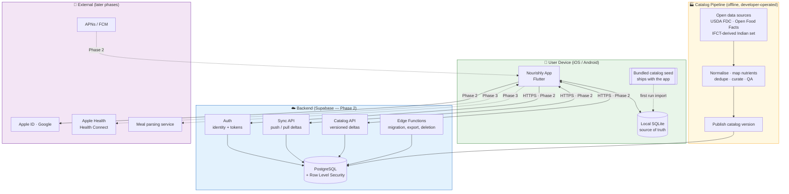
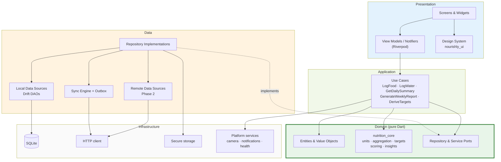
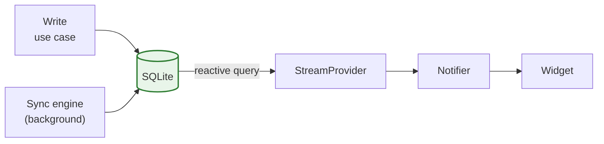
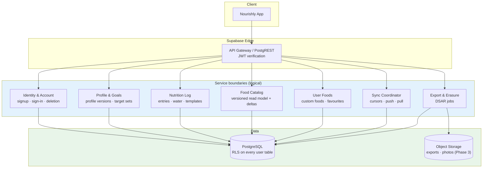

# Part III — System, Mobile, and Backend Architecture

*Sections 13–15 · [Back to index](./README.md)*

---

## 13. High-Level System Architecture

### 13.1 Architectural principles

These are the rules every subsequent decision is checked against.

| # | Principle | Consequence |
|---|---|---|
| AP-1 | **The device is the source of truth for user-generated data.** The server is a durable replica and a synchronisation relay. | No user action ever waits for the network. Sync failures are recoverable, never data-losing. |
| AP-2 | **The server is the source of truth for the food catalog.** Devices hold a versioned, read-only replica. | Catalog updates flow one way; user edits never mutate catalog rows. |
| AP-3 | **Facts are immutable; derived values are disposable.** Log entries and their nutrient snapshots are facts. Summaries, scores, and insights are derived and always rebuildable. | A corrupted or stale aggregate is a recompute, never a data-recovery incident (NFR-R-06). |
| AP-4 | **Unknown is not zero.** | Every nutrient value carries presence, and every aggregate carries coverage (§20.7). |
| AP-5 | **Calculation lives in exactly one place.** | `nutrition_core` is the sole implementation; any second implementation must pass the same golden vectors (§20.3). |
| AP-6 | **Nutrients, targets, scoring weights, and insight rules are data.** | Extending the nutrient set is a content change, not a release (TO-3). |
| AP-7 | **Every external dependency sits behind a port.** | Food providers, auth, notifications, health platforms, and AI parsers are all replaceable adapters (§14.6). |
| AP-8 | **Build the seam, defer the feature.** | Sync metadata, provider ports, and reminder rules exist in the MVP; their implementations do not. |

### 13.2 System context



**Reading the diagram:** in the MVP, only the green box and the seed import are live. Everything in blue is designed, schema-compatible, and deferred. The yellow pipeline runs on the developer's machine and produces artefacts committed to the repo and (later) published to the backend — it is *not* a runtime service.

### 13.3 Logical layering



**Dependency rule:** arrows point inward only. Presentation → Application → Domain. Data *implements* Domain ports and is injected at the composition root; the domain never names a concrete data class. This is the classic Clean Architecture dependency inversion, and it is what allows the entire scoring engine to be tested with no database and no widgets.

### 13.4 Primary runtime flow — logging a food


Everything above happens on-device with no network. The outbox insert is inside the same transaction as the entry — this is what makes sync exactly-once-effective rather than best-effort (§17.3).

### 13.5 Deployment view

| Component | Where it runs | MVP? | Ops burden |
|---|---|---|---|
| Flutter app | User device | Yes | App store releases |
| Bundled catalog seed | Shipped in the app bundle | Yes | Rebuilt per release |
| Postgres + Auth + RLS | Supabase managed | No (Phase 2) | Managed; backups configured, restore rehearsed |
| Sync API | Supabase PostgREST + Edge Functions | No (Phase 2) | Minimal |
| Catalog API | Supabase (read-only tables + CDN-cached delta files) | No (Phase 2) | Publish on catalog release |
| Catalog ETL pipeline | Developer machine / CI job | Yes (produces the seed) | Run per catalog release |
| Crash reporting | Vendor | Yes | Minimal |

**MVP has no servers to operate.** That is a deliberate and significant de-risking choice (ADR-006).

---

## 14. Mobile Application Architecture

### 14.1 Chosen pattern

**Feature-first modular architecture with Clean Architecture layering inside each feature, plus shared cross-cutting packages.** *(ADR-002)*

Two organising axes exist: by layer (all screens together, all repositories together) or by feature (everything about water logging together). Layer-first directory structures fail at scale because a single change touches four distant directories, and because nothing prevents features from reaching into each other. Feature-first keeps change local; the layering inside each feature preserves testability.

### 14.2 Why not simpler, why not more complex

| Alternative | Verdict |
|---|---|
| MVVM with repositories, no explicit domain layer | Tempting for a solo dev. Rejected: the calculation and scoring logic is the product's core intellectual asset and must be independently testable and portable. Without a domain layer, it would end up entangled with Drift row types. |
| Full DDD with aggregates, domain events, and a bus | Rejected as over-engineering for a single-user, single-writer app. Selected DDD *concepts* are used where they pay: value objects for quantities and nutrient amounts, an explicit aggregate boundary around `FoodLogEntry` + its nutrient snapshot, and a ubiquitous language documented in §22.1. |
| Redux-style single global store | Rejected: forces all state through one reducer graph; poor fit for reactive DB streams. |
| BLoC everywhere | Viable; rejected for boilerplate weight relative to Riverpod at solo-dev scale. Riverpod gives the same testability with less ceremony. |

### 14.3 Layer responsibilities and rules

| Layer | Contains | May depend on | Must never |
|---|---|---|---|
| **Presentation** | Widgets, screens, Riverpod notifiers, view state, formatting | Application, Domain (types only), Design System | Touch Drift, HTTP, or `dart:io` |
| **Application** | Use cases; orchestration; transaction boundaries | Domain | Know about widgets or SQL |
| **Domain** | Entities, value objects, ports, `nutrition_core` | Nothing outside pure Dart | Import Flutter, Drift, or any I/O |
| **Data** | Repository implementations, DAOs, DTOs, mappers, sync engine | Domain (to implement ports), Infrastructure | Leak DTOs or Drift row types upward |
| **Infrastructure** | Drift database, HTTP client, secure storage, platform plugins | — | Contain business rules |

**Enforcement:** a CI import-lint rule fails the build if `nutrition_core` or `nourishly_domain` gains a forbidden import (NFR-M-02). Without machine enforcement this rule erodes within weeks.

### 14.4 Feature module anatomy

Every feature module follows one shape, so navigating an unfamiliar feature costs nothing:

```
features/water/
├── presentation/
│   ├── screens/          # WaterScreen, WaterHistoryScreen
│   ├── widgets/          # QuickAddChipRow, HydrationRing
│   └── state/            # waterDayProvider, WaterLogNotifier
├── application/
│   └── usecases/         # LogWater, UndoLastWaterLog, GetWaterDay
└── data/
    ├── dao/              # WaterLogDao (Drift)
    ├── dto/
    └── water_repository_impl.dart
```

Domain entities (`WaterLogEntry`, `HydrationTarget`) and the `WaterRepository` port live in the shared `nourishly_domain` package rather than inside the feature, because reporting also consumes them. **Rule: if two features need a type, it belongs in the shared domain package — features never import each other** (NFR-M-03).

### 14.5 State management model

Four kinds of state, deliberately distinguished:

| Kind | Example | Mechanism | Lifetime |
|---|---|---|---|
| **Persistent domain state** | Log entries, foods, targets | SQLite, exposed as Drift reactive streams wrapped in Riverpod `StreamProvider`s | Forever |
| **Derived state** | Daily summary, score, weekly report | Computed providers over persistent state; materialised in SQLite when read-hot (§25) | Rebuildable |
| **Ephemeral UI state** | Search text, expanded sections, form drafts | `StateNotifier`/`NotifierProvider`, scoped to the screen and auto-disposed | Screen |
| **Session/app state** | Auth state, sync status, connectivity, unit preferences | Long-lived app-scoped providers | App |

**The critical rule:** the UI subscribes to database streams rather than to command results. Writing an entry does not push new state into the view; it writes to the database, and the view updates because its query re-emits. This makes the UI correct by construction under sync, background writes, and multi-screen edits — there is exactly one path by which state reaches the screen.



### 14.6 Ports and adapters (the future-proofing seams)

Each port is defined in the domain now, even where the MVP ships only one trivial adapter. This is where AP-8 is cashed out.

| Port | MVP adapter | Later adapters |
|---|---|---|
| `FoodCatalogRepository` | Local SQLite catalog | + remote catalog delta sync (Phase 2) |
| `FoodDataProvider` | Local catalog lookup | Open Food Facts by barcode (Phase 2); commercial API (if ever) |
| `BarcodeScanner` | *not registered* | `mobile_scanner` adapter (Phase 2) |
| `MealParser` | *not registered* | NL parser; photo recogniser (Phase 3) — both return candidates into the normal confirmation UI |
| `ReminderScheduler` | *not registered* | Local notifications (Phase 2); server push (Phase 3) |
| `AuthService` | `GuestAuthService` (returns a stable local identity) | Supabase auth (Phase 2) |
| `SyncService` | `NoOpSyncService` | Real sync engine (Phase 2) |
| `HealthDataPort` | *not registered* | HealthKit / Health Connect (Phase 3) |
| `AnalyticsPort` | No-op / minimal | Constrained by NFR-S-05 |
| `ClockPort` | System clock | Test clock (already valuable in MVP for day-boundary tests) |

`GuestAuthService` and `NoOpSyncService` are not busywork: they mean the Phase 2 work is *registering a different adapter at the composition root*, not rewriting call sites.

### 14.7 Threading and performance

- Log writes and summary recomputation are small and stay on the UI isolate; the transaction in §13.4 is sub-millisecond-scale at realistic entry counts.
- **Background isolates** are used for: catalog seed import on first run (thousands of inserts), catalog delta application, data export, and any monthly recomputation over long histories. These are the only operations that can plausibly jank a frame.
- Search is debounced ~120 ms and cancels in-flight queries on new keystrokes.
- Reports are computed from materialised daily summaries (§25), so a monthly report reads ~31 rows, not ~3,000 entries.

### 14.8 Error handling model

- Use cases return an explicit `Result<T, Failure>` (sealed) rather than throwing for expected failures. Exceptions are reserved for programmer errors.
- Failure taxonomy: `ValidationFailure`, `NotFoundFailure`, `StorageFailure`, `NetworkFailure`, `AuthFailure`, `SyncConflictFailure`, `UnknownFailure`.
- **`NetworkFailure` must never surface in a logging flow** (NFR-O-02). If it can, the flow has an architecture bug.
- User-facing messages are mapped from failures at the presentation layer, never constructed in the domain.

### 14.9 Testing strategy

| Level | Scope | Target |
|---|---|---|
| Unit — `nutrition_core` | Conversions, aggregation, target derivation, scoring, insight rules | ≥ 95% line coverage; the highest-value tests in the project |
| **Golden vectors** | Versioned JSON input/expected-output fixtures for the whole calculation pipeline (§20.3) | Every scoring-ruleset change must produce a new version, never mutate an existing vector |
| Unit — use cases | Orchestration with fake repositories | ≥ 90% |
| Integration — data | Real in-memory SQLite: DAOs, migrations, aggregate SQL | Every migration tested against a populated fixture DB (NFR-R-03) |
| Widget | Key screens, empty/loading/error states, accessibility semantics | Primary flows |
| End-to-end | J-1, J-2, J-3, J-6, J-7 on both platforms | Pre-release |
| Property-based | Aggregation invariants (order independence, additivity, unknown propagation) | Core aggregation only |

---

## 15. Backend Architecture

### 15.1 Backend strategy decision

Three options were weighed (full analysis in ADR-006):

| Option | Assessment |
|---|---|
| **No backend, ever** | Cheapest and simplest. Rejected: device loss means data loss; users who switch phones churn permanently; catalog corrections require an app-store release. |
| **Full backend from day one** | Most capable. Rejected for MVP: auth, sync, and server ops are the single largest engineering cost in the plan, and none of it is needed to validate the core hypothesis (§9.5). Building it first delays learning by ~6 weeks. |
| **Hybrid: sync-ready model now, backend switched on in Phase 2** ✅ | **Chosen.** The MVP ships with no servers. The data model, ID scheme, tombstones, and outbox exist from the first commit, so Phase 2 is additive rather than a migration. |

The failure mode this avoids is well known and expensive: shipping a local-only app with integer autoincrement primary keys, hard deletes, and no change tracking, then discovering that adding sync requires rewriting every table and migrating every existing user's database. The cost of avoiding it now is roughly one day of schema design.

### 15.2 Backend components (Phase 2)



**These are service *boundaries*, not microservices.** They are schemas, table groups, and function modules inside one Postgres database and one deployment. Splitting them into separate services at this scale would add operational cost and distributed-transaction problems in exchange for nothing. The boundaries matter because they define *data ownership* and give a clean extraction seam if scale ever demands it (§31.4).

### 15.3 Data ownership

| Domain | Owner | Writer | Reader | Notes |
|---|---|---|---|---|
| Identity (user id, auth identities) | Identity | Server only | Client (own record) | Client never writes identity |
| Profile versions, target sets | Profile & Goals | Client (synced) | Client | Server validates shape, not content |
| Food log entries, water logs, templates | Nutrition Log | **Client only** | Client | Server is a replica; it never computes or mutates these |
| Custom foods, favourites | User Foods | Client (synced) | Client | Scoped to the owner |
| Food catalog | Catalog | **Server only** (via pipeline) | Client (read-only replica) | One-way flow (AP-2) |
| Daily summaries, scores, reports | — | **Client only, and never synced** | Client | Derived data (AP-3); syncing it would create a second source of truth and the ruleset-version skew problem in §25.7 |
| Sync cursors, device registry | Sync Coordinator | Server | Client | — |

The row worth arguing about is the last-but-one. **Derived data is deliberately excluded from sync.** A new device recomputes summaries from synced entries after pull. This keeps exactly one authority for the scoring ruleset (the client's `nutrition_core` version) and avoids a whole class of "device A and device B disagree about Tuesday's score" bugs.

### 15.4 Why Supabase over Firebase

| Criterion | Supabase | Firebase |
|---|---|---|
| Data model fit | Postgres — relational, exactly matches the nutrient/entry/target model; aggregate SQL is natural | Firestore documents; nutrient aggregation requires denormalisation or client fan-out |
| Isolation guarantee | RLS enforced by the database (NFR-S-04) | Security rules in a separate rule language, enforced at the API layer |
| Query power for catalog | Full SQL, trigram/FTS indexes for server-side search | Limited querying; would need a separate search service |
| Exit cost | Standard Postgres, self-hostable OSS | High; proprietary APIs throughout |
| Cost predictability | Predictable at this scale | Read-count-based; a chatty client can surprise you |
| Auth breadth | Apple, Google, email OTP — sufficient | Broader, marginally better tooling |
| Offline SDK | Weaker — but irrelevant, since offline is owned by the local SQLite layer, not by the backend SDK | Stronger built-in offline |

The last row deserves emphasis: Firebase's headline advantage (offline persistence) is worth nothing here, because AP-1 puts offline correctness in the app's own storage layer where it can be reasoned about and tested. Choosing Firebase for its offline SDK would mean adopting its data model to get a capability already owned.

### 15.5 Backend responsibilities — and, more importantly, non-responsibilities

**The backend does:**
- Authenticate users and issue tokens.
- Store and return user-owned records, enforcing per-row isolation.
- Assign a monotonic `server_seq` to every accepted change (the sync cursor, §17.4).
- Serve versioned food catalog deltas.
- Run account deletion and data export as asynchronous jobs.
- Detect and reject malformed or oversized payloads.

**The backend does not:**
- Compute nutrition totals, scores, or insights. *(AP-5 — one implementation, on the client.)*
- Derive nutrition targets.
- Decide conflict outcomes beyond mechanical last-writer-wins on a per-record basis (§17.6).
- Generate reports.
- Hold business rules that the client would need to duplicate.

This keeps the backend a thin, boring, cheap, and highly reliable component — which is the correct shape for a solo-developer product. It also means a backend outage degrades the app to exactly its MVP behaviour: everything works, nothing syncs.

### 15.6 Reliability and operations

| Concern | Approach |
|---|---|
| Backups | Managed daily Postgres backups + PITR; **restore rehearsed before launch, not after an incident** |
| Migrations | Versioned SQL migrations in the repo, applied via CI; additive-only where possible; a rollback plan per migration |
| Observability | Request/error rates, sync push/pull latency, outbox age percentiles reported by clients, catalog delta hit rate |
| Rate limiting | Per-user limits on sync push size and frequency; hard caps on batch size |
| Abuse | Custom food creation and error reports rate-limited; catalog is write-protected from clients entirely |
| Incident posture | Because the client is fully functional offline, a backend outage is a P2, not a P1. This is an underrated benefit of AP-1 |

---

*Continue to [Part IV — Offline, Sync, and Auth](./04-offline-sync-auth.md).*
