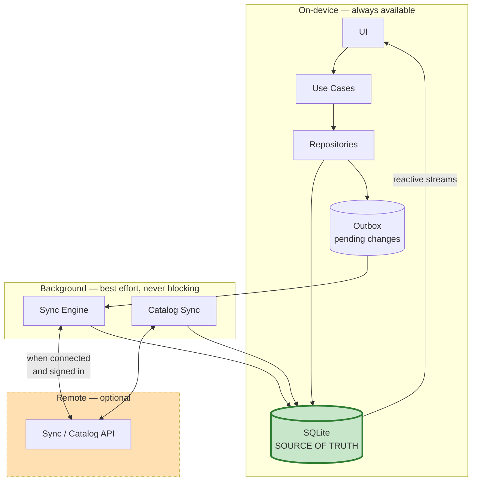
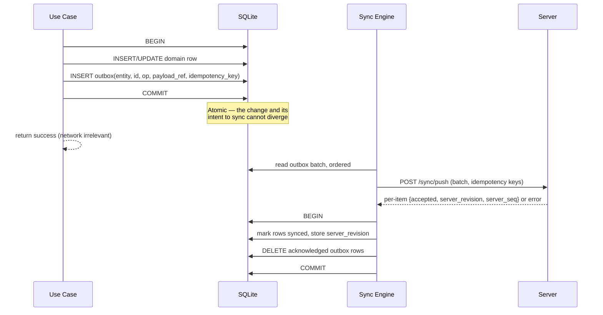
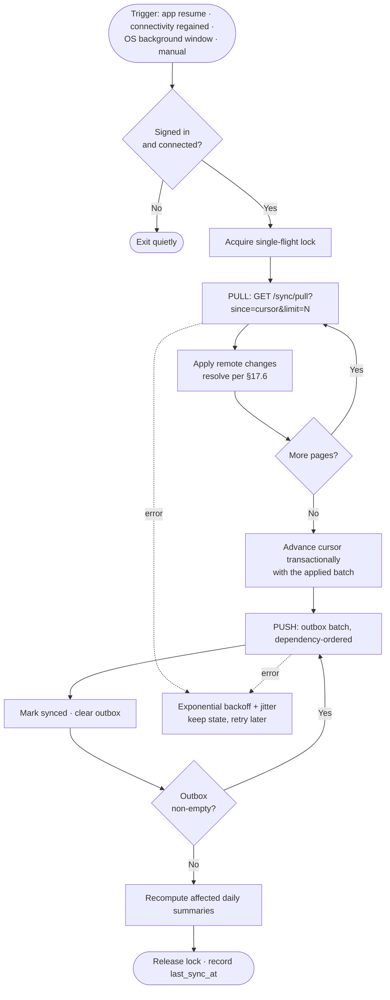
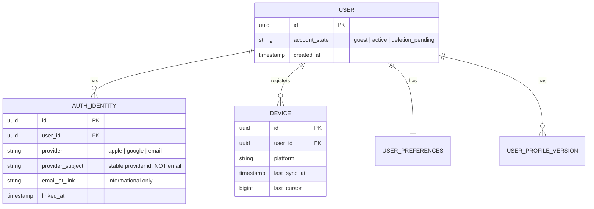
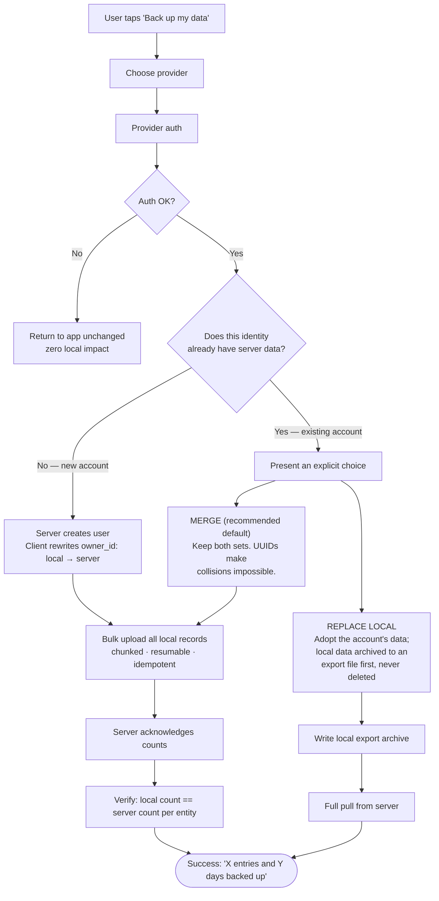

# Part IV — Offline, Synchronization, and Authentication

*Sections 16–18 · [Back to index](./README.md)*

---

## 16. Offline-First Architecture

### 16.1 The requirement, stated precisely

"Offline support" is usually implemented as a cache with a degraded mode. That is not what is required here. Nutrition logging happens in restaurants, on trains, in office basements, and on flights — the moments of *worst* connectivity are the moments of *highest* logging intent. Therefore:

> **Offline is the normal operating mode. Connectivity is an optional enhancement that adds durability and multi-device access, and nothing else.**

**This holds even though the backend is live at launch.** A working API is a standing temptation to put a network call on a path that does not need one; the rules below are what prevent that drift.

Concretely (NFR-O-01…05):
- Every core feature — logging, viewing, computing, reporting, target management — works with the radio off, indefinitely, with no banner, no spinner, and no degraded state.
- A brand-new install works fully offline, including food search, before it has ever reached the network.
- There is no code path where a logging action can produce a network error.

The last point is architecturally enforceable: `LogFoodUseCase` and `LogWaterUseCase` have no dependency on any network port. It is impossible for them to fail on connectivity, because they cannot reach it.

### 16.2 Local-first data flow

The user-facing path (green) and the network path (orange) are fully decoupled. They meet only at the database and the outbox, both of which are transactional.

### 16.3 What is stored locally

| Data | Storage | Lifetime | Size estimate |
|---|---|---|---|
| Food catalog replica (~30k foods + servings + nutrient values) | SQLite, read-only from the app's perspective | Permanent, updated by delta | 25–45 MB |
| FTS5 search index | SQLite | Permanent | 5–10 MB |
| User profile versions, preferences | SQLite | Permanent | < 100 KB |
| Target sets (effective-dated) | SQLite | Permanent | < 100 KB |
| Food log entries + nutrient snapshots | SQLite | Permanent | ~1.5–3 MB / year |
| Water logs | SQLite | Permanent | ~150 KB / year |
| Custom foods, favourites, meal templates | SQLite | Permanent | < 2 MB |
| Daily summaries + scores (materialised) | SQLite | Permanent, rebuildable | ~500 KB / year |
| Outbox | SQLite | Until acknowledged | Bounded (§17.9) |
| Sync state (cursors, device id) | SQLite | Permanent | < 1 KB |
| Auth tokens | Secure storage (Keychain / Keystore) — **never the database** | Session | — |

Two-year projection: **well under 150 MB** (NFR-E-04), dominated by the catalog rather than the user's own data.

### 16.4 The bundled seed catalog

The most important offline decision in the design: **the food catalog ships inside the app bundle**, even though a catalog API is live at launch.

- A compressed, pre-built SQLite file (or a compact binary import format) is included as an asset.
- On first launch, a background isolate imports/attaches it and builds the FTS index, behind a one-time progress state in onboarding — which is dead time anyway while the user reads the value screens.
- Rejected alternative: download the catalog on first run. It would make first launch dependent on connectivity, break the "install on the plane" case, and add a failure mode to the most fragile moment in the user's relationship with the app.
- Trade-off accepted: a larger download. The catalog ageing between releases is solved by over-the-air deltas (§19.8), which ship in v1.0. The size is within NFR-P-09.
- The obvious alternative once a backend exists — bundle a small seed and pull the rest on first run — is **rejected**, because it makes first launch depend on connectivity and breaks the install-on-a-plane case at the most fragile moment in the user's relationship with the app.

### 16.5 Offline behaviour by feature

| Feature | Offline behaviour |
|---|---|
| Food search | Full local FTS. Identical to online. |
| Log food / water / template | Full. Written immediately, queued for sync if signed in. |
| Edit / delete | Full. Soft delete with tombstone. |
| Custom food creation | Full. Created locally with a client-generated UUID. |
| Dashboard, daily summary, score, insights | Full — all computed on-device from local data. |
| Weekly / monthly reports | Full. |
| Profile & target changes | Full. |
| Export | Full — writes to device storage. |
| Barcode lookup | Scanning works offline; a barcode present in the local catalog resolves instantly. An unknown barcode queues a lookup, says so honestly, and offers manual entry or custom-food creation immediately — the user is never left unable to log |
| Recipes | Full — composition is computed locally from catalog ingredients |
| Reminders | Full — notifications are scheduled locally on the device (§29.3) |
| Health platform read/write | Local OS APIs; works offline |
| Sign-in / account creation | Requires network. Presented as such, and never on a path that blocks logging |
| Sync | Queued; status visible in settings; never blocks anything |
| Catalog delta download | Background, opportunistic, unmetered by default; the bundled catalog is always sufficient on its own |
| AI meal parsing *(v1.1)* | Will require network; falls back to manual logging, which is always available |

### 16.6 Connectivity and the UI

- Connectivity is observed but **not used as a gate**. There is no "offline mode" toggle and no full-screen offline state.
- The only connectivity-derived UI is a sync-status affordance in Settings: last synced time, pending change count, and any actionable error (FR-S-05).
- Anti-pattern explicitly avoided: a persistent "You are offline" banner. It trains users to believe the app is broken when it is working exactly as designed.

### 16.7 Data safety on device

| Threat | Mitigation |
|---|---|
| Process kill mid-write | All multi-row writes in a single transaction; UI acknowledges only after commit (NFR-R-02) |
| Corrupted database file | Periodic integrity check; automatic local snapshot before each schema migration; restore path from the snapshot (NFR-R-08) |
| Failed migration | Migration runs against a copy; the live DB is swapped only on success; failure retains the old DB and reports rather than wiping (NFR-R-03) |
| App uninstall while in guest mode | Local data is lost. Signed-in users lose nothing. This is the strongest argument for creating an account and should be made once, contextually, without alarm — never as a nag |
| Device loss/theft | OS disk encryption; optional biometric app lock; optional SQLCipher (§30.3) |

---

## 17. Synchronization Strategy

*Synchronisation ships in the first release. §17.2's schema requirements must be in the very first migration regardless — retrofitting them is prohibitively expensive.*

### 17.1 What makes this sync problem easy — and where it is genuinely hard

It is worth being precise, because a lot of sync complexity is avoidable here.

**Easy, by nature of the domain:**
- One user, and in practice one device writing at a time. Concurrent edits are rare.
- Log entries are **append-mostly facts**. They are created, occasionally edited or deleted, and never collaboratively co-authored.
- No ordering dependencies between records — a food log entry does not depend on another entry.
- Derived data is not synced at all (§15.3), removing an entire conflict class.

**Genuinely hard:**
- Guest→account migration with possible pre-existing server data (§18.5).
- A device offline for months, then reconnecting with a large outbox (NFR-O-05).
- Referential integrity across the sync boundary: an entry referencing a custom food that has not yet been pushed.
- Clock skew — device clocks are not trustworthy for ordering.
- Not double-applying a change whose acknowledgement was lost in transit.

The design targets these five, and deliberately does not adopt heavyweight machinery (full CRDTs, operational transform) for the easy cases.

### 17.2 Foundations that must exist in the first schema migration

Non-negotiable from schema v1, before any sync code is written:

| Requirement | Reason |
|---|---|
| **UUIDv7 primary keys, generated on the client** | No server round-trip to create a record; no id collisions on merge; time-ordered so index locality is preserved. Autoincrement integers would be fatal here. |
| **`created_at`, `updated_at` (device clock, UTC)** | Change detection and human-readable ordering |
| **`deleted_at` soft-delete tombstone** | A hard delete cannot be propagated; the record simply reappears from another replica |
| **`owner_id`** on every user-owned row | Guest uses a local sentinel; sign-in rewrites it (§18.4) |
| **`sync_state`** (`pending` / `synced` / `conflicted`) | Distinguishes local-only from confirmed |
| **`server_revision`** (nullable) | The server's version of the row, for optimistic concurrency |
| **`outbox` table** | Durable, transactional change queue |
| **`sync_cursor`** per entity group | Resumable incremental pull |
| **`device_id`** | Attribution and loop prevention |

### 17.3 The outbox pattern

Every mutation writes the domain row *and* an outbox record **in the same transaction**:

**Why this and not "sync the diff on demand":** an outbox makes the queue durable across process death (NFR-O-04), makes retries safe, gives an observable backlog metric, and — most importantly — removes any need to scan the whole database to work out what changed.

**Idempotency:** each outbox record carries a stable `idempotency_key` (`device_id` + local monotonic sequence). The server records applied keys and returns the prior result for a repeat. This is what makes a lost acknowledgement harmless (NFR-R-04).

### 17.4 Sync cycle

One cycle, always in this order:

**Pull before push,** deliberately: the client sees the server's current state before submitting its own changes, so conflicts are detected on the client where full record context exists, rather than being adjudicated blindly by a server that owns no business rules (§15.5).

**Cursor semantics:** the server assigns a monotonically increasing `server_seq` to every accepted change. The client's cursor is the highest `server_seq` it has durably applied. The cursor advances **in the same transaction** as the applied batch — this is what makes an interrupted pull resumable with no gap and no double-apply (NFR-R-05).

**Triggers** (NFR-E-02): app foreground resume, connectivity regained, OS-scheduled background window, explicit user action, and after a burst of local writes settles (debounced). **Never a polling timer.**

### 17.5 Dependency ordering and partial sync

Records have referential dependencies. Push order is topological:

1. Profile versions, target sets
2. Custom foods, then their servings
3. Meal templates, then template items
4. Food log entries, then their nutrient snapshots
5. Water logs (independent — can go any time)

If a batch fails midway, accepted items are cleared from the outbox and the rest are retried. Because pushes are idempotent and ordered, a partially applied batch is a normal, safe state — not an error condition.

**Server-side referential safety:** an entry arriving before its custom food is rejected with a specific, retryable "missing dependency" error rather than a foreign-key violation, and the client re-queues it behind the dependency. Belt and braces on top of the client's ordering.

### 17.6 Conflict resolution

The strategy is **domain-aware per entity**, not one global rule. A single LWW policy applied everywhere is the usual source of "my water total went backwards" bugs.

| Entity | Policy | Rationale |
|---|---|---|
| **Water log entry** | **Conflict-free by construction.** Each log is a separate immutable row with its own UUID. Two devices logging 250 ml produce two rows; the daily total is a `SUM`, never a stored mutable counter | This is the single most important modelling choice in the sync design. A mutable `water_total_for_day` field would require counter-merge logic (or a PN-Counter CRDT); immutable rows make the set grow-only and the merge trivially correct |
| **Food log entry** | Field-level LWW on `updated_at`, with `deleted_at` winning over any concurrent edit | Deleting is a stronger intent than editing; resurrecting a deleted entry is the worse failure |
| **Nutrient snapshot rows** | Not independently merged — they are part of the entry aggregate and replaced wholesale with it | They are derived from the entry; independent merging could produce an entry whose snapshot disagrees with its quantity |
| **Custom food** | Field-level LWW; a food referenced by any entry is never hard-deleted, only tombstoned | Preserves history (AP-3) |
| **Favourites** | Grow/shrink set with per-item LWW on the toggle timestamp | Idempotent, order-insensitive |
| **Meal template + items** | Whole-aggregate LWW (the template and its items move together) | Partial item merges produce nonsensical templates |
| **Profile version** | Effective-dated append-only; never merged | A weight change on 3 March and one on 5 March are two facts, not a conflict |
| **Target set** | Effective-dated append-only; never merged | Same |
| **Preferences** | Field-level LWW | Small blast radius |
| **Daily summary / score** | **Never synced.** Recomputed locally after pull | §15.3 |

**Clock skew:** device clocks are untrusted for ordering. The server stamps `server_received_at` and assigns `server_seq`; when two versions of a record collide, ordering uses `server_seq` as the tiebreaker, with the device `updated_at` used only as an intent hint and for user-facing display. A device whose clock is wildly wrong is detected on sync (comparing server time to device time) and surfaced, since it also corrupts day boundaries.

**User-visible conflicts:** there are essentially none by design. If a genuinely irreconcilable case appears (the same entry edited differently on two devices within the same sync window), LWW applies silently and the losing version is retained in a local `conflict_log` for 30 days for diagnostics. Prompting a single user to adjudicate their own edit is bad UX and should be avoided.

### 17.7 Deletion semantics

- Deletes are always soft: `deleted_at` set, row retained.
- Tombstones are retained for **180 days**, comfortably longer than the realistic maximum offline window, then purged locally and server-side by a scheduled job.
- A device offline longer than the tombstone window risks resurrecting deleted records. Mitigation: the server records each device's last-seen cursor; if a device's cursor is older than the tombstone horizon, the server responds with a **full-resync directive** and the client rebuilds from a snapshot rather than a delta. This is rare, correct, and much simpler than indefinite tombstone retention.

### 17.8 Retry and backoff

| Failure | Response |
|---|---|
| No connectivity | Do nothing; wait for the connectivity signal. No retry loop, no battery cost (NFR-E-01) |
| 5xx / timeout | Exponential backoff with full jitter: 2s → 4s → 8s → … capped at 30 min, reset on success |
| 429 | Honour `Retry-After` |
| 401 | Attempt token refresh once; on failure, mark the session as needing re-auth and surface it non-blockingly |
| 409 (concurrency) | Re-pull the affected record, re-resolve per §17.6, re-push |
| 400 (malformed / permanently unacceptable) | Do **not** retry indefinitely. Move to a `sync_dead_letter` table, log, and surface once in Settings. A poison item must never block the queue behind it |
| Batch too large | Halve the batch size and retry; adaptive sizing thereafter |

### 17.9 Bounding the outbox

- Outbox rows are small: entity type, id, operation, idempotency key, and a reference to the live row (payload is read at push time, not copied). This means the outbox cannot double the database size.
- Coalescing: repeated updates to the same record collapse to one pending update. Create-then-delete before any push collapses to nothing.
- If the outbox exceeds a sanity threshold (say 50k rows), sync switches to a bulk-upload path rather than paging a huge queue — the same path used for guest→account migration (§18.5).

### 17.10 First sync after sign-in on a device that already has data

This is the guest→account migration case, treated as a first-class flow rather than a special case of normal sync — see §18.5. Because guest mode is the default entry path (ADR-007) and sync is live at launch, **this flow runs for essentially every user who ever creates an account.** It is not an edge case; it is the modal path into an account, and it should be tested and instrumented accordingly (R-5).

---

## 18. Authentication Strategy

### 18.1 Principles

1. **No signup wall.** The app is fully usable, forever, without an account. Requiring registration before the first log is the single largest avoidable drop-off in this product category.
2. **Accounts are sold on benefit, not obligation** — "back up and use on another phone," offered contextually after the user has data worth protecting (a good trigger: 7 days logged, or a device-change intent).
3. **Identity is minimal.** Nourishly stores the least identity data that supports auth and account recovery.
4. **Every auth flow is reversible and non-destructive.**

### 18.2 Supported methods

| Method | Phase | Notes |
|---|---|---|
| **Guest (anonymous local identity)** | v1.0 | The default. A locally generated `owner_id`; no credentials, no server contact |
| **Sign in with Apple** | v1.0 | **Mandatory on iOS** if any third-party sign-in is offered (App Store guideline 4.8). Must support the private-relay email and the "hide my email" case — never key user identity on the email address |
| **Google Sign-In** | v1.0 | Primary method for the Android/India audience |
| **Email one-time code (OTP / magic link)** | v1.0 | Password-free by design: no password storage, no reset flow, no credential-stuffing exposure. Preferred over email+password |
| Email + password | — | **Not planned.** Adds password storage, reset flows, and breach liability for no user benefit here |
| Phone / SMS OTP | Future | Common and trusted in India, but adds per-message cost and fraud surface. Revisit if email OTP underperforms with Indian users — an explicit open question (§35) |

### 18.3 Identity model

**Critical detail:** identity is keyed on the provider's stable subject identifier, never on the email address. Apple's private relay can change the visible address, and users change emails. Multiple identities may link to one user, which is what allows "I signed in with Google last time and Apple this time" to resolve to the same account rather than silently creating a duplicate.

### 18.4 The guest identity

A guest user has a real `owner_id`: a UUID generated at first launch and written to every user-owned row, exactly as a signed-in user's would be. There is no separate "local mode" representation.

This is what makes §18.5 a rewrite of one column rather than a walk over every table, and it is why guest mode costs almost nothing to support despite being a full first-class identity. A guest is simply a user whose `owner_id` has not yet been reconciled with a server account.

### 18.5 Guest → account migration *(the highest-consequence flow in the product)*

**Requirements on this flow:**

- **Interruptible and resumable.** Upload is chunked with idempotency keys; killing the app mid-migration and reopening resumes rather than duplicating (NFR-R-04).
- **Never destructive.** The "replace local" branch writes a complete local export *before* anything is cleared. There is no path in this design that deletes user data without a recoverable copy.
- **Verified, not assumed.** Success is claimed only after per-entity counts reconcile. A mismatch surfaces as a retryable state, not a green tick.
- **Merge is the default** because UUID-keyed, append-mostly data merges cleanly: two breakfasts on the same day both appear, and the user can delete one. The opposite failure (silently losing 40 days) is far worse.
- **The one real merge hazard** — duplicate days from tracking on two devices before linking them — is a visible, self-correctable annoyance, not data loss. Post-merge, the app should offer a "review possible duplicates" screen (v1.0 nice-to-have, §9.3) rather than guessing.

### 18.6 Sign-out, device change, and account deletion

| Scenario | Behaviour |
|---|---|
| **Sign out** | Explicit choice, clearly worded: *keep data on this device* (default) or *remove local data* (requires typed confirmation; offers export first). Never silently wipe on sign-out — a widespread and much-hated pattern |
| **New device, signed in** | Full pull; summaries and scores recomputed locally after pull (§15.3) |
| **New device, was guest** | Data is not recoverable unless the user exported it. This must be stated plainly in onboarding and at the export screen |
| **Account deletion** | In-app, mandatory for App Store compliance. Two-step confirmation; export offered first; server data erased within 30 days; local data cleared on the device; irreversible and clearly labelled as such (§30.7) |
| **Token expiry** | Silent refresh; on refresh failure the app **stays fully usable offline** and shows a non-blocking re-auth prompt. Losing a session must never lock a user out of their own local data |

### 18.7 Security requirements

| Requirement |
|---|
| Tokens in Keychain / Keystore-backed storage, never in the app database or shared preferences (NFR-S-02) |
| OAuth via ASWebAuthenticationSession / Custom Tabs — never an embedded WebView |
| PKCE for all OAuth flows |
| Short-lived access tokens with refresh rotation; refresh reuse detection revokes the family |
| Row-level security enforced in Postgres so that a compromised client token cannot read another user's rows (NFR-S-04) |
| Email OTP rate-limited per address and per IP, with short expiry and single use |
| Optional biometric app lock for a locally sensitive dataset |

---

*Continue to [Part V — Food Data, Nutrition Calculation, and Scoring](./05-food-and-nutrition.md).*
