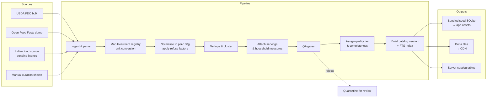
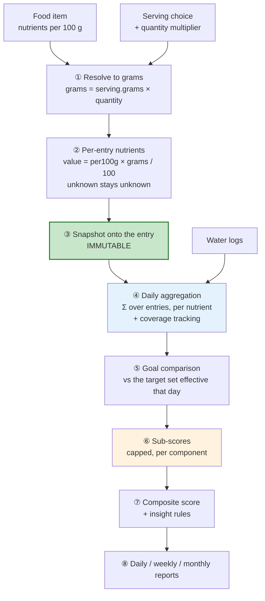
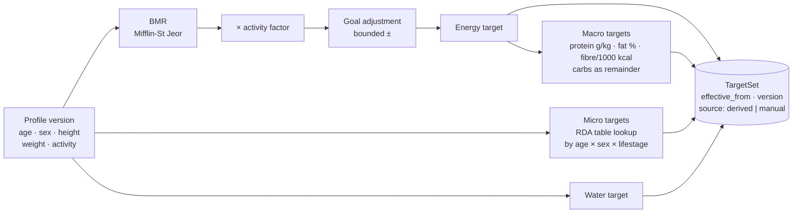

# Part V — Food Data, Nutrition Calculation, and Scoring

*Sections 19–21 · [Back to index](./README.md)*

---

## 19. Food and Nutrition Data Strategy

### 19.1 Why this is the hardest problem in the product

Everything downstream — totals, targets, scores, insights, trends — is arithmetic over food data. If the food data is wrong, sparse, or missing the user's actual foods, no amount of architectural quality upstream matters. Three failure modes are specific and predictable:

1. **Coverage failure.** The user's food is not in the database. They create a custom entry (friction) or give up (churn). Acute for Indian home cooking.
2. **Sparsity failure.** The food exists but has only energy and macros. Micronutrient reports then rest on a fraction of the day's intake — and if unknowns are treated as zeros, the app confidently reports deficiencies that do not exist. This is the failure mode that makes a nutrition app actively harmful rather than merely unhelpful.
3. **Portion failure.** The food exists with accurate per-100 g values, but the user has no idea whether their katori of dal was 120 g or 200 g. Portion estimation error commonly exceeds database error.

The strategy below is organised around these three, in that order of priority.

### 19.2 Options evaluated

| Source | Licence / cost | Coverage | Micronutrients | Indian foods | Offline-cacheable | Verdict |
|---|---|---|---|---|---|---|
| **USDA FoodData Central** (Foundation, SR Legacy, FNDDS, Branded) | US Government **public domain**; free API + full bulk download | ~1.9M entries incl. branded; excellent generic ingredients | **Best available** — Foundation/SR Legacy carry deep, lab-measured micronutrient profiles | Poor for dishes; good for ingredients (lentils, rice, wheat flour, spices) | ✅ Yes — bulk download, no restriction | **Core ingredient and micronutrient backbone** |
| **Open Food Facts** | **ODbL** (open database licence, share-alike); free | ~3M+ packaged products, global, barcode-indexed | Sparse and inconsistent — mostly the mandated label panel | Growing Indian packaged-goods coverage | ✅ Yes, with attribution and licence compliance | **Packaged goods + barcode source** |
| **IFCT 2017** (Indian Food Composition Tables, ICMR-NIN) | **Licence must be verified** — see [OPEN Q-1] | ~528 foods, Indian ingredients, analytically measured | Good, and India-specific (regional soil/variety differences matter for iron, zinc) | **Authoritative for Indian ingredients** | Depends on licence | **Highest-value Indian source — pending legal review** |
| **ICMR-NIN "Nutritive Value of Indian Foods" / recipe tables** | Same question | Cooked Indian dishes | Moderate | **Best for dishes** | Depends | Same |
| Nutritionix | Commercial, per-call | Large, strong NL parsing | Moderate | Weak | ❌ **Typically prohibits persistent storage** | Rejected for the core catalog |
| Edamam | Commercial, tiered | Large | Moderate | Weak | ❌ Usually restricted | Rejected for the core catalog |
| FatSecret / Spoonacular | Commercial | Large | Varies | Weak | ❌ Usually restricted | Rejected for the core catalog |
| Crowd-sourced user entries | Free | Unbounded | Poor | Good over time | ✅ | Supplement only, never the base |

### 19.3 The decisive constraint

> **Most commercial nutrition APIs forbid persistent local caching of their data. Offline-first (NFR-O-01) requires exactly that. The two are architecturally incompatible.**

This single constraint, more than cost, eliminates commercial APIs as the foundation. An app that must call an API to resolve a food cannot work on a train. The conclusion is unavoidable: **Nourishly must own its catalog**, built from sources whose licences permit redistribution inside an app bundle.

Commercial providers remain viable as *optional enrichment* behind the `FoodDataProvider` port (§14.6) — for example, a later fallback for packaged products absent from Open Food Facts — but never as a dependency of the logging path.

### 19.4 Recommended strategy: an owned, curated, tiered catalog *(ADR-008)*

**The Nourishly Food Catalog** is a first-party asset assembled offline by a developer-operated pipeline, versioned, and shipped to devices.

**Composition at v1.0 (~12–15k bundled, plus an on-demand long tail):**

| Tier | Count | Source | Purpose |
|---|---|---|---|
| **T1 — Curated Indian foods & dishes** | 1,500–2,500 | IFCT-derived ingredients + hand-curated dish compositions, reviewed item by item | The product's differentiator. Every item has correct household measures (katori, roti, glass, piece) |
| **T2 — Generic ingredients & international staples** | 5,000–8,000 | USDA Foundation + SR Legacy | Micronutrient backbone; the values with the deepest nutrient profiles |
| **T3 — Common branded/packaged (India-relevant)** | 2,000–5,000 | Open Food Facts, filtered by market and completeness threshold | Packaged goods people actually buy |
| **T4 — User custom foods** | Per user | The user | The escape hatch that guarantees nothing is unloggable |

**Why the curated Indian tier is worth 3–4 weeks of manual work:** it is the difference between a product Ananya (Persona 1) keeps and one she abandons in four days. Generic databases return twelve irrelevant lentil-soup entries for "dal"; a curated tier returns *Dal tadka (toor), 1 katori (150 g)*. No automated pipeline produces that. Automating it is the tempting mistake — accepting the manual cost is the correct call, and it is the largest single scope risk in the plan (§33, R-1).

**Every catalog item carries:**
- `provenance` (source dataset + original identifier), for auditability and licence attribution
- `quality_tier` — `verified` (lab-measured: IFCT/USDA Foundation) · `derived` (computed recipe composition) · `label` (manufacturer panel) · `community` (crowd-sourced) · `user` (private custom)
- `nutrient_completeness` — which of the tracked nutrients actually have values (this is what §21.5's coverage gating consumes)
- `revision` and `catalog_version`, for delta updates and reproducibility

### 19.5 Data normalisation

Everything is normalised into one internal representation before it is ever stored. This is the pipeline's core job.

| Concern | Canonical rule |
|---|---|
| **Nutrient basis** | Every food stores nutrient amounts **per 100 g of edible portion**. Liquids additionally store `density_g_per_ml` so per-100 ml can be derived rather than duplicated |
| **Nutrient units** | Fixed per nutrient by the nutrient registry: energy kcal; protein/carb/fat/fibre/sugar g; minerals mg; trace minerals and most vitamins µg. Source values are converted once, at ingest, never at read time |
| **Vitamin A** | Stored as **µg RAE**, not IU. Sources vary; conversion is applied at ingest with the source form recorded. IU→µg conversion is not a single constant (it differs for retinol vs β-carotene), so a source that reports only IU without a form is marked *unknown*, not guessed |
| **Vitamin D** | µg (1 µg = 40 IU) |
| **Vitamin E** | mg α-tocopherol |
| **Folate** | µg DFE where available; plain µg otherwise, with the form recorded — these are not interchangeable and must not be silently mixed |
| **Niacin** | mg NE where available |
| **Energy** | kcal canonical; kJ derived for display only. Where a source gives only macros, energy is *not* back-computed silently — Atwater-derived values are marked `derived` |
| **Missing values** | Stored as **absent rows, never zeros** (AP-4). A food with no vitamin D row means "unknown," and the pipeline must never emit a 0 to fill a gap |
| **Edible portion** | Values are for the edible portion; refuse factors are applied at ingest so the user never reasons about banana peels |
| **Cooked vs raw** | Treated as distinct foods, never as a conversion. Cooked dishes carry a `yield_factor` for provenance, but their stored values are for the cooked state as served |
| **Names** | Canonical English name + `alt_names[]` (regional and transliteration variants: paneer/panir, curd/dahi/yoghurt, brinjal/baingan/eggplant) + a normalised transliteration column for search |

### 19.6 Servings, portions, and household measures

**The model:** a food has 1..N named servings, each mapping a label to a mass (or volume). Everything the user logs resolves to grams before any nutrient arithmetic happens.

```
FoodItem (nutrients per 100 g)
   └── ServingSize[]
         ├── { label: "1 katori",   grams: 150, is_default: true,  household: true }
         ├── { label: "1 bowl",     grams: 250, household: true }
         ├── { label: "100 g",      grams: 100, household: false }
         └── { label: "1 serving",  grams: 180, household: false }
```

**Household measures are first-class, not a convenience layer.** For Indian foods this is the single highest-leverage UX decision in the catalog. Standard measures with defined gram weights, curated per food (a katori of dry sabzi is not a katori of dal):

| Measure | Typical range | Notes |
|---|---|---|
| Katori (small bowl) | 120–180 ml | Per-food gram weight; the most-used Indian measure |
| Roti / chapati | 35–45 g | Varies by size and flour; offer small/medium/large variants |
| Paratha | 60–90 g | Contains added fat — significant for energy accuracy |
| Idli | 35–50 g | |
| Dosa | 80–130 g | Plain vs masala are distinct foods |
| Glass | 200–250 ml | User-configurable default |
| Cup | 240 ml (US) | Distinguish from Indian "cup" usage in recipes |
| Tbsp / tsp | 15 / 5 ml | Volume → mass via per-food density |
| Piece / slice / medium | Per food | e.g. "1 medium banana, 118 g" |

**Portion uncertainty is acknowledged rather than hidden.** [ASSUMPTION A-4] Household-measure gram weights carry ±20–30% real-world variance. The design response is deliberately restrained:
- Sensible per-food defaults so the common case needs no thought.
- Quick size modifiers (small / medium / large) on measures where variance is large.
- **No false precision in the UI.** Displaying "1,847 kcal" implies accuracy the data cannot support; the dashboard rounds energy to the nearest 10 kcal and presents targets as bands rather than points (§21.3, §27.11).
- Uncertainty is *not* propagated as error bars through the whole model — that was considered and rejected as complexity users cannot act on. It is handled at the presentation boundary instead.

### 19.7 The catalog pipeline (developer-operated, not a runtime service)



**QA gates (B6)** — automated, blocking, run on every catalog build:
- Atwater sanity: `|stated kcal − (4P + 4C + 9F + 2·fibre)| ≤ 20%`, else quarantine.
- Macro mass sanity: `protein + carb + fat + fibre + ash + water ≈ 100 g` where components are known.
- Range checks per nutrient against physiologically plausible maxima (catches unit errors — mg entered where µg was meant, the most common ingest bug).
- Sodium/potassium outlier detection.
- Serving-weight plausibility: no 5 g roti, no 2 kg katori.
- Duplicate-cluster review queue.
- **Zero-vs-null audit:** any source row with a literal `0` for a micronutrient in a food where zero is implausible is flagged, because upstream datasets frequently encode "not measured" as `0`. This gate directly protects AP-4.

### 19.8 Deduplication

Duplicates arise between sources and from user-created foods.

- **Pipeline-time:** cluster by normalised name + macro-vector similarity; the highest quality tier wins as canonical, with others recorded as aliases. Ambiguous clusters go to manual review rather than being auto-merged.
- **User-created (FR-F-15):** on custom-food save, if a close catalog match exists (name similarity + macro proximity), offer "Did you mean X?" — but **always allow the user to proceed**. Blocking custom creation to enforce catalog hygiene trades a user's ability to log for a data-quality preference; that is the wrong trade.
- **Never auto-merge a user's custom food into a catalog food.** Their entry may encode a real difference (their mother's recipe). Offer, never impose.

### 19.9 Catalog updates and their effect on history

Catalog updates ship as versioned deltas from the first release: added foods, revised foods, deprecated foods, applied in the background on unmetered connections (FR-S-13).

**The rule that protects trust:** a catalog revision **never** changes a past log entry, because nutrient values were snapshotted at log time (§20.5). If dal's iron value is corrected, yesterday's report is unchanged. The user may opt into "recalculate history with updated food data" from Settings — an explicit, reversible, clearly-explained action. Silent retroactive change is the behaviour that makes longitudinal data untrustworthy, and it is forbidden here.

### 19.10 Recipes and multi-ingredient meals

`FoodItem` carries a `kind` discriminator: `ingredient | dish | branded | recipe | user_custom`. A recipe is a `FoodItem` whose nutrients are computed from its components:

```
Recipe = Σ(ingredient_i × grams_i) → total nutrients
       ÷ cooked_weight (= raw_weight × yield_factor)
       → per-100g values → portions
```

Cooking yield (water loss/gain) materially changes per-100 g values and is the detail most implementations get wrong. Nutrient retention factors (vitamin C loss on boiling, for example) are a Future refinement, explicitly not attempted at first.

Recipes ship in v1.0 (§9.1). Two consequences worth stating: a recipe is a `FoodItem`, so it is loggable, favouritable, and template-able with no special handling anywhere in the app; and because entries snapshot nutrients at log time (§20.5), editing a recipe never rewrites meals already logged from it. Nutrient retention factors (vitamin C loss on boiling, for example) are a should-have refinement (§9.2), not a launch requirement — yield is the effect that matters most and it is handled.

### 19.11 Data quality communicated to the user

Users are told, plainly and without jargon, how good a number is:
- A quality badge on food detail: *Lab-measured* · *From label* · *Estimated* · *Your entry*.
- Nutrients with no data show **"—"** with a "not recorded for this food" explanation — never `0`.
- Reports state coverage: *"Micronutrients based on 62% of today's food."*
- Custom foods with only energy entered are visibly marked as limiting report completeness, so the consequence is understood at creation time rather than discovered later.

---

## 20. Nutrition Calculation Architecture

### 20.1 The pipeline



### 20.2 Where each stage runs

| Stage | Where | Why |
|---|---|---|
| ①–② Resolve & compute | `nutrition_core` (pure Dart), on device, synchronously at log time | Instant; no I/O; unit-testable in isolation |
| ③ Snapshot | Data layer, in the same transaction as the entry | Atomicity (§13.4) |
| ④ Aggregation | SQL `SUM ... GROUP BY nutrient` over snapshot rows, on device | The database is the right tool for summation; avoids loading entries into memory |
| ⑤–⑦ Compare, score, insights | `nutrition_core`, on device | AP-5 — one implementation |
| ⑧ Reports | On device, over materialised daily summaries (§25) | No server dependency; works offline |

**Nothing in the calculation path runs on the server.** This is not incidental: it is what makes the whole pipeline work offline, and it removes any possibility of client and server disagreeing about a number the user is looking at.

### 20.3 Cross-platform consistency

Flutter compiles the same Dart source for iOS and Android, so platform divergence is essentially impossible *within the client*. The real risks are **version skew** (two app versions computing differently) and **future re-implementation** (a server-side or web recompute).

Both are handled by treating the calculation rules as a **specified, versioned artefact**:

1. `ruleset_version` — a semantic version covering nutrient registry, target derivation, scoring weights, and scoring curves.
2. **Golden vectors** — a directory of JSON fixtures: `{ input: profile + entries + targets, expected: totals + coverage + sub-scores + composite }`. Every fixture is tagged with the ruleset version that produced it.
3. **Vectors are append-only.** Changing the rules means adding a new versioned set, never editing an old one. A diff to an existing vector in a pull request is a red flag by definition.
4. Any second implementation (server, web, a rewritten client) is correct if and only if it passes the vectors.
5. Every materialised daily summary records the `ruleset_version` it was computed with (§25.7), so stale rows are detectable and lazily recomputable.

This is the mechanism that turns "the calculation must be consistent" from a hope into a testable property.

### 20.4 Nutrition targets

**Targets are derived, versioned, and effective-dated. They are never recomputed retroactively.**



**Derivation (defaults, all overridable per FR-U-05):**

| Target | Basis | Notes |
|---|---|---|
| BMR | **Mifflin-St Jeor** | Better validated in general populations than Harris-Benedict. Katch-McArdle is more accurate but needs body-fat %, which users rarely have — offer it later as an optional refinement |
| TDEE | BMR × PAL (1.2 sedentary → 1.9 very active) | Activity level is self-reported and systematically over-estimated; the UI descriptions must be concrete ("desk job, little exercise") rather than adjectives |
| Weight loss / gain | TDEE ∓ 10–20%, **floored** at a safe minimum (≈1,200 kcal ♀ / 1,500 kcal ♂) and capped at ~±0.75 kg/week | The floor is a **safety requirement, not a default**: aggressive deficits are exactly what an unregulated wellness app must not facilitate (§30.8) |
| Protein | 0.8 g/kg general · 1.2–1.6 muscle gain · 1.6–2.0 g/kg resistance-training goal | Uses body weight; capped to plausible ranges |
| Fat | 20–35% of energy (range target, not a point) | |
| Carbohydrate | Remainder of energy after protein and fat | |
| Fibre | ~14 g per 1,000 kcal | |
| Micronutrients | **ICMR-NIN RDA 2020 for Indian users**, keyed by age × sex × lifestage; WHO/IOM DRI as fallback for other regions | Region matters: Indian RDAs differ meaningfully from US DRIs for several nutrients |
| Upper limits | Tolerable Upper Intake Levels where defined; WHO sodium guidance (<2,000 mg) | Needed for the "excess" side of scoring |
| Water | ~30–35 ml/kg body weight, adjusted for activity, with a sane floor and ceiling | [ASSUMPTION A-5] Hydration needs vary with climate and are poorly characterised; treat as guidance and make it easily overridable. Indian summer conditions plausibly justify a higher default — an open question (§35, Q-4) |

**Effective dating is the mechanism that protects history.** A `TargetSet` has `effective_from` and is immutable. Changing weight or goal creates a *new* TargetSet from that date. A day is always evaluated against the TargetSet in force on that date, so:
- Yesterday's 87 stays 87 forever.
- Weekly and monthly trends compare like with like.
- Reviewing "the week I switched to muscle gain" shows the actual transition rather than a rewritten past.

Without this, every goal change silently falsifies all historical reports — a bug that is invisible in testing and corrosive in production.

**Pregnancy/lactation lifestages** materially change micronutrient targets. [ASSUMPTION A-6] Out of scope for v1.0: they carry clinical implications the app is not positioned to own (§30.8). If added, they require explicit medical disclaimers and probably a professional-guidance referral.

### 20.5 Snapshotting — the rule that makes history immutable

When an entry is created, the computed nutrient values are **written onto the entry** alongside `food_id`, `food_revision`, `serving_id`, `quantity`, and `grams`.

| Property | Consequence |
|---|---|
| Reports are reproducible from entries alone | No dependency on the current catalog state |
| Catalog corrections do not rewrite history | §19.9 |
| Deleting a custom food does not corrupt past entries | FR-F-06 |
| Daily aggregation is a simple `SUM` over snapshot rows | No joins to foods; fast, and correct even if a food is later removed |
| Full traceability retained | `food_id` + `food_revision` allow "recalculate with updated data" when the user asks for it |

Cost: storage. ~24 nutrient rows per entry × ~6 entries/day × 365 days ≈ 52k rows/year, a few MB. **Trivially worth it**, and the alternative (recomputing from live food rows at read time) trades correctness for a saving that does not matter.

*Implementation note (not a decision to make now): the snapshot may be stored as normalised `log_entry_nutrient` rows (best for SQL aggregation) or as a compact serialised blob (best for write throughput). The recommendation is normalised rows, because the daily aggregation query is the hottest read in the app and SQL summation over indexed rows is both faster and simpler than deserialising blobs.*

### 20.6 Units and conversions

| Domain | Canonical internal unit | Display |
|---|---|---|
| Energy | kcal | kcal (kJ optional) |
| Macronutrients | g | g, 0.1 precision |
| Minerals | mg | mg |
| Trace minerals, most vitamins | µg | µg |
| Mass (food, body weight) | g / kg | kg or lb per preference |
| Volume (water, liquids) | ml | ml, L, or fl oz per preference |
| Height | cm | cm or ft/in per preference |

**Rules:**
- Conversion happens **only at the presentation boundary**. No converted value is ever persisted. Storing user-preferred units is a classic source of corruption when the preference changes.
- Volume → mass uses the food's `density_g_per_ml`; where density is unknown, water density (1.0) is used **and the value is marked as estimated** rather than silently assumed.
- **`fl oz` is ambiguous**: US = 29.5735 ml, Imperial = 28.4131 ml. Default to US; expose the choice in preferences. A 4% error on a hydration target is small but is exactly the sort of quiet wrongness that erodes trust when noticed.
- Unit conversion lives in `nutrition_core` as typed value objects (`Mass`, `Volume`, `Energy`, `NutrientAmount`) so a raw `double` can never be passed where a unit-bearing quantity is expected. This eliminates the entire class of unit-mixup bugs at compile time.

### 20.7 Rounding and precision

**Principle: compute at full precision, round once, at display.**

| Stage | Precision |
|---|---|
| Stored per-100 g values | Full source precision (`double`) |
| Per-entry computed values | Full precision, unrounded |
| Daily aggregation | Full precision |
| Score computation | Full precision |
| **Display** | Per-nutrient rules (below) |

| Displayed value | Rounding |
|---|---|
| Daily energy | Nearest 10 kcal (honest about precision — §19.6) |
| Per-entry energy | Nearest 1 kcal |
| Macros | 0.1 g under 10 g; 1 g above |
| Minerals (mg) | 1 mg |
| Micrograms | 0.1 µg under 10 µg; 1 µg above |
| Percentages | Whole numbers |
| Scores | Whole numbers |
| Water | Nearest 10 ml, or 0.1 L / 0.5 fl oz |

**Never round intermediates.** Rounding each entry then summing produces visible drift ("my meals add to 1,847 but the total says 1,851"), which users read as a bug and which erodes confidence in every other number. If a displayed breakdown must sum exactly to a displayed total, apply largest-remainder allocation at the display layer only.

Floating-point `double` is sufficient here — nutrition arithmetic has no financial-grade exactness requirement, and the input data's own uncertainty (§19.6) dwarfs floating-point error by orders of magnitude. Introducing decimal arithmetic would be false rigour.

### 20.8 Unknown propagation — the rule that makes the numbers honest

Every aggregated nutrient carries three values, not one:

```
NutrientAggregate {
  amount:            double   // sum over entries that HAVE a value
  known_energy_kcal: double   // energy from foods that report this nutrient
  total_energy_kcal: double   // energy from all foods that day
  coverage:          double   // known_energy / total_energy  ∈ [0,1]
}
```

Rules:
- An entry with no value for nutrient N contributes to `total_energy` but not to `amount` or `known_energy`.
- `coverage` is the fraction of the day's energy that came from foods actually reporting that nutrient — an energy-weighted measure, not a count of entries, because one large unmeasured meal matters more than three small measured snacks.
- Below a coverage threshold (default **0.60**), the nutrient is reported as **insufficient data** rather than as a number, and is excluded from scoring (§21.5).
- Coverage is always available to the UI (FR-N-07), so "62% of today's food reports iron" can be shown instead of a false precision.

This is the single most important correctness property in the nutrition pipeline. Almost every consumer nutrition app conflates unknown with zero, and it is why they report implausible deficiencies.

---

## 21. Nutrition Performance and Scoring Design

### 21.1 What a score is for — and its dangers

A score is a **compression device**: it turns 24 numbers into one glanceable signal and enables trend lines. That is genuinely valuable — most users cannot judge "1,850 kcal, 62 g protein, 18 g fibre" on their own (P-3).

It is also dangerous:

| Danger | Design response |
|---|---|
| **Implies a precision the data cannot support** | Coverage gating (§21.5); score bands rather than a bare number in primary UI |
| **Invites gaming** — hitting the number rather than eating well | Cap every sub-score; no bonus for exceeding (§21.4) |
| **Reads as a health verdict** | Explicit framing: "how closely today matched *your targets*", never "how healthy you were" |
| **Enables compensatory behaviour** — under-eating to raise a score | No penalty framing on energy shortfall below a threshold; no streak pressure; the score is dismissible (§21.8) |
| **Feels arbitrary and untrustworthy** | Fully decomposed and explainable: every sub-score is visible and tappable (FR-D-03) |

Because of this, the recommended design is **not** "a score", but **a set of visible sub-scores with an optional composite on top**. The sub-scores are the product; the composite is a convenience.

### 21.2 Options considered for the scoring approach

| Approach | Description | Assessment |
|---|---|---|
| **A. Simple goal-completion %** | Mean of `min(actual/target, 1)` across targets | Transparent and easy. Rejected as sufficient on its own: cannot express overshoot (2× sodium scores as "met"), and treats all nutrients as equally important |
| **B. Adapted published index** (HEI / NRF / Nutri-Score-like) | Reuse a validated food-quality index | Attractive for credibility. Rejected: these are designed for *food/diet-pattern quality*, are population- and cuisine-calibrated (HEI is US dietary-guideline specific), and are not personalised to individual targets — which is precisely what the product promises. Worth revisiting as a *secondary* "diet quality" metric later |
| **C. Weighted capped sub-scores with asymmetric curves** ✅ | Per-target scores from piecewise curves, capped at 100, weighted by goal, aggregated with a floor guard | **Chosen.** Expresses under- and over-consumption, personalises via weights, resists gaming through caps, and decomposes cleanly for explanation |
| **D. ML / learned scoring** | Model trained on outcomes | Rejected outright: no outcome data, no ground truth, unexplainable, and would create implied health claims with no evidential basis. Actively inappropriate for this domain |
| **E. No score at all** | Only raw numbers and insights | Genuinely defensible and the safest option. Rejected because it fails P-3 and makes trend lines impossible. The compromise: keep the score, cap it, explain it, and let users turn it off (§21.8) |

### 21.3 Scoring curves

Nutrients behave differently, so one curve shape cannot serve all of them. Four types:

**Type 1 — Range target** (energy, fat, carbohydrate): a target with an acceptable band. Full credit inside the band, decaying outside it, in both directions.

```
score = 100                                  when target×(1−t) ≤ x ≤ target×(1+t)
      = 100 − k · (deviation beyond band)    outside, floored at 0
```
Default tolerance `t = 0.10` for energy. Deviation is measured as a fraction of target, and the decay is deliberately gentler on the low side than the high side for energy — see §21.8.

**Type 2 — Floor target / "more is fine"** (protein, fibre, most vitamins and minerals): ramps to full credit at the target, then flat.

```
score = 100 · min(x / target, 1)      and strictly no credit above 100
```
The cap is the anti-gaming mechanism: 3× the protein target cannot compensate for zero fibre.

**Type 3 — Ceiling target / limit nutrient** (sodium, added sugar, saturated fat): full credit up to the limit, then decays.

```
score = 100                                        when x ≤ limit
      = 100 · max(0, 1 − (x − limit) / limit)      above
```

**Type 4 — Floor with an upper limit** (nutrients with a meaningful UL: sodium as a floor+ceiling case, iron, vitamin A, zinc): ramps to the RDA, plateaus, then decays as the UL is approached and exceeded — a plateau curve.

```
        100 ┤        ┌──────────────┐
            │       ╱                ╲
            │      ╱                  ╲
          0 ┼─────┘                    └────
            0    RDA               UL
```

All curves are **data, not code** (AP-6, NFR-M-05): each nutrient's curve type and parameters live in the nutrient/target registry, versioned under `ruleset_version`.

### 21.4 Components of the daily score

| Component | Contents | Default weight | Weight when goal = muscle gain | Weight when goal = hydration |
|---|---|---|---|---|
| **Energy adherence** | Type 1 on kcal | 25% | 20% | 10% |
| **Macro balance** | Protein (T2), fibre (T2), fat (T1), carbs (T1) — sub-weighted within the component | 30% | 40% (protein-dominant) | 15% |
| **Micronutrient coverage** | Mean of scored micros (T2/T4), **coverage-gated** | 20% | 15% | 10% |
| **Limit nutrients** | Sodium, added sugar, saturated fat (T3) | 15% | 10% | 10% |
| **Hydration** | Water vs target (T2) | 10% | 15% | 55% |

Weights are configuration, keyed by goal type; they sum to 100 and are shown to the user on the score explanation screen. [ASSUMPTION A-7] These weights are a considered starting point, not an evidence-based derivation. They should be reviewed with a qualified nutrition professional before launch (§37) — this is stated plainly rather than dressed up as science.

**Aggregation with a floor guard.** A plain weighted mean lets one catastrophic component hide behind four good ones — 0 g of protein alongside a perfect everything-else still scores in the 70s, which is misleading. The recommended aggregate:

```
weighted   = Σ(weight_i × subscore_i)
minComp    = min(subscore_i over components that were scored)
composite  = weighted × (0.85 + 0.15 × minComp/100)
```

The dampener caps the penalty at 15%, so a single weak component pulls the composite down noticeably without letting it dominate. The alternative — a harmonic mean — punishes low components far too aggressively and makes the score volatile and demoralising.

**Renormalisation on exclusion:** when a component is not scored (insufficient coverage, or the day is incomplete), its weight is redistributed proportionally across the remaining components and **the UI states which components were excluded**. Silently scoring 4 of 5 components as if all 5 were present would be exactly the dishonesty this design exists to avoid.

### 21.5 Coverage gating — the guard against false deficiency reporting

This is where §20.8 pays off.

| Rule | Behaviour |
|---|---|
| A micronutrient with `coverage < 0.60` is **not scored** and shows "insufficient data" | Prevents "you're deficient in B12" when B12 simply is not recorded for most of what was eaten |
| If fewer than 60% of scorable micros clear the gate, the whole **micronutrient component is excluded** and its weight redistributed | |
| The report always states coverage alongside micronutrient claims | FR-N-07 |
| Macro coverage is expected to be near 100%; if energy coverage drops below 90%, the whole day is flagged as unreliable | Custom foods with only partial data are the usual cause |

**Day completeness gating** is the companion rule:
- The score is not finalised before the day's rollover time; during the day the dashboard shows *progress*, framed as remaining budget, not a score.
- A day with implausibly low logged energy (below ~40% of target) is marked **"looks incompletely logged"** and either withheld from scoring or excluded from weekly averages — with the user able to override ("no, that's accurate").
- This single rule prevents the most common false signal in nutrition apps: a forgotten dinner reading as a severe calorie deficit and dragging weekly averages down.

### 21.6 Score presentation

- Primary display is a **band with a number**, not a bare number: *Excellent (85–100) · Good (70–84) · Fair (50–69) · Needs attention (<50)*, each with a label and an icon, never colour alone (NFR-A-04).
- Sub-scores are always visible on the daily report; the composite never appears without them.
- Tapping any sub-score reveals the exact inputs: value, target, curve type, and the resulting points.
- Withheld scores show the reason, not a blank or a zero.

### 21.7 Insights — rule-based, reviewed, and bounded

Insights (FR-D-07) are generated by a **deterministic rule engine over the daily summary**, not by a language model. Rules are data, evaluated in priority order; the top 2–4 are shown.

```
Rule {
  id, priority, condition (over summary + targets + coverage + history),
  template, category (celebrate | inform | suggest), requires_coverage
}
```

| Category | Example condition | Example output |
|---|---|---|
| Celebrate | protein ≥ target, 3rd consecutive day | "Third day in a row hitting your protein target." |
| Inform | fibre < 60% target, coverage ok | "Fibre came in at 12 g against your 30 g target." |
| Suggest | fibre low and the user logs dal frequently | "Adding a katori of dal or a serving of fruit would close most of the fibre gap." |
| Caution | sodium > UL | "Sodium was above the recommended daily limit today." |
| Data quality | micro coverage < 0.6 | "Micronutrients are based on 45% of today's food, so they're only a partial picture." |

**Language boundary — enforced by review of every template string:**

| Never | Instead |
|---|---|
| "You are deficient in iron" | "Your iron intake was below your target on 5 of 7 days" |
| "This is unhealthy" | "Sodium was above the recommended limit" |
| "You should take a supplement" | *(no supplement recommendations at all)* |
| "This will cause…" | *(no outcome claims of any kind)* |
| "Bad day" / "You failed" | "Today was below your usual" |
| Any diagnosis, condition name, or treatment | Referral to a qualified professional where relevant |

Every template is reviewed against this table before release, and the table itself is part of the definition of done for the insight engine. Rule-based generation is chosen over an LLM precisely because it makes this boundary auditable — an LLM cannot be guaranteed to stay inside it, and would also break offline operation.

### 21.8 Safety considerations

Nutrition tracking has documented associations with disordered eating. The design takes explicit positions:

| Concern | Position |
|---|---|
| Under-eating rewarded by the score | Energy uses a **range** target (Type 1). Eating far under target lowers the score, exactly as eating far over does. There is no path where restriction improves the number |
| Aggressive deficits | Hard calorie floors and a capped rate of loss (§20.4). The app will not compute an unsafe target even if asked |
| Streak pressure | No punitive streaks. Progress framing is cumulative and forgiving; a missed day is never called a failure |
| Score obsession | The score is **fully dismissible** — a setting hides it everywhere, leaving raw data and insights. Persona 4 (hydration-only) never sees it at all |
| Calorie visibility | A "hide energy" preference exists for users who track nutrients but not calories |
| Food moralising | No good/bad food labels anywhere, ever (§10.3) |
| BMI / weight framing | Weight is a series, not a judgement. No BMI categories displayed as verdicts |
| Signposting | Settings includes a plain, non-alarmist note that the app is not suitable for managing a diagnosed condition or an eating disorder, and that a qualified professional is the right resource |

These are requirements, not aspirations, and they should be verified in review before launch (§37).

---

*Continue to [Part VI — Data Model](./06-data-model.md).*
