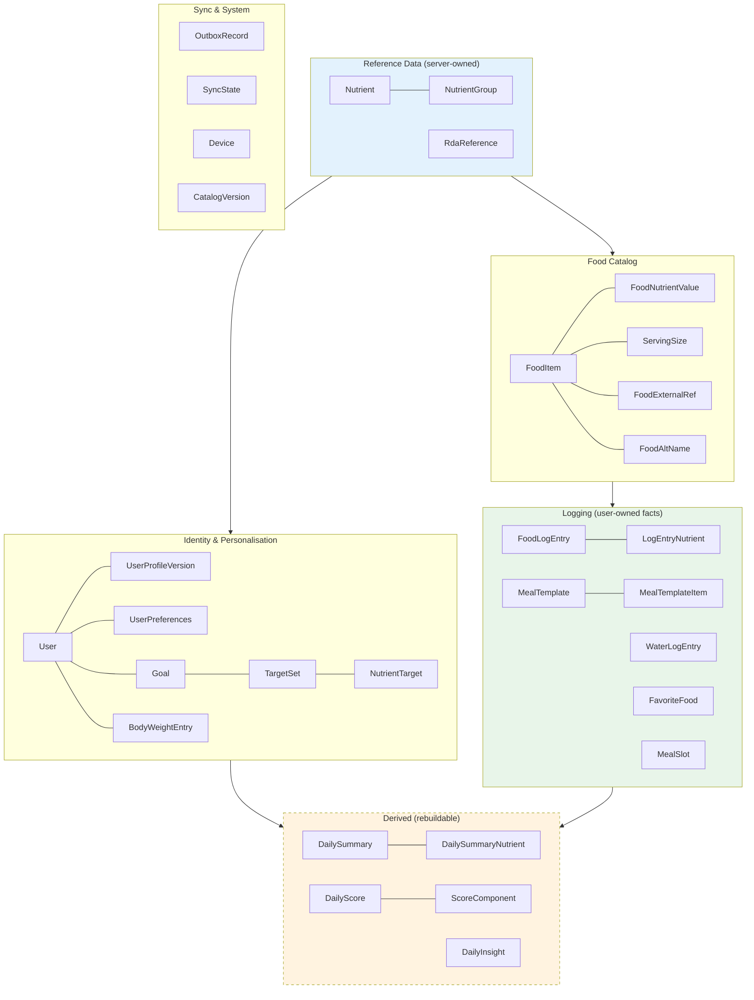
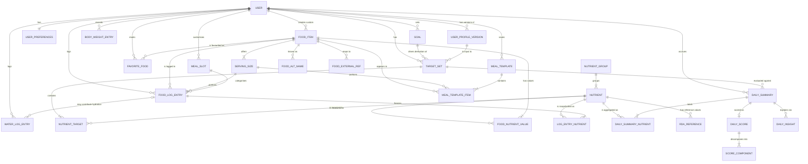
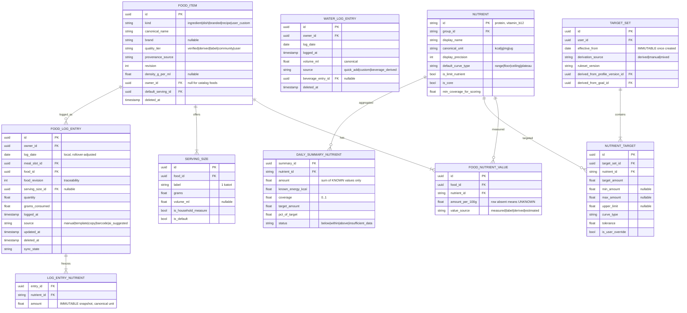

# Part VI — Data Model, ERD, and API Domains

*Sections 22–24 · [Back to index](./README.md)*

---

## 22. Data Model

### 22.1 Ubiquitous language

Fixing vocabulary now prevents the most common modelling confusion in this domain — conflating a *food*, a *serving*, and an *entry*.

| Term | Meaning | Not to be confused with |
|---|---|---|
| **Food Item** | A definition of something edible with nutrient values per 100 g. A *type*, not an event | A log entry |
| **Serving Size** | A named portion of a specific food, mapping a label to grams | A quantity |
| **Quantity** | The multiplier the user applies to a serving ("2 × 1 katori") | A serving |
| **Food Log Entry** | The fact that a user consumed a quantity of a food, in a meal slot, on a date. Immutable in substance once created | A food item |
| **Nutrient Snapshot** | The nutrient values computed and frozen at log time | Live food nutrients |
| **Meal Slot** | Breakfast / lunch / dinner / snack, or a user-defined category. An attribute of an entry | A meal template |
| **Meal Template** | A saved, reusable set of (food, serving, quantity) triples | A day's meal |
| **Target Set** | An effective-dated, versioned collection of per-nutrient targets | A goal |
| **Goal** | The user's stated intent (muscle gain, weight loss) that *drives* target derivation | A target |
| **Daily Summary** | The materialised aggregate for one user-day | A report |
| **Report** | A presentation over one or more daily summaries | A summary |
| **Coverage** | Fraction of a day's energy from foods that report a given nutrient | Completeness of logging |

### 22.2 Model overview

Six groups:

**The dashed group is disposable** — every row in it is derivable from the solid groups (AP-3). It is never synced (§15.3) and can be dropped and rebuilt.

### 22.3 Evaluation of the entity list in the brief

The brief proposed a candidate entity list. Assessment:

| Proposed | Verdict | Reasoning |
|---|---|---|
| User | ✅ Keep | |
| User Profile | ✅ Keep, **as versioned rows** (`UserProfileVersion`) | Weight and activity change over time. A single mutable profile row destroys the ability to explain why April's targets differed from March's |
| Nutrition Goal | ✅ Split into **Goal** (intent) + **TargetSet** (derived numbers) | The brief itself asks to separate user-provided info from derived targets. These are different lifecycles: intent changes rarely, targets are recomputed |
| Food Item | ✅ Keep, with a `kind` discriminator | Enables recipes later without a new entity (§19.10) |
| Food Nutrient | ✅ Keep as `FoodNutrientValue`, **one row per (food, nutrient)** | This is what makes new nutrients a data change (TO-3) |
| Serving Size | ✅ Keep | |
| Food Log | ✅ Keep as `FoodLogEntry` | |
| **Meal** | ❌ **Reject as an entity** → replace with `MealSlot` (reference) + `meal_slot_id` on the entry | A per-day "Meal" row is a pure write amplifier: it must be created, garbage-collected when emptied, and synced, and it buys nothing. Meal subtotals are a `GROUP BY` |
| Meal Entry | ❌ Merged into `FoodLogEntry` | Without a Meal entity, this indirection disappears |
| Water Log | ✅ Keep — **immutable, one row per logging action** | Load-bearing for conflict-free sync (§17.6) |
| Daily Nutrition Summary | ✅ Keep as a **materialised, rebuildable** entity | §25 |
| Nutrition Score | ✅ Keep as `DailyScore` + `ScoreComponent` | Component rows are required for explainability (FR-D-03) |
| **Weekly Report** | ❌ **Reject as a stored entity** | Computed on demand from ~7 daily summaries; storing it creates a staleness problem for no gain (§25.4) |
| **Monthly Report** | ❌ Reject, same reasoning | |
| User Preferences | ✅ Keep | |

**Added, not in the brief:**

| Entity | Why it is necessary |
|---|---|
| **Nutrient** (registry) | Nutrients as rows is the single decision that makes the model extensible (TO-3, AP-6). Without it, every new nutrient is a schema migration in three tables |
| **NutrientGroup** | Ordering and grouping for display (macros / vitamins / minerals) |
| **RdaReference** | Target derivation table keyed by age × sex × lifestage × region — data, not code |
| **LogEntryNutrient** | The immutable nutrient snapshot (§20.5) — the entity that makes history immutable |
| **FoodAltName** | Regional and transliteration variants, essential for Indian food search |
| **FoodExternalRef** | (source, external_id) — barcodes, USDA FDC ids, provenance |
| **MealSlot** | Reference table supporting custom meal categories (FR-M-11) |
| **FavoriteFood** | Explicit favourites (FR-F-07) |
| **BodyWeightEntry** | Weight series (FR-U-14), and a target-derivation input |
| **DailyInsight** | Persisted so the daily report is stable rather than regenerating differently on each view |
| **OutboxRecord / SyncState / Device** | §17 |
| **ReminderRule** | Reminder type, schedule, conditions, quiet hours — syncable, so reminder preferences follow the user across devices (§29.3) |
| **RecipeComponent** | A recipe `FoodItem`'s ingredient list with quantities and a yield factor (§19.10). The recipe's own nutrient values are derived from it once and stored like any other food's, so logging a recipe needs no special path |
| **CatalogVersion** | Delta updates and reproducibility |

**Deliberately *not* an entity: `RecentFood`.** Recents are a query over `FoodLogEntry` ordered by recency and frequency. Materialising them creates a second thing to keep consistent for no benefit — the query is trivially indexed.

### 22.4 Why nutrients are rows, not columns

The alternative — a `daily_summary` table with `protein_g`, `vitamin_a_ug`, `iron_mg`, … columns — is superficially simpler and is a trap:

| | Columns | **Rows (chosen)** |
|---|---|---|
| Add vitamin B12 | Migration in 3+ tables, app release, backfill | Insert one `Nutrient` row; delivered with a catalog delta |
| Iterate all nutrients | Hard-coded list, duplicated in every layer | `SELECT * FROM nutrient` |
| Unknown vs zero | NULL, which is easy to coerce to 0 by accident | Row absent — structurally unambiguous |
| Per-nutrient config (curve type, unit, precision, RDA) | Nowhere natural to put it | Columns on `Nutrient` |
| Sparse storage | Wastes a column per unknown | Only known values stored |
| Query ergonomics | Wide, awkward | `GROUP BY nutrient_id` — natural |
| Type safety in code | Named fields | Requires a typed registry wrapper (accepted cost) |

The one real cost — losing named-field type safety — is mitigated by generating a typed accessor set from the nutrient registry, so `summary.protein` still exists in code while the storage stays generic.

### 22.5 Entity specifications

Attributes marked **[sync]** appear on every syncable user-owned entity: `id (UUIDv7 PK)`, `owner_id`, `created_at`, `updated_at`, `deleted_at`, `sync_state`, `server_revision`, `device_id`.

---

#### Identity & Personalisation

**User** — the account or guest identity that owns all user data.
- `id`, `account_state` (guest | active | deletion_pending), `created_at`
- Owns: everything user-scoped. **Ownership root.**
- Guest users exist locally with no server counterpart until migration (§18.4).

**UserProfileVersion** — an immutable, effective-dated snapshot of the physical attributes that drive target derivation.
- `id`, `user_id`, `effective_from`, `date_of_birth`, `biological_sex` (for nutritional reference values; nullable, with a "prefer not to say" path that falls back to a neutral reference), `height_cm`, `weight_kg`, `activity_level`, `lifestage`, `region_ref` (which RDA table applies), `source` (user | derived), **[sync]**
- Relationship: User 1—N ProfileVersion. Never updated in place; a change appends a new version.
- **Why versioned:** §20.4. This is what makes historical targets explainable.

**Goal** — the user's stated intent.
- `id`, `user_id`, `goal_type`, `target_weight_kg?`, `target_rate_kg_per_week?`, `effective_from`, `effective_to?`, **[sync]**
- Deliberately separate from TargetSet: intent is user-provided data; targets are derived (a requirement stated explicitly in the brief).

**TargetSet** — an immutable, effective-dated collection of nutrient targets in force from a date.
- `id`, `user_id`, `effective_from`, `derivation_source` (derived | manual | mixed), `ruleset_version`, `derived_from_profile_version_id`, `derived_from_goal_id`, `notes`, **[sync]**
- Relationship: 1—N NutrientTarget.
- **Never mutated.** Any change creates a new set. This is the anchor of historical comparability.

**NutrientTarget** — one nutrient's target within a set.
- `id`, `target_set_id`, `nutrient_id`, `target_amount`, `min_amount?`, `max_amount?`, `upper_limit?`, `curve_type` (range | floor | ceiling | plateau), `tolerance`, `weight_hint`, `is_user_override`
- `is_user_override` is what lets manual overrides survive profile-driven recomputation (FR-U-05).

**UserPreferences** — units, display, and behaviour settings.
- `user_id`, `unit_system`, `volume_unit` (ml | L | floz_us | floz_imp), `mass_unit`, `height_unit`, `energy_unit`, `week_start_day`, `day_rollover_time`, `focus_nutrient_ids[]`, `quick_add_water_amounts[]`, `show_score`, `hide_energy`, `theme`, `locale`, **[sync]**

**BodyWeightEntry** — `id`, `user_id`, `recorded_at`, `weight_kg`, `source`, **[sync]**

---

#### Reference Data (server-owned, read-only on device)

**Nutrient** — the registry that makes the model extensible.
- `id` (stable slug, e.g. `protein`, `vitamin_b12`), `group_id`, `display_name`, `canonical_unit`, `display_precision`, `default_curve_type`, `is_limit_nutrient`, `sort_order`, `is_core` (shown by default), `min_coverage_for_scoring`
- **The single most important reference entity.** Everything nutrient-related keys off it.

**NutrientGroup** — `id`, `name` (macronutrients | vitamins | minerals | other), `sort_order`

**RdaReference** — target derivation lookup.
- `id`, `nutrient_id`, `region` (IN | INTL), `sex`, `age_min`, `age_max`, `lifestage`, `rda_amount`, `ai_amount?`, `upper_limit?`, `source_citation`, `ruleset_version`
- Data, not code (AP-6). Adding a region or updating a guideline is a content change.

---

#### Food Catalog

**FoodItem** — a definition of an edible thing.
- `id`, `kind` (ingredient | dish | branded | recipe | user_custom), `canonical_name`, `brand?`, `cuisine_tags[]`, `quality_tier`, `provenance_source`, `provenance_id`, `revision`, `catalog_version`, `density_g_per_ml?`, `default_serving_id`, `is_verified`, `owner_id?` (null for catalog, set for user customs), `deleted_at`
- Relationships: 1—N FoodNutrientValue, 1—N ServingSize, 1—N FoodAltName, 1—N FoodExternalRef.
- **Ownership:** catalog foods are server-owned and read-only on device (AP-2); `owner_id`-bearing foods are user-owned and synced.
- Custom foods and catalog foods share one entity **deliberately**: every consumer (search, logging, templates, favourites) then works identically for both, with no polymorphism at the call site.

**FoodNutrientValue** — `id`, `food_id`, `nutrient_id`, `amount_per_100g`, `value_source` (measured | label | derived | estimated), `confidence?`
- **Absence of a row means unknown.** There is no null-amount row and no zero-filling (AP-4).

**ServingSize** — `id`, `food_id`, `label`, `grams`, `volume_ml?`, `is_household_measure`, `is_default`, `sort_order`
- Every serving resolves to grams; that is the only contract downstream code depends on.

**FoodAltName** — `id`, `food_id`, `name`, `name_normalized`, `language`, `is_transliteration`
- Feeds the FTS index. This is how "panir", "paneer", and "पनीर" find the same food.

**FoodExternalRef** — `id`, `food_id`, `source` (usda_fdc | off | ifct | gtin), `external_id`
- Barcode resolution is a query against this table, requiring no separate entity: a GTIN is just another external reference.

**CatalogVersion** — `version`, `published_at`, `food_count`, `checksum`, `notes`

---

#### Logging (user-owned facts)

**MealSlot** — `id`, `owner_id?` (null = system default), `key` (breakfast|lunch|dinner|snack|custom), `display_name`, `sort_order`, `default_time_start`, `default_time_end`, **[sync]**
- System rows seeded; user rows support FR-M-11. `default_time_*` drives meal auto-selection (FR-M-02).

**FoodLogEntry** — the central fact.
- `id`, `owner_id`, `log_date` (local date, resolved with the user's rollover time), `meal_slot_id`, `food_id`, `food_revision`, `serving_size_id?`, `quantity`, `grams_consumed`, `logged_at`, `source` (manual | template | copy | barcode | ai_suggested), `note?`, **[sync]**
- Relationship: 1—N LogEntryNutrient (the snapshot).
- `grams_consumed` is stored even though it is derivable, because serving definitions can change and the resolved amount is a fact about what happened.
- `log_date` is stored explicitly rather than derived from `logged_at`, because back-dating (FR-M-04) and the configurable rollover time (FR-U-08) both break the naive derivation.

**LogEntryNutrient** — the immutable snapshot.
- `entry_id`, `nutrient_id`, `amount` (canonical unit)
- Absent row = the food did not report that nutrient (feeds coverage, §20.8).
- Written in the same transaction as the entry; never updated except by wholesale replacement when the entry is edited.

**WaterLogEntry** — `id`, `owner_id`, `log_date`, `logged_at`, `volume_ml`, `source` (quick_add | custom | beverage_derived), `beverage_entry_id?`, **[sync]**
- **Immutable and additive by design** (§17.6). `volume_ml` is canonical regardless of the display unit.
- `beverage_entry_id` links the hydration contribution of a logged beverage back to its food entry (FR-W-09), so deleting the tea also removes its water contribution.

**MealTemplate** — `id`, `owner_id`, `name`, `default_meal_slot_id?`, `last_used_at`, `use_count`, **[sync]**
**MealTemplateItem** — `id`, `template_id`, `food_id`, `serving_size_id?`, `quantity`, `sort_order`
- Applying a template creates independent `FoodLogEntry` rows with fresh snapshots. Entries never reference the template — editing a template must not alter past logs.

**FavoriteFood** — `id`, `owner_id`, `food_id`, `preferred_serving_id?`, `created_at`, **[sync]**
- `preferred_serving_id` is what makes repeat logging one tap (J-2).

---

#### Derived (rebuildable, never synced)

**DailySummary** — `id`, `owner_id`, `log_date`, `total_energy_kcal`, `entry_count`, `logged_meal_slots`, `completeness_flag`, `target_set_id` (in force that day), `ruleset_version`, `computed_at`, `is_stale`
**DailySummaryNutrient** — `summary_id`, `nutrient_id`, `amount`, `known_energy_kcal`, `coverage`, `target_amount`, `pct_of_target`, `status` (below | within | above | insufficient_data)
**DailyScore** — `summary_id`, `composite_score?`, `band`, `withheld_reason?`, `ruleset_version`
**ScoreComponent** — `summary_id`, `component_key`, `raw_score`, `weight`, `applied_weight`, `was_excluded`, `exclusion_reason`
**DailyInsight** — `id`, `summary_id`, `rule_id`, `category`, `rendered_text`, `priority`, `generated_at`

Every one of these is reproducible from entries + targets + ruleset. `is_stale` and `ruleset_version` drive lazy recomputation (§25.7).

---

#### Sync & System

**OutboxRecord** — `id`, `entity_type`, `entity_id`, `operation`, `idempotency_key`, `created_at`, `attempt_count`, `last_error`, `next_attempt_at`, `depends_on_id?`
**SyncState** — `entity_group`, `cursor`, `last_sync_at`, `last_success_at`, `status`
**Device** — `id`, `owner_id`, `platform`, `app_version`, `last_seen_at`

### 22.6 Key invariants

| # | Invariant | Enforced by |
|---|---|---|
| I-1 | A `FoodLogEntry` always has a complete `LogEntryNutrient` snapshot for every nutrient the food reported | Single transaction at write; integration test |
| I-2 | A missing `LogEntryNutrient` row means *unknown*, never *zero* | Aggregation code + property test |
| I-3 | Every `log_date` is evaluated against the `TargetSet` whose `effective_from` is the latest ≤ that date | Query construction; golden vectors |
| I-4 | `TargetSet` and `UserProfileVersion` rows are never updated after creation | Repository-level guard; no update method exists |
| I-5 | Catalog `FoodItem` rows are never written by the app | Separate read-only repository; no write path exists |
| I-6 | A `FoodItem` referenced by any entry is never hard-deleted | Soft delete only |
| I-7 | Derived tables can be dropped and rebuilt with no loss | Rebuild routine + test |
| I-8 | Every user-owned mutation produces an outbox record in the same transaction | Repository base class; test |
| I-9 | Daily water total is always `SUM(volume_ml)` over live rows — never a stored counter | No counter column exists |
| I-10 | Nutrient amounts are always in the nutrient's canonical unit | Typed value objects (§20.6) |

### 22.7 Indexing strategy

| Index | Purpose |
|---|---|
| `food_log_entry (owner_id, log_date, meal_slot_id)` | Daily view and per-meal grouping — the hottest read |
| `food_log_entry (owner_id, food_id, logged_at DESC)` | Recents and frequency ranking |
| `log_entry_nutrient (entry_id)` + `(nutrient_id)` | Snapshot fetch and per-nutrient aggregation |
| `water_log_entry (owner_id, log_date)` | Daily hydration sum |
| `food_nutrient_value (food_id)` | Food detail |
| `serving_size (food_id)` | Logging flow |
| **FTS5 virtual table** over `canonical_name` + `alt_names` + normalised transliteration | NFR-P-03 |
| `food_item (kind, quality_tier)` | Search ranking |
| `daily_summary (owner_id, log_date)` | Report period scans |
| `outbox (next_attempt_at, created_at)` | Sync batch selection |
| `food_external_ref (source, external_id)` | Barcode lookup |

### 22.8 Data retention

| Data | Retention |
|---|---|
| Log entries, water logs | Indefinite — this is the user's record and the product's value |
| Derived summaries/scores/insights | Indefinite but disposable; may be pruned beyond 24 months and recomputed on demand |
| Tombstones | 180 days, then purged (§17.7) |
| Outbox | Until acknowledged; dead-letter retained 30 days |
| Conflict log | 30 days, diagnostics only |
| Local DB snapshots | Last 2 pre-migration snapshots |

---

## 23. Entity Relationship Diagram

### 23.1 Core model

### 23.2 Attribute detail for the central entities

### 23.3 Reading guide — the three structural ideas

1. **`NUTRIENT` is referenced by four tables and hard-coded by none.** Every nutrient-bearing structure keys off the registry, which is what delivers TO-3.
2. **`LOG_ENTRY_NUTRIENT` has no path back to `FOOD_NUTRIENT_VALUE`.** The snapshot is deliberately disconnected from live catalog data. That disconnection *is* the immutability guarantee (§20.5).
3. **`TARGET_SET` sits between the user and every daily summary.** No summary is ever evaluated against "current targets" — only against the set effective on its date (I-3).

---

## 24. API Domain Design

> ## ⛔ DEFERRED — not built in the personal-use scope
>
> No API is built. This section is retained because it documents the data-ownership boundaries cleanly, which remain a useful description of the model even without a server. Retained as reference in case the scope ever changes. See [Part 0 — Personal-Use Scope](./00-scope.md).

*Domains and contracts, not implementations. Retained because the data-ownership boundaries below describe the model usefully even with no server — in particular, the rule that derived summaries and scores are never authoritative anywhere but on the device.*

### 24.1 Design principles

| # | Principle |
|---|---|
| AD-1 | The API is a **synchronisation and identity surface**, not an application API. It exposes no business operations |
| AD-2 | No calculation endpoints. The server never computes totals, targets, scores, or reports (§15.5) |
| AD-3 | Every mutation is **idempotent** via a client-supplied key |
| AD-4 | Batch-oriented, because sync moves sets of records, not single objects |
| AD-5 | Cursor-based delta reads, never offset pagination (which is incorrect under concurrent writes) |
| AD-6 | Authorisation enforced at the database (RLS), not only in application code (NFR-S-04) |
| AD-7 | Versioned from the first release (`/v1`); a client months out of date must still sync or be told clearly to upgrade |

### 24.2 Domains

| Domain | Owns | Client may | Notes |
|---|---|---|---|
| **Identity** | Users, auth identities, sessions, devices | Sign in/out, link identity, register device, delete account | Server-authoritative |
| **Profile & Goals** | Profile versions, goals, target sets, preferences, body weight | Push/pull | Server stores; never derives |
| **Nutrition Log** | Food entries + snapshots, water logs, meal slots | Push/pull | The bulk of sync traffic |
| **User Foods** | Custom foods, their servings, favourites, templates | Push/pull | Owner-scoped |
| **Food Catalog** | Catalog foods, nutrients, servings, RDA reference, versions | **Read only** | One-way (AP-2) |
| **Sync Coordination** | Cursors, sequence assignment, full-resync directives | Read cursor state | Mechanism, not policy |
| **Account Lifecycle** | Export jobs, deletion jobs, migration | Request and poll | Asynchronous by nature |

### 24.3 Domain contracts (shape, not signature)

**Identity**
| Capability | Notes |
|---|---|
| Exchange a provider credential for a session | Apple / Google / email OTP |
| Refresh session | Rotating refresh tokens with reuse detection |
| Link an additional identity to the current user | Keyed on provider subject, never email (§18.3) |
| Register / list / revoke devices | |
| Request account deletion | Asynchronous; returns a job |

**Sync (the core surface)**
| Capability | Semantics |
|---|---|
| **Pull** — given `entity_group` and `cursor`, return changes after that cursor | Returns records (including tombstones) plus `next_cursor` and `has_more`. Ordered by `server_seq`. Bounded page size |
| **Push** — submit a batch of client changes with idempotency keys | Returns **per-item** results: accepted (with `server_revision`, `server_seq`), conflicted (with the server's current version), or rejected (with a machine-readable reason). Partial success is normal and expected, never an error |
| **Bulk import** — chunked, resumable upload for guest→account migration | Same idempotency guarantees; returns per-entity counts for the verification step in §18.5 |
| **Sync status** — server time, cursor validity, whether a full resync is required | Full-resync directive when a cursor predates the tombstone horizon (§17.7) |

**Catalog**
| Capability | Notes |
|---|---|
| Current catalog version | Cheap, cacheable |
| Delta from a given version | Added / revised / deprecated foods with servings and nutrient values. Served as static, CDN-cached files — the highest-traffic and cheapest-to-serve endpoint, and the mechanism that lets the curated catalog grow without app releases (§15.1) |
| Fetch a food by id or external ref (barcode) | The long-tail path for items absent from the on-device replica; results are cached locally so the food resolves offline thereafter |
| Report a data error | Rate-limited; feeds the curation queue |

**Account lifecycle**
| Capability | Notes |
|---|---|
| Request data export | Async job; produces a signed, expiring download of the complete dataset. A *local* export path also exists and works with no account (§30.6) |
| Poll job status | |
| Confirm deletion | Two-step; irreversible; §30.7 |

### 24.4 Cross-cutting API requirements

| Concern | Requirement |
|---|---|
| Auth | Bearer JWT; RLS derives the user from the token's subject claim |
| Idempotency | `idempotency_key` per item; server retains applied keys ≥ 30 days |
| Errors | Machine-readable code + human message + `retryable` boolean. The client's retry policy keys off `retryable`, never off a string |
| Payload limits | Explicit maxima on batch size and body size; oversize returns a specific error that instructs the client to halve the batch (§17.8) |
| Compression | gzip; catalog deltas pre-compressed |
| Clock | Every response carries server time so clients can detect skew (§17.6) |
| Rate limits | Per user and per device; `Retry-After` on 429 |
| Versioning | Path-versioned; a deprecation window with an in-app upgrade prompt before any breaking change |
| Observability | Correlation id per sync cycle, propagated through logs |

### 24.5 What is deliberately absent

| Absent | Why |
|---|---|
| `GET /reports/daily`, `/weekly`, `/monthly` | Reports are computed on-device (§25). A server report endpoint would duplicate the scoring engine and create the divergence AP-5 forbids |
| `POST /score` | Same |
| `POST /targets/calculate` | Target derivation is client-side and must work offline |
| Per-record CRUD endpoints | Sync is batch-oriented; per-record endpoints would invite a chatty, online-dependent client and undermine AP-1 |
| Any social or sharing endpoint | Not in the product (§10.3) |
| Server-side search as a dependency | Search is local (NFR-P-03). A server search may exist later purely as a catalog-discovery aid, never as a logging dependency |

---

*Continue to [Part VII — Reporting and Analytics](./07-reporting.md).*
