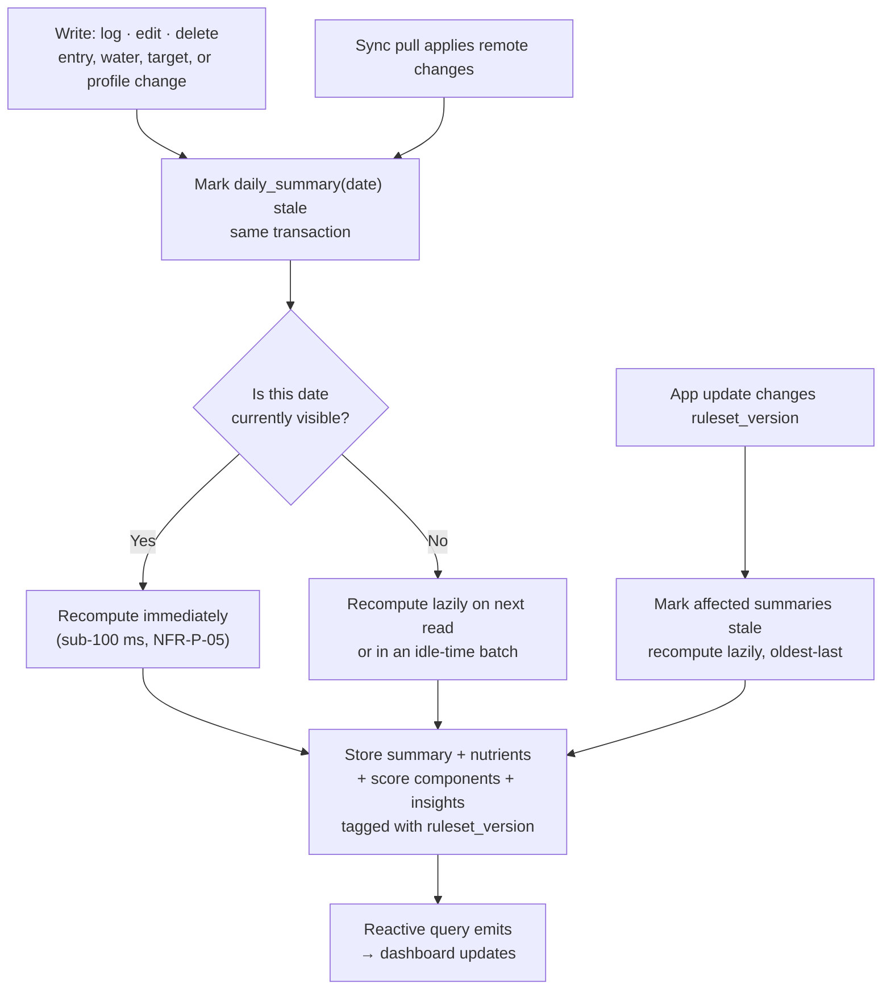
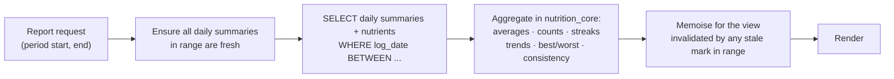

# Part VII — Reporting and Analytics Architecture

*Section 25 · [Back to index](./README.md)*

---

## 25. Reporting and Analytics Architecture

### 25.1 The core question

Reports can be produced four ways. The right answer differs by period, and picking one strategy for all three is the usual mistake.

| Strategy | How | Pros | Cons |
|---|---|---|---|
| **On demand** | Aggregate raw entries at read time | Always correct; no storage; no invalidation logic | Cost grows with history; the dashboard would re-aggregate on every keystroke-triggered rebuild |
| **Stored snapshot** | Compute once, freeze, never revisit | Fast; historically stable | Goes stale on edits and back-dated logs; needs explicit invalidation; risks showing numbers that no longer match the underlying entries |
| **Pre-calculated (materialised) + invalidation** | Compute on write, store, invalidate on change | Fast reads; bounded work per write | Requires disciplined invalidation |
| **Cached** | Memoise a computed result with a TTL | Cheap to add | TTLs are wrong in both directions — stale after an edit, recomputed needlessly when nothing changed |

### 25.2 Recommendation

> **Materialise daily summaries (write-time, invalidation-driven). Compute weekly and monthly on demand from those daily rows. Cache in memory only for the current view.** *(ADR-009)*

The reasoning is a straightforward read/write-ratio argument:

| Period | Reads/day | Underlying rows | Cost if on demand | Decision |
|---|---|---|---|---|
| **Today** | 20–50 (every dashboard render, every edit) | ~6 entries × ~24 nutrients ≈ 150 rows | Small individually, but multiplied by every render and recomputed on each of the ~6 writes | **Materialise** |
| **Past day** | Occasional | Same | Small | Materialised as a by-product |
| **Week** | 1–3 | **7 daily summary rows** | Trivial | **On demand** |
| **Month** | < 1 | **28–31 daily summary rows** | Trivial | **On demand** |

The insight that settles it: **once daily summaries exist, weekly and monthly reports are aggregations over ~7 and ~31 rows respectively.** Materialising them would buy microseconds and cost a second staleness surface. Storing weekly and monthly reports as entities (as the brief's candidate list proposed) is therefore rejected (§22.3).

### 25.3 Daily summary lifecycle

**What marks a day stale:**
- Any entry or water log created, edited, or deleted on that date.
- A sync pull touching that date.
- A new `TargetSet` whose `effective_from` covers that date *(a goal change today makes today stale, but not the past — I-3 guarantees past days keep their original targets)*.
- A `ruleset_version` change on app update.
- An explicit "recalculate with updated food data" action (§19.9).

**Recomputation is cheap and bounded:** it reads one day's entries, sums their snapshot rows in SQL, applies scoring in `nutrition_core`, and upserts. There is no cascade — one day's recompute never triggers another's.

### 25.4 Weekly and monthly computation

Aggregations are computed over daily summaries, **not** re-derived from entries — which means a monthly report reads ~31 rows plus their nutrient children, not ~180 entries and ~4,300 snapshot rows. This is what makes NFR-P-07 comfortable rather than tight, and it is the property that satisfies NFR-SC-01: **report cost is bounded by period length, never by total history.**

### 25.5 Report contents

**Daily** (FR-D-*): verdict sentence · composite score with band · all sub-scores with weights and exclusions · energy and macros vs target · micros with coverage · water · gaps · excesses · 2–4 insights · meal-by-meal breakdown with energy share.

**Weekly** (FR-WK-*):
| Metric | Definition — stated precisely, because these are easy to get subtly wrong |
|---|---|
| Average daily energy | Mean over **logged days only**, with the day count always displayed beside it |
| Average protein / water | Same denominator rule |
| Days target met | Count where the nutrient's status was `within` or `above` for floor targets, `within` for range targets |
| Score trend | Daily composites plotted; a trend arrow only when ≥ 5 days are scored |
| Best day | Highest composite among scored days, with the reason ("highest micronutrient coverage and protein met") |
| Weakest day | Shown as *informational*, never as a failure. Excluded if flagged incompletely logged (§21.5) |
| Most-missed nutrients | Ranked by days below target, **among nutrients that cleared coverage gating** |
| Consistency | Days logged / 7 and meals logged / expected — always adjacent to every average |

**Monthly** (FR-MO-*): monthly averages · daily trend with a 7-day moving average · goal-consistency percentages · chronically deficient and chronically exceeded nutrients · previous-month comparison · (Post-MVP) a score heat-map calendar.

### 25.6 Statistical honesty rules

These prevent the reports from lying by omission, and they matter more than the visualisations.

| Rule | Reason |
|---|---|
| **Averages always display their denominator.** "1,780 kcal average across 5 logged days", never a bare average | A 7-day average over 2 logged days is not a weekly average |
| **A period with < 3 logged days shows raw data and no averages or trends** | Below that, an average is noise presented as signal |
| **Days flagged as incompletely logged are excluded from averages by default**, with the exclusion visible and reversible | §21.5 — the forgotten-dinner problem |
| **Period-over-period comparison requires both periods to meet the logging threshold** | Comparing a 6-day week to a 2-day week produces a meaningless delta and a misleading arrow |
| **Trend arrows require a minimum sample and a minimum effect size** | A 1.5% change across 5 days is not a trend |
| **Micronutrient period averages carry a period coverage figure** | A month's iron average built from 40% coverage must say so |
| **No causal language, ever** | "Your fibre was higher in weeks you logged breakfast" is a correlation; it may be shown as an observation, never as a cause |

### 25.7 Ruleset versioning and historical stability

Every `DailySummary` records the `ruleset_version` used to compute it. When the app updates and the ruleset changes:

1. Summaries computed under an older version are marked stale.
2. They are recomputed lazily — on view, or in idle-time batches, newest first (recent data is what users look at).
3. **Entries and their snapshots are never touched.** Only derived values change.
4. A change that materially moves historical scores must be surfaced honestly in release notes and, for significant shifts, in-app ("we improved how fibre is scored; past scores were updated").

Silently changing 90 days of scores in an update is a trust-destroying event. This mechanism makes it visible and intentional instead.

### 25.8 Where reports are computed

**On the device, always.** Consequences:
- Reports work offline (NFR-O-01).
- No server cost scales with report views (§31).
- No possibility of client/server disagreement (AP-5).
- The trade-off: a *new* device must pull entries and recompute summaries before showing history. This runs in a background isolate with progress shown, and is a one-time cost measured in seconds for a year of data.

Server-side aggregation would only become attractive for cross-user analytics (a product Nourishly does not have) or for reports over histories too large for a device (which, at ~500 KB/year of summaries, will not occur).

### 25.9 Product analytics — a separate concern, deliberately constrained

Distinct from user-facing reports. Constrained by NFR-S-05 and §30:

| Allowed | Forbidden |
|---|---|
| Screen views, feature usage, funnel steps | Any nutrient value, food name, or score |
| Aggregate performance (cold start, search latency) | Anything reconstructing what a user ate |
| Crash reports with PII scrubbed | Weight, height, body metrics |
| Retention cohorts on opaque ids | Sharing with advertising or data brokers |

Analytics is opt-in where local law requires and is degradable: the app must remain fully functional with all analytics disabled, and this should be verified by test.

---

*Continue to [Part VIII — UX and Interaction Design](./08-ux.md).*
