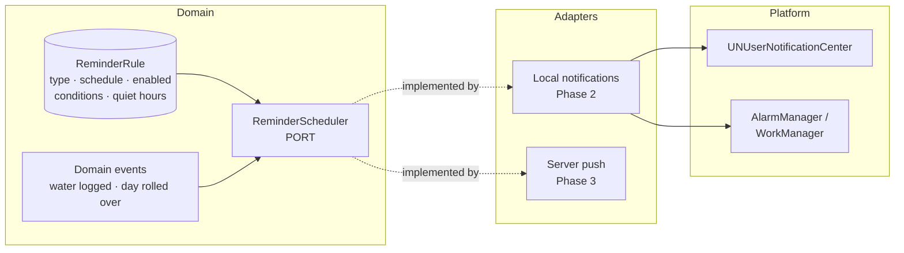

# Part VIII — UX, Screens, Navigation, and Notifications

*Sections 26–29 · [Back to index](./README.md)*

---

## 26. UX Information Architecture

### 26.1 Design principles

| # | Principle | Concrete consequence |
|---|---|---|
| UX-1 | **Logging is the product.** | The log action is reachable in one tap from every primary screen. No screen may add a step to the log path |
| UX-2 | **Answer before detail.** | Every report leads with a sentence a person can read in two seconds; numbers live underneath |
| UX-3 | **Progress, not judgement.** | "180 kcal left" beats "you have eaten 1,820 of 2,000". Never red-for-failure framing on a person's food |
| UX-4 | **Show the denominator.** | Every average, score, and coverage figure states what it is based on |
| UX-5 | **Defaults do the work.** | Last-used serving, time-inferred meal slot, most-likely quantity — pre-filled every time |
| UX-6 | **Nothing is unloggable.** | If search fails, custom creation is one tap away with the query pre-filled |
| UX-7 | **Undo over confirm.** | One-tap actions get inline undo, not confirmation dialogs. Only irreversible actions confirm |
| UX-8 | **Accessible by default, not by setting.** | Contrast, target size, labels, and text alternatives are built in, never a mode |

### 26.2 Information hierarchy

```mermaid
graph TD
    ROOT["Nourishly"]
    ROOT --> T1["① Today<br/>dashboard · live progress"]
    ROOT --> T2["② Log<br/>add food & water"]
    ROOT --> T3["③ Insights<br/>daily · weekly · monthly"]
    ROOT --> T4["④ Profile<br/>goals · settings"]

    T1 --> T1a[Day detail / meal breakdown]
    T1 --> T1b[Water detail]
    T1 --> T1c[Nutrient detail]
    T1 --> T1d[Date navigation]

    T2 --> T2a[Search]
    T2 --> T2b[Recents & favourites]
    T2 --> T2c[Meal templates]
    T2 --> T2d[Custom food creation]
    T2 --> T2e[Food detail & portion]
    T2 --> T2f["Barcode · Phase 2"]

    T3 --> T3a[Daily report]
    T3 --> T3b[Weekly report]
    T3 --> T3c[Monthly report]
    T3 --> T3d[Score explanation]

    T4 --> T4a[Profile & body metrics]
    T4 --> T4b[Goals & targets]
    T4 --> T4c[Preferences & units]
    T4 --> T4d[Reminders · Phase 2]
    T4 --> T4e[Account & sync · Phase 2]
    T4 --> T4f[Data export & deletion]
    T4 --> T4g[About · disclaimers]

    style T1 fill:#e8f5e9
    style T2 fill:#fff3e0
```



### 26.3 Depth budget

| Task | Max taps from Today |
|---|---|
| Log a repeat food | **3** (UX-1, NFR-A-07) |
| Log water | **1** |
| Log a meal template | **3** |
| See today's score and gaps | **2** |
| Open the weekly report | **2** |
| Create a custom food | **4** (acceptable — a rare action) |
| Change a target | 4 |

A design that violates the first two rows should be rejected in review regardless of its other merits.

---

## 27. Screen and Feature Design

### 27.1 Onboarding

**Purpose:** get to the first log fast, and collect only what is needed for meaningful targets.
**Content:** two value cards (what the app does, that it works offline and needs no account) → optional profile setup → derived targets shown with a plain explanation → dashboard.
**Actions:** Continue · **Skip** (prominent, not hidden) · adjust any target.
**Navigation:** one way in, straight to the dashboard.

**Requirements:**
- Skippable at every step. A skipped profile yields generic targets and a persistent, non-nagging "personalise your targets" affordance.
- **No account, no permissions, no paywall before the first log** (§18.1).
- The targets screen explains *why*, once, in one sentence: "Based on your height, weight, activity and goal, we've set 2,050 kcal and 95 g of protein a day. You can change any of these."
- A hydration-only path exists for Persona 4: "I just want to track water" skips nutrition setup entirely.
- Catalog seed import (§16.4) runs behind these screens.

### 27.2 Daily Dashboard *(the home screen)*

**Purpose:** answer "how am I doing today, and what should I do next?" at a glance.

**Content, in priority order:**
1. Date header with quick navigation to adjacent days.
2. **Energy ring** — consumed vs target, with **remaining** as the large number (UX-3).
3. **Macro bars** — protein, carbs, fat, fibre, each with a target marker.
4. **Water progress** with quick-add chips inline.
5. **Focus nutrients** (up to 3, user-chosen) — Persona 3's screen.
6. **Meals list** — the four slots with their energy totals and logged items; empty slots show an inviting "+ Add" rather than an emptiness.
7. A live one-line status ("You're on track; ~500 kcal left for dinner").
8. Late in the day, an entry point to the daily report.

**Actions:** log to any meal · quick-add water · tap any metric for detail · tap an entry to edit · change date.

**Design notes:**
- The ring shows the **target band**, not a single point, reflecting §19.6's honesty about precision.
- Exceeding a target is presented neutrally — a filled ring with an over-target marker, never an alarm colour with a warning icon.
- The dashboard is the app's most-viewed screen; it must render from a single materialised summary row plus its nutrient children (§25.3), never by aggregating entries at render time.

### 27.3 Food Logging (entry point)

**Purpose:** get from intent to logged in as few decisions as possible.
**Content:** meal slot selector (**pre-selected by time of day and the user's own pattern**) · a large search field · segmented access to Recents / Favourites / Templates / My Foods · barcode button (Phase 2).
**Default tab is Recents, not Search** — most logging is repetition, and presenting a keyboard first makes the common case slower.
**Actions:** search · pick from recents · apply a template · create a custom food · scan.

### 27.4 Food Search

**Purpose:** find the right food fast, including foods the user has invented.
**Content:** live results as the user types, grouped and ranked: your foods → recents → favourites → verified catalog → other catalog. Each row shows name, brand or cuisine, default serving, and energy for that serving.
**Actions:** select · long-press to favourite · **"Create '<query>' as a custom food"** always pinned at the bottom of results (UX-6).

**Requirements:**
- Fully offline, p95 < 120 ms (NFR-P-03).
- Matches alternate names and transliterations (§22.5 `FoodAltName`) — "panir" finds paneer.
- Quality tier shown as a small badge so users can prefer verified data (§19.11).
- Zero results is never a dead end.

### 27.5 Food Detail & Portion Selection

**Purpose:** choose the portion and confirm the nutrition.
**Content:** food name and quality badge · serving picker (household measures first) · quantity stepper with fractional support · **live-updating** nutrition for the chosen amount · expandable full nutrient list showing "—" for unknowns · provenance.
**Actions:** adjust serving/quantity · change meal slot · save · favourite · report a data error (Phase 2).

**Requirements:**
- Last-used serving and quantity for this food are pre-filled (UX-5) — the single highest-leverage detail for J-2.
- Nutrition updates live as the quantity changes; no "calculate" step.
- Unknown nutrients render as "—" with an explanation on tap, never `0` (AP-4, §19.11).

### 27.6 Meal Logging & Templates

**Purpose:** log recurring multi-item meals in one action.
**Content:** template list with name, item count, and energy; template detail with editable items.
**Actions:** apply to a meal slot · create from today's meal ("Save these 4 items as a template") · edit · delete.
**Requirement:** creating a template from an existing logged meal is the primary creation path — building one from scratch is the fallback, not the default.

### 27.7 Water Tracking

**Purpose:** make hydration effortless and independently useful.
**Content:** today's total vs target with a fill visualisation · quick-add chips · today's log with times · a 7-day mini-history.
**Actions:** one-tap quick add · long-press for custom · **inline undo for 5 s** (UX-7, FR-W-06) · edit/delete past entries · configure chips and unit.
**Requirements:** works with zero nutrition setup; unit conversion at display only (§20.6); satisfies Persona 4 as a standalone experience.

### 27.8 Daily Nutrition Report

**Purpose:** turn the day into understanding.
**Content, in order (UX-2):**
1. **One-sentence verdict.**
2. Score band + composite (or a clear withheld-reason state).
3. **Sub-scores** — each with its weight, its value, and any exclusion reason.
4. What went well (2–3 items).
5. What fell short — gaps and excesses, phrased per §21.7's language boundary.
6. Insights with concrete, food-level suggestions.
7. Macro breakdown with targets.
8. Micronutrients **with coverage stated**.
9. Water.
10. Meal-by-meal breakdown and energy distribution.

**Actions:** tap any score for its full explanation · tap a nutrient for its detail and top contributors · navigate days · share (Should-have).
**Requirements:** every number is traceable to its inputs in at most two taps (FR-D-03); withheld scores explain themselves rather than showing blank or zero.

### 27.9 Weekly Report

**Purpose:** show patterns that a single day cannot.
**Content:** week selector · headline averages **each with its logged-day denominator** · a 7-bar energy chart with a target line · a score trend line · days-target-met counts per key nutrient · best day (with reason) · most-missed nutrients · a consistency strip showing which days and meals were logged.
**Actions:** change week · tap a day to open its daily report · tap a nutrient for its weekly detail.
**Requirements:** §25.6's honesty rules are enforced in the UI, not just the data layer — below three logged days the screen shows raw days and an explanation instead of averages.

### 27.10 Monthly Report

**Purpose:** long-horizon perspective.
**Content:** month selector · monthly averages · a 30-day trend line with a 7-day moving average · goal-consistency percentages · chronically low and chronically high nutrients · previous-month comparison (gated per §25.6) · logging-consistency summary · (Post-MVP) score heat-map calendar.
**Actions:** change month · drill into a week or a day.

### 27.11 Visual Data Representation

The brief asks specifically for visualisation recommendations. Choices, with reasons:

| Data | **Recommended** | **Avoid** | Why |
|---|---|---|---|
| Energy vs target (today) | **Progress ring** with a target band and remaining in the centre | A speedometer/gauge | Rings read instantly, encode one value cleanly, and a band communicates the honest precision (§19.6) |
| Macros vs targets | **Horizontal bars with target markers** | **Pie chart of macro split** | A pie shows *proportion* but cannot show *adequacy*. Users need "am I short of protein", which a pie structurally cannot answer. This is the most common visualisation error in nutrition apps |
| Micronutrients | **Sorted horizontal bar list**, capped at 100%, grouped, with coverage stated | **Radar/spider chart** | Radar charts distort by axis order, are hard to read at 17 axes, and are inaccessible to screen readers. A sorted list answers "what is low" immediately |
| Weekly energy | **Vertical bars + a horizontal target line** | Stacked bars of macros | The comparison of interest is day-to-target |
| Score over time | **Line chart with points**, gaps left as **gaps** for unlogged days | Interpolating across missing days | Interpolation invents data; a visible gap is the truth |
| Monthly trend | **Line with a 7-day moving average** | Raw daily line only | Daily nutrition is noisy; the smoothed line is the signal |
| Meal distribution | **Horizontal stacked bar** (one bar, four segments) | Donut | Compact, comparable across days, and labels fit |
| Logging consistency | **7- or 30-cell strip** (logged / partial / none) | Streak counter with loss framing | Shows the denominator (UX-4) without punitive framing (§21.8) |
| Period comparison | **Paired bars** with an explicit delta | Percentage-change badge alone | A bare "+12%" hides the base |
| Water | **Fill visualisation + numeric** | Ambiguous glass icons only | Numeric progress is unambiguous |

**Accessibility requirements for every chart (NFR-A-02, NFR-A-04):**
- A text alternative that conveys the *conclusion*, not the coordinates: "Protein: 82 g of 95 g target, 86%" — not "bar at 86%".
- Never colour alone: pair every status with a label, icon, or pattern.
- Contrast ≥ 4.5:1 for text, ≥ 3:1 for meaningful graphics.
- Legible and correct at 200% text scale — charts reflow or become lists rather than truncating.
- Respect reduced-motion: animations become instant transitions.
- Every chart has an accessible tabular view.

### 27.12 Goals & Preferences

**Purpose:** control targets without needing to understand the derivation.
**Content:** current goal · derived targets with an "explain this" affordance · per-target overrides with reset-to-derived · unit preferences · focus nutrients · week start and day rollover · score visibility and hide-energy toggles (§21.8).
**Requirements:** changing a goal creates a **new** effective-dated TargetSet and says so plainly — "This applies from today. Your past reports keep the targets they were measured against." That sentence is the user-facing expression of I-3, and it is what makes the history trustworthy in the user's eyes as well as in the data.

### 27.13 Settings

**Content:** account and sync (Phase 2) · reminders (Phase 2) · **data export** · **account and data deletion** · privacy policy · about, version, catalog version · disclaimers · accessibility options · a support/feedback path.
**Requirements:** export and deletion are discoverable, not buried (§30.6, §30.7). Deletion is two-step, offers export first, and states clearly that it is irreversible.

### 27.14 Cross-cutting behavioural design

| Concern | Design position |
|---|---|
| Empty states | Instructive and inviting, never blank or blaming. An unlogged day says "Nothing logged yet — add breakfast?", not "No data" |
| Errors | Only for real failures; never for connectivity in a logging flow (NFR-O-02) |
| Loading | Skeletons for the dashboard; no spinner should ever appear in the log path, which is local and instant |
| Undo | Inline snackbar undo for logs and deletes (UX-7) |
| Haptics | Light confirmation on log and water add — makes one-tap actions feel confirmed without a dialog |
| Tone | Neutral and factual. No praise for restriction, no admonishment for excess (§21.8) |
| Missed days | Never guilt-framed. "No entries for Tuesday" — full stop |
| Dark mode | First-class, not an afterthought; charts have complete dark palettes |
| Localisation | All strings externalised from the first commit; no sentence assembled by concatenation, which breaks in Hindi and most other languages |

---

## 28. Navigation Design

### 28.1 Recommendation

> **Bottom tab navigation with four tabs and a prominent central log action, dashboard-first.**

```
┌─────────────────────────────────────────┐
│              Today (default)            │
│                                         │
│         [ dashboard content ]           │
│                                         │
├─────────────────────────────────────────┤
│  Today    Insights   ⊕    Water  Profile│
└─────────────────────────────────────────┘
        (⊕ = log food, always centre)
```

*Layout note: the tab bar carries four destinations plus one action. The action (⊕) is not a destination — it opens the logging flow modally and returns the user to where they were.*

### 28.2 Options considered

| Option | Assessment |
|---|---|
| **Bottom tabs + central action** ✅ | Chosen. Flat, thumb-reachable, one-tap to any primary area, and it makes the most frequent action the most prominent element in the app. Standard on both platforms, so it costs the user no learning |
| Bottom tabs without a central action | Logging becomes a per-meal button inside the dashboard — more taps and less discoverable. Rejected |
| Drawer / hamburger | Hides navigation, poor thumb reach, and known-low discoverability. Rejected |
| Dashboard-first with pure push navigation | Fewer chrome elements, but reaching reports takes more steps and there is no persistent home affordance. Rejected |
| Top tabs | Poor reachability on large phones; conflicts with per-screen segmented controls. Rejected |
| Five tabs | Considered (splitting daily/weekly/monthly). Rejected — those are periods of one thing, better as a segmented control inside Insights |

### 28.3 Why Water gets a tab

Debatable, and worth stating the reasoning: water is the highest-frequency logging action (6–10 times a day), is used by people who track nothing else (Persona 4), and has its own history and settings. Burying it inside the dashboard would make the app's most-repeated action require navigation.

The mitigation for the tab's cost is that **quick-add water chips also live on the dashboard**, so the tab is for detail and history rather than for routine logging. If usability testing shows the tab is rarely visited, the alternative is to fold water into Today and promote Insights' sub-periods — an easy change, since the navigation is flat.

### 28.4 Navigation rules

| Rule | Reason |
|---|---|
| Tabs preserve their own navigation stacks | Returning to a tab resumes where the user was |
| Logging opens **modally** from ⊕ and dismisses back to the origin | Logging is a task, not a place; a user who logs from the weekly report returns to the weekly report |
| Maximum 3 levels of push depth within a tab | Deeper hierarchies mean the information architecture is wrong |
| Every modal is dismissible by gesture and by an explicit control | Platform expectation on both OSes |
| Date context is preserved across Today ↔ Insights | Viewing 4 March and switching to Insights shows 4 March |
| Deep links resolve to a tab + stack, never a detached screen | Required for notification taps (Phase 2) |
| Back from a modal with unsaved input prompts once | Prevents accidental loss of a half-entered custom food |

### 28.5 Route structure

```
/today?date=YYYY-MM-DD
/today/meal/:slotId
/today/nutrient/:nutrientId

/log                       (modal)
/log/search?q=
/log/food/:foodId          (portion selection)
/log/templates
/log/custom/new
/log/barcode               (Phase 2)

/insights/daily?date=
/insights/daily/score      (explanation)
/insights/weekly?start=
/insights/monthly?month=

/water
/water/history

/profile
/profile/goals
/profile/targets
/profile/preferences
/profile/account           (Phase 2)
/profile/reminders         (Phase 2)
/profile/data              (export / delete)
/profile/about
```

Declarative, typed routes (`go_router`, §12.2) so that Phase 2 notification deep links (`/insights/daily?date=…`) require no navigation rework.

---

## 29. Notification Architecture

*Phase 2 implementation; the seams are MVP (AP-8).*

### 29.1 Design position

Notifications in a tracking app sit close to nagging. The posture:
- **Opt-in, and requested in context** — permission is asked when a user configures their first reminder, never at launch. Launch-time permission prompts are the main reason users deny notifications permanently.
- **Few, and useful.** A hard default cap of 3–4 per day.
- **Never punitive.** No "you broke your streak", no guilt (§21.8).
- **Fully local in Phase 2.** No server, no push infrastructure, no data leaving the device.

### 29.2 Reminder types

| Type | Trigger | Phase | Default |
|---|---|---|---|
| Water reminder | Time-based, or after N hours without a water log | 2 | Off |
| Meal logging reminder | User-set times per meal slot | 2 | Off |
| End-of-day summary | Configurable evening time, after rollover | 2 | **On** if any reminder is enabled — it is the one with clear value |
| Goal achieved | Water or protein target met | 3 | Off |
| Weekly report ready | Week-start day | 3 | Off |
| Re-engagement | N days without logging, **strictly capped and easy to disable** | 3 | Off — an ethically borderline category that must never become nagging |

### 29.3 Architecture



**What the MVP contains:** the `ReminderRule` entity in the data model (syncable, so preferences carry across devices later) and the `ReminderScheduler` port with no adapter registered. That is roughly an hour of work and removes any need to reshape the data model in Phase 2.

**Why local-first notifications:** they work offline, require no server, need no push tokens, and expose no data. Server push is only needed for cross-device coordination and content the device cannot know — neither of which applies before Phase 3.

### 29.4 Behavioural requirements

| Requirement |
|---|
| Reminders are **conditional**: a water reminder must not fire if the goal is already met. Firing irrelevant reminders is the fastest route to being muted |
| Quiet hours are respected and default to sensible values |
| Rescheduling happens on app resume, on rule change, and after device reboot (a commonly missed case on Android) |
| Notification taps deep-link to the right screen with the right date (§28.5) |
| A single switch disables everything, and the app remains fully functional |
| Permission denial is handled gracefully — reminder settings show why they are inactive and how to enable them, without repeated prompting |
| The end-of-day summary notification carries the actual headline, so it is useful even unopened: "Yesterday: 1,950 kcal, protein met, fibre a bit low" |
| Notification copy is subject to the same language boundary as insights (§21.7) |

---

*Continue to [Part IX — Privacy, Security, and Scalability](./09-privacy-scalability.md).*
