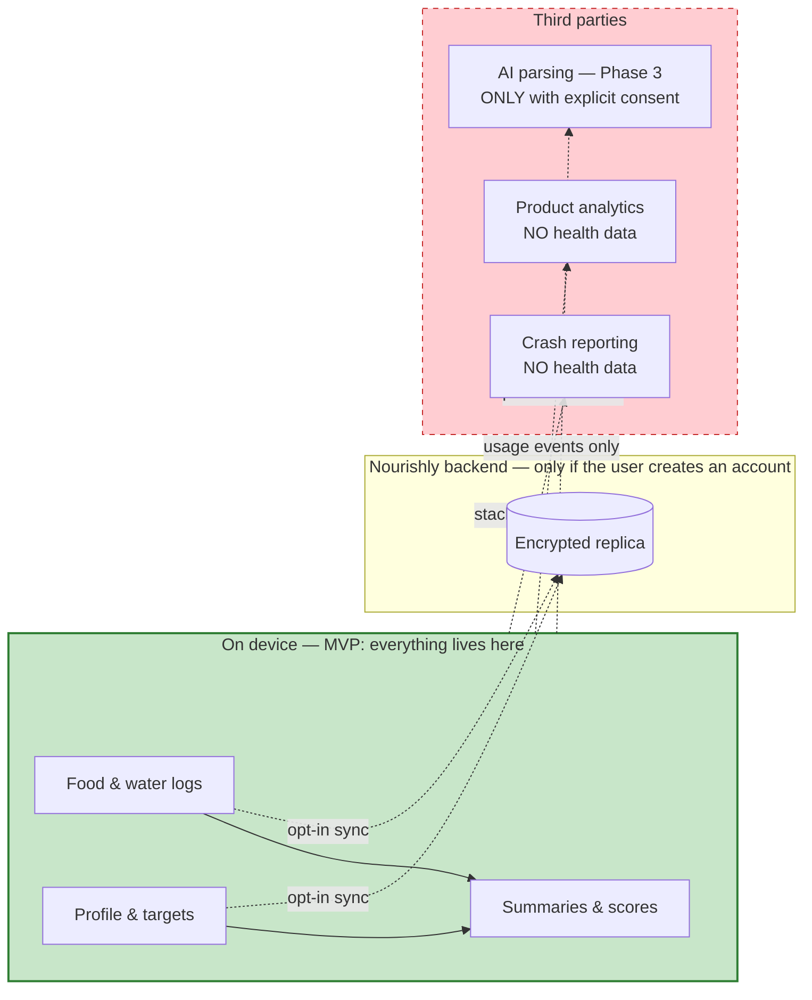

# Part IX — Privacy, Security, and Scalability

*Sections 30–31 · [Back to index](./README.md)*

---

## 30. Privacy and Security Considerations

### 30.1 What kind of data this is

Nutrition and hydration logs, combined with age, sex, height, weight, and stated goals, constitute **health-adjacent personal data**. In aggregate a food log reveals more than nutrition: religious and cultural practice (fasting patterns, dietary restrictions), medical conditions (a sudden shift to low-sodium or gluten-free), pregnancy, disordered eating, alcohol consumption, and daily routine.

That inference surface — not the calorie count — is why this data deserves careful handling. The design treats it as sensitive by default rather than reasoning about whether each field individually qualifies.

**Regulatory posture** [ASSUMPTION A-8, and see [OPEN Q-8]]:
- **India — DPDP Act 2023** is the primary regime for the initial user base: consent, purpose limitation, data-principal rights (access, correction, erasure), breach notification, and obligations around children's data.
- **GDPR-equivalent rights** are implemented regardless of jurisdiction, because doing so is simpler than geo-conditional behaviour and is a reasonable baseline everywhere.
- **Apple App Store / Google Play** health-data policies apply: no selling health data, no use for advertising, mandatory in-app account deletion, accurate privacy-nutrition labels and Data Safety declarations.
- **Not a medical device.** Nourishly makes no diagnostic or treatment claims (§30.8). Crossing that line would invoke a regulatory regime (CDSCO in India, FDA/MDR elsewhere) that this product is not built for. The insight language boundary in §21.7 is the operational control that keeps the product on the right side of it.

*This is a design position, not legal advice. Counsel review is a launch prerequisite (§37).*

### 30.2 Privacy principles

| # | Principle | Implementation |
|---|---|---|
| PR-1 | **Local by default** | MVP has no server. Data never leaves the device unless the user creates an account. This is the strongest privacy property the product has, and it comes free from the offline-first architecture |
| PR-2 | **Data minimisation** | Only fields that affect targets or logging are collected. No contacts, no location, no device fingerprinting, no advertising identifiers |
| PR-3 | **Purpose limitation** | Health data is used to compute the user's own reports. Nothing else. No secondary use, no model training on user logs |
| PR-4 | **No third-party health-data sharing** | Enforced by NFR-S-05 and verified by a network-egress review before each release |
| PR-5 | **User ownership** | Complete export at any time; deletion is real deletion |
| PR-6 | **Informed, granular, revocable consent** | Separate consent for sync, analytics, and (Phase 3) AI processing. Declining any one leaves the app fully functional |
| PR-7 | **Transparency** | Plain-language privacy policy; an in-app summary of what is stored and where |

### 30.3 Storage security

| Layer | Protection |
|---|---|
| Local database | Relies on OS full-disk encryption (iOS Data Protection, Android FBE) as the baseline. **Optional SQLCipher** with a Keystore/Keychain-held key as a user-enabled setting |
| Tokens & secrets | iOS Keychain / Android Keystore-backed storage. **Never** in the database or shared preferences (NFR-S-02) |
| Exports | Written to user-chosen storage; the user is told the file is unencrypted and portable |
| Backups | On iOS, the database is excluded from iCloud backup unless the user opts in — health data should not silently propagate to a cloud the user did not choose |
| Server (Phase 2) | Encryption at rest; TLS in transit; RLS on every user table (NFR-S-04) |
| Logs | No PII, no food names, no nutrient values. Redaction verified by test (NFR-S-08) |

**On SQLCipher being optional rather than default:** it costs measurable read performance on the hottest queries, and on a device with OS-level encryption and a lock screen it adds protection mainly against an attacker with physical access and an unlocked device. Making it a setting lets users who want it have it without imposing the cost on everyone. This is a judgement call worth revisiting if the user base skews toward higher-risk contexts.

### 30.4 Consent model

| Consent | When asked | Default | If declined |
|---|---|---|---|
| Core app use | Implicit on install; explained in onboarding | — | — |
| Health-data storage (local) | Explained in onboarding, not gated | — | — |
| Account creation & cloud sync | At sign-in (Phase 2) | Off | App fully functional; local only |
| Product analytics | Onboarding or first launch, per jurisdiction | Off where consent is required | App fully functional |
| Crash reporting | Same | On (no PII) | App fully functional |
| Notifications | When configuring the first reminder | Off | Reminders unavailable; nothing else affected |
| Camera (barcode, Phase 2) | On first scan | — | Manual entry always available |
| Photo upload (Phase 3) | Per use | Off | Manual logging available |
| AI meal parsing (Phase 3) | Explicit, with a clear statement of what is sent and to whom | Off | Manual logging available |

**Every consent is revocable in Settings, and revoking never removes functionality that does not depend on it.** The Phase 3 AI consent deserves particular care: sending a meal description or photo to a third-party service is a materially different privacy act from local logging, and must be presented as such rather than buried in a toggle.

### 30.5 Data flows and where data actually goes

The dashed red boundary is the one that must be audited before every release: **no health data crosses it.** A concrete verification step — proxy the app and inspect every outbound request — belongs in the pre-release checklist, because this is the kind of guarantee that erodes silently when a well-meaning SDK is added.

### 30.6 Data export (FR-U-13, NFR-S-07)

- User-initiated from Settings, available in MVP without an account.
- **Complete**: profile versions, goals, target sets, all log entries with their nutrient snapshots, water logs, custom foods, templates, favourites, preferences, and derived summaries.
- Two formats: **JSON** (complete and re-importable) and **CSV** (spreadsheet-friendly, one file per entity).
- Includes a manifest with schema version, ruleset version, catalog version, and export timestamp — without these, an export is not reliably re-interpretable later.
- Runs in a background isolate with progress; large histories must not block the UI.

### 30.7 Deletion (FR-U-12, NFR-S-06)

| Scope | Behaviour |
|---|---|
| Delete a single entry | Soft delete, tombstoned, undoable in-session, purged after 180 days (§17.7) |
| Delete all local data | Available without an account. Two-step; export offered first |
| Delete account (Phase 2) | In-app (an App Store requirement). Two-step confirmation. Server data erased within 30 days; backups age out on their own retention cycle, which must be stated honestly in the privacy policy rather than glossed as "immediately" |
| Post-deletion | Local data cleared; the app returns to a fresh guest state rather than an error state |

**No dark patterns:** deletion is not hidden behind a support email, does not require contacting anyone, and is not made deliberately tedious.

### 30.8 The medical boundary

This is the most important non-technical constraint in the product, and it is enforced in three places:

| Control | Where |
|---|---|
| **Language rules** — no diagnosis, no treatment, no outcome claims, no supplement advice | §21.7, enforced by review of every insight and notification template |
| **Target safety limits** — calorie floors, capped rates of change, no unsafe targets even on request | §20.4 |
| **Explicit positioning** — the app describes itself as a wellness tracking tool, in onboarding, in Settings, and in store listings | §27.13 |

**Disclaimers** are shown once in onboarding and remain available in Settings, worded plainly rather than as a legal wall:
> Nourishly helps you track and understand what you eat and drink. It is not a medical device and does not provide medical advice, diagnosis, or treatment. Nutrition data is estimated and portion sizes vary. For decisions about a medical condition, pregnancy, or a specific diet, please speak to a qualified healthcare professional.

**Signposting:** Settings carries a short, non-alarmist note that the app is not suitable for managing a diagnosed condition or an eating disorder, with a pointer to professional resources (§21.8).

### 30.9 Future privacy considerations

| Feature | Implication |
|---|---|
| **AI meal parsing/photo (Phase 3)** | Sends user content to a processor. Requires: explicit per-feature consent, a named processor in the privacy policy, a contractual no-training-on-user-data commitment, minimal payloads (no profile, no history), and a clearly stated retention period. On-device inference is materially better for privacy and should be preferred if it becomes viable |
| **Health platform integration (Phase 3)** | HealthKit and Health Connect have their own strict rules — no using health data for advertising, no sharing with third parties, granular per-type permissions. Read and write consent must be separate |
| **Family/shared tracking (Future)** | A different consent model entirely, plus a hard question about minors. Do not build without a dedicated privacy design |
| **Dietician access (Future)** | Sharing health data with a professional is a significant privacy act requiring revocable, scoped, audited consent and probably a different legal basis |
| **Children under 18** | DPDP has specific obligations around children's data and verifiable parental consent. [ASSUMPTION A-9] MVP is 18+ only, stated in the terms and enforced by a date-of-birth check at profile setup |

---

## 31. Scalability Considerations

### 31.1 What actually needs to scale

Being honest about this prevents over-engineering. Four axes:

| Axis | Growth driver | Pressure |
|---|---|---|
| **Per-user history** | Time | Client-side query and storage cost |
| **Catalog size** | Curation effort | On-device storage and search latency |
| **User count** | Adoption | Backend cost and throughput (Phase 2 only) |
| **Sync volume** | Users × entries/day | Backend write throughput (Phase 2 only) |

The MVP has **no server**, so axes 3 and 4 are not live concerns until Phase 2. The two that matter from day one are client-side.

### 31.2 Client scalability

| Concern | At 5 years of daily logging | Mitigation |
|---|---|---|
| Log entries | ~11k entries, ~260k snapshot rows | Indexed by `(owner_id, log_date)`; every query is period-bounded (NFR-SC-01) |
| Database size | ~15 MB user data + ~45 MB catalog | Well within budget (NFR-E-04) |
| Daily summaries | ~1,825 rows | Trivial; prunable and recomputable beyond 24 months |
| Report queries | Bounded by period, never by history | The architectural property that makes this a non-issue (§25.4) |
| Search | Grows with catalog, not history | FTS5 with a bounded working set |
| Cold start | Independent of history — the dashboard reads one summary row | The design deliberately avoids any "load all entries" path |

**The key property:** no screen in the app has a query whose cost grows with total history. The dashboard reads one day. The weekly report reads seven summaries. The monthly report reads thirty-one. A user with ten years of data has the same experience as a user with ten days.

### 31.3 Catalog scalability

| Scale | Approach |
|---|---|
| MVP: ~10–20k items bundled | Fits comfortably; FTS5 well under the latency budget |
| Growth to ~50k on-device | Still fine; the practical limits are app size and index build time |
| Beyond ~100k (branded products at scale) | **Tiered replica**: keep a core working set on device (curated + generic + India-relevant branded) and resolve the long tail on demand, caching results locally. Barcode lookups are the natural long-tail case and are already an on-demand path (§24.3) |
| Server catalog at 500k+ | Postgres with trigram/FTS indexes; deltas served as static CDN files, which is the cheapest possible scaling story for the highest-volume endpoint |

Critically, the long tail is *only* reachable online — which is acceptable, because the on-device working set is chosen to cover the overwhelming majority of real logging, and the custom-food escape hatch covers the rest offline (UX-6).

### 31.4 Backend scalability (Phase 2)

Load characteristics are unusually gentle, and it is worth stating why: **this is not a read-heavy social app.** Each user syncs their own small dataset a handful of times a day, and reads are served locally.

| Metric at 100k MAU | Estimate |
|---|---|
| Entries written per day | ~600k (6/user/day) |
| Sync cycles per day | ~400k (3–4/user/day) |
| Peak sync writes/sec | ~50–100 (usage clusters around meal times) |
| Storage growth | ~30–50 GB/year |
| Catalog reads | Almost entirely CDN-cached deltas |

A single well-indexed Postgres instance handles this without difficulty. Scaling levers, in the order they would be needed:

1. Connection pooling (PgBouncer) — first and usually sufficient.
2. Read replicas for catalog reads — though the CDN largely obviates this.
3. Partition `food_log_entry` by month once it grows large — a mechanical change.
4. Move catalog deltas fully to object storage + CDN — likely from day one anyway.
5. Extract the sync coordinator as a separate service — only if write throughput genuinely demands it. The service boundaries in §15.2 make this a contained change rather than a rewrite.

**Deliberately not adopted now:** sharding, microservices, event sourcing, a message queue, CQRS. None is justified by the projected load, and each would add operational burden to a solo-developer product. The boundaries exist so they *can* be adopted; adopting them pre-emptively would be the classic mistake.

### 31.5 Cost model (Phase 2)

| Component | At 10k MAU | At 100k MAU |
|---|---|---|
| Postgres (managed) | Low tier | Mid tier |
| Auth | Included | Included |
| Bandwidth (sync payloads are small; catalog deltas CDN-cached) | Low | Moderate |
| Object storage (exports; photos in Phase 3) | Negligible | Low–moderate |
| **Target** | **≤ ₹5 / MAU** (NFR-SC-04) | Should improve per-user with scale |

**Cost risk to watch:** Phase 3 AI features are per-request and would dominate this model entirely. They need their own economic analysis — including on-device inference and aggressive result caching — before commitment (§33, R-9).

### 31.6 Operational scalability for a solo developer

The most binding scalability constraint on this project is not technical.

| Pressure | Mitigation |
|---|---|
| Support load | In-app FAQ; a structured feedback path; honest data-quality badges that pre-empt "your calories are wrong" reports |
| Catalog curation as coverage requests arrive | A prioritised queue driven by *failed searches* and custom-food creation frequency — the data tells you exactly which foods to add next. This is the single highest-leverage operational feedback loop in the product |
| Release cadence | Automated CI, staged rollouts, small releases |
| On-call | Backend outages are P2 by design (AP-1) — the app keeps working. This is a genuine and underrated benefit of the offline-first architecture |
| Feature-request pressure | The MVP scope and phase classification in §9–10 exist to be pointed at |

---

*Continue to [Part X — Architecture Decision Records](./10-adrs.md).*
